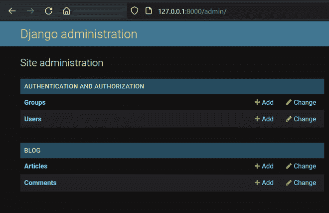
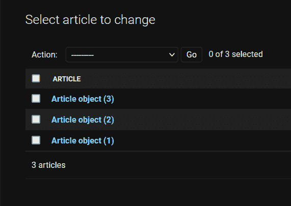
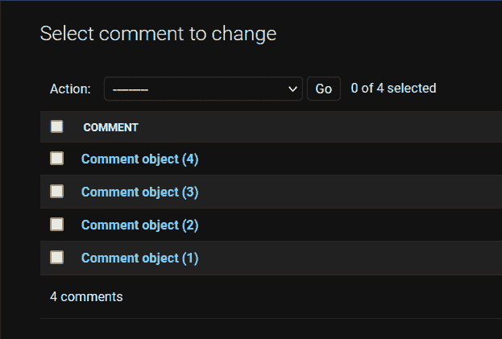
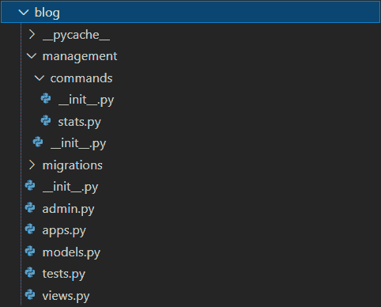
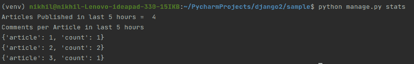
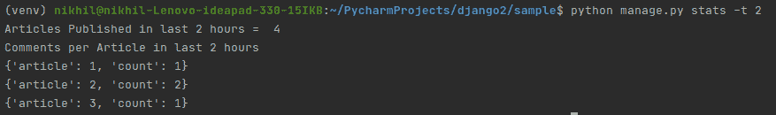

# 自定义姜戈管理命令

> 原文:[https://www . geesforgeks . org/custom-django-management-commands/](https://www.geeksforgeeks.org/custom-django-management-commands/)

**先决条件:** [姜戈介绍和安装](https://www.geeksforgeeks.org/django-introduction-and-installation/)

Django 中的 Manage.py 是一个命令行实用程序，其工作方式类似于 django-admin 命令。区别在于它指向项目的 settings.py 文件。这个 manage.py 实用程序提供了在使用 Django 时必须具备的各种命令。一些最常用的命令是–

*   python manage.py startapp
*   python manage.py makemigrations
*   python manage.py 迁移
*   python manage.py runserver

有趣的是，我们可以创建自己的自定义管理命令来满足各种各样的需求，从使用命令行与应用程序交互到作为执行 Cron 作业的接口。我们将创建一个定制的管理命令，该命令为我们提供新发布文章的统计数据或指标，以及在某一天对这些文章的评论。

## 入门指南

按照 [Django 介绍和安装](https://www.geeksforgeeks.org/django-introduction-and-installation/)设置虚拟环境并安装 Django

**步骤 1:** 通过以下命令初始化项目

```py
django-admin startproject geeks_site
```

**第二步:**创建一个名为 blog 的应用

```py
python manage.py startapp blog
```

**步骤 3:** 将你的应用添加到设置中。py

在**极客 _ 站点/设置. py**

## 蟒蛇 3

```py
# Application definition

INSTALLED_APPS = [
    'django.contrib.admin',
    'django.contrib.auth',
    'django.contrib.contenttypes',
    'django.contrib.sessions',
    'django.contrib.messages',
    'django.contrib.staticfiles',
      'blog',
]
```

**第四步:**在**博客** app 中创建名为**文章**和**评论**的模型

**模型文章**:

*   **字段**:
    *   **标题**:存储文章标题
    *   **正文**:那篇文章的内容
    *   **创建时间:**创建文章的日期和时间

**车型评论**:

*   **字段**:
    *   **文章**:创建评论的文章
    *   **正文**:实际评论
    *   **创建时间:**创建文章的日期和时间

在**博客/模特. py**

## 蟒蛇 3

```py
from django.db import models

class Article(models.Model):
    title = models.CharField(max_length=200)
    body = models.TextField()
    created_on = models.DateTimeField(auto_now_add=True)

class Comment(models.Model):
    article = models.ForeignKey(Article, on_delete=models.CASCADE)
    text = models.CharField(max_length=200)
    created_on = models.DateTimeField(auto_now_add=True)
```

**步骤 5:** 在 blog/admin.py 中注册您的模型，以便它显示在管理面板中。

在**博客/管理页面**

## 蟒蛇 3

```py
from django.contrib import admin 
from .models import Article, Comment

admin.site.register(Article)
admin.site.register(Comment)
```

**步骤 6:** 现在，要迁移所有更改并启动服务器，请在终端中运行以下命令

```py
python manage.py makemigrations
python manage.py migrate
python manage.py runserver
```

创建超级用户帐户以登录到管理面板

```py
python manage.py createsuperuser
```

现在，请访问管理面板 http://127.0.0.1:8000/admin/



创建一些文章和评论:

 

现在，让我们开始创建自定义 Django 管理命令

*   在**博客**应用中添加**管理/命令**目录
*   添加 **__init__。py** 至**博客/管理**和**init _ _。py + stats.py** 文件到**博客/管理/命令**目录

**注意:** Django 将为目录中名称不以下划线开头的每个 Python 模块注册一个 **manage.py** 命令

**博客应用**的文件夹结构如下:



我们将使用 **python manage.py stats** 来运行我们的自定义管理命令。现在我们将配置这个命令实际上会做什么。

在 **stats.py** 中

## 蟒蛇 3

```py
from django.core.management.base import BaseCommand
from django.db.models import Count
from blog.models import Article, Comment
from datetime import timedelta, datetime
from django.utils.timezone import utc

def now():
    return datetime.utcnow().replace(tzinfo=utc)

class Command(BaseCommand):
    help = 'Displays stats related to Article and Comment models'

    def handle(self, *args, **kwargs):
        From = now() - timedelta(hours=5)
        To = now()

        articles_published_in_last_5_hour = Article.objects.filter(
            created_on__gt=From, created_on__lte=To).count()
        comments_published_per_article = Comment.objects.filter(
            created_on__gt=From, created_on__lte=To).values(
          'article').annotate(count=Count('article')).order_by()

        print("Articles Published in last 5 hours = ",
              articles_published_in_last_5_hour)

        print("Comments per Article in last 5 hours")
        for data in comments_published_per_article:
            print(data)
```

**了解 stats.py 文件**

基本上，一个 Django 管理命令是从一个名为 **Command** 的类构建的，该类继承自 **BaseCommand** 。

**1) help:** 它告诉命令实际做什么。运行以下命令并查看帮助

```py
python manage.py stats --help
```

**2) handle():** 处理命令执行时需要执行的所有逻辑。让我们了解一下**手柄()**方法里面的代码

*   这里我们关注以下两个统计数据
    *   过去 5 小时内发表的文章数量
    *   每篇文章在过去 5 小时内创建的评论数
*   **从:**当前时间–5 小时
*   **至:**当前时间
*   **articles _ published _ in _ last _ 5 _ hour:**一个整数值
*   **comments _ published _ per _ article:**query set 对象或字典列表
*   打印报表以在终端上输出数据

现在，在您的终端中运行以下命令:

```py
python manage.py stats
```

**输出:**



## 添加参数

Django 使用 [argparse](https://www.geeksforgeeks.org/command-line-option-and-argument-parsing-using-argparse-in-python/) 模块来处理自定义参数。我们需要在命令类下定义一个函数 add_arguments 来处理参数。

## 蟒蛇 3

```py
from django.core.management.base import BaseCommand
from django.db.models import Count
from app.models import Article, Comment
from datetime import timedelta, datetime
from django.utils.timezone import utc

def now():
    return datetime.utcnow().replace(tzinfo=utc)

class Command(BaseCommand):
    help = 'Displays stats related to Article and Comment models'

    def add_arguments(self, parser):
        parser.add_argument('-t', '--time', type=int, help='Articles published in last t hours')

    def handle(self, *args, **kwargs):
        t = kwargs['time']
        if not t:
            t=5
        From = now() - timedelta(hours=t)
        To = now()

        articles_published_in_last_t_hour = Article.objects.filter(
            created_on__gt=From, created_on__lte=To).count()

        comments_published_per_article = Comment.objects.filter(
            created_on__gt=From, created_on__lte=To).values(
            'article').annotate(count=Count('article')).order_by()

        print(f"Articles Published in last {t} hours = ",
              articles_published_in_last_t_hour)

        print(f"Comments per Article in last {t} hours")
        for data in comments_published_per_article:
            print(data)
```

**输出:**

