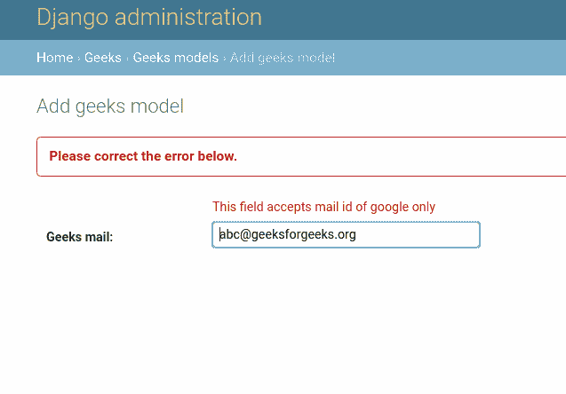

# 姜戈模型中的自定义字段验证

> 原文:[https://www . geesforgeks . org/custom-field-verification-in-django-models/](https://www.geeksforgeeks.org/custom-field-validations-in-django-models/)

本文围绕如何向特定字段添加自定义验证展开。例如，通过指定特定的格式将电子邮件的验证添加到[字符域](https://www.geeksforgeeks.org/charfield-django-models/)中。有多种方法可以实现自定义验证。在本文中，我们将从模型本身展示它，这样您就不需要在其他地方操作它。
当您试图创建模型实例时，会运行这些验证。从技术上讲，这种验证是在运行 ModelName.objects.create(数据=数据)之后实现的。

**语法–**

```
field_name = models.Field(validators = [function 1, function 2]) 
```

## 姜戈自定义字段验证说明

使用示例说明**验证器**。考虑一个名为 geeksforgeeks 的项目，它有一个名为 geeks 的应用程序。

> 请参考以下文章，查看如何在 Django 中创建项目和应用程序。
> 
> *   [如何利用姜戈的 MVT 创建基础项目？](https://www.geeksforgeeks.org/how-to-create-a-basic-project-using-mvt-in-django/)
> *   [如何在姜戈创建 App？](https://www.geeksforgeeks.org/how-to-create-an-app-in-django/)

将以下代码输入**极客** app 的 models.py 文件。我们将使用 CharField 对所有字段选项进行实验。

## 蟒蛇 3

```
from django.db import models
from django.db.models import Model
# Create your models here.

class GeeksModel(Model):
    geeks_mail = models.CharField(
                    max_length = 200, 
                    )
```

现在我们将应用一个自定义验证，这样上面的字段只针对谷歌邮件 id 进行验证。创建一个接受名为**值**的参数的函数。现在可以对值应用任何类型的操作。所以让我们检查一下我们的函数值是否包含 **@gmail.com** 只针对谷歌邮件 id 进行验证。

## 蟒蛇 3

```
from django.db import models
# importing validationerror
from django.core.exceptions import ValidationError

# creating a validator function
def validate_geeks_mail(value):
    if "@gmail.com" in value:
        return value
    else:
        raise ValidationError("This field accepts mail id of google only")

# Create your models here.
class GeeksModel(models.Model):
    geeks_mail = models.CharField(max_length = 200)
```

现在让我们将这个函数作为验证器添加到我们的字段中。请注意，一个验证函数可以同时用于多个字段。

## 蟒蛇 3

```
from django.db import models
# importing validationerror
from django.core.exceptions import ValidationError

# creating a validator function
def validate_geeks_mail(value):
    if "@gmail.com" in value:
        return value
    else:
        raise ValidationError("This field accepts mail id of google only")

# Create your models here.
class GeeksModel(models.Model):
    geeks_mail = models.CharField(
                         max_length = 200,
                         validators =[validate_geeks_mail]
                         )
```

让我们尝试创建一个没有 gmail.com 的实例，并检查我们的验证是否有效。请注意，在 models.py 中的每一次更改之后，都需要运行 makemigrations 和 migrate 命令。
在浏览器中，转到[http://localhost:8000/admin/geeks/geeks model/add/](http://localhost:8000/admin/geeks/geeksmodel/add/)并输入“abc@geeksforgeeks.org”。

让我们检查一下它是否保存在数据库中。



所以验证成功了，这个字段只能接受以@gmail.com 结尾的电子邮件 id。