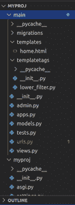
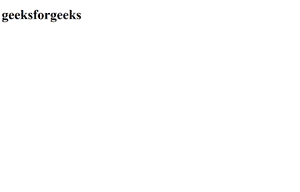

# 姜戈定制模板过滤器

> 原文:[https://www . geesforgeks . org/custom-template-filters-in-django/](https://www.geeksforgeeks.org/custom-template-filters-in-django/)

Django 是一个基于 Python 的网络框架，允许您快速创建高效的网络应用程序。它也被称为电池内置框架，因为 Django 为一切提供内置功能，包括 Django 管理界面、默认数据库——sqllite 3 等。

### Django 模板语言(DTL)中的过滤器是什么？

在了解如何在 Django 模板语言中制作自定义过滤器之前，让我们先了解一下什么是 Django 中的过滤器。

*   过滤器也是我们模板语言的重要特征。
*   过滤器基本上用于修改或过滤变量。
*   您必须使用此管道(|)符号在任何变量中应用过滤器。

例如:-

所以这个过滤器将以小写形式修改这个变量值

{{变量名称|过滤器名称}}

### 如何在 Django 中创建自定义模板过滤器？

首先，使用以下命令创建 django 项目

```
django-admin startproject myproj
```

```
cd myproj
```

然后在 myproj 中创建新的应用程序

对于 Ubuntu

```
python3 manage.py startapp main
```

在**设置中添加应用名称。在 INSTALLED_APPS 中复制**


将此视图添加到您的**视图中**

## 蟒蛇 3

```
from django.shortcuts import render

# Create your views here.
def home(request):
    value="GEEKSFORGEEKS"
    return render(request,"home.html",{"value":value})
```

现在让我们在主**文件夹中创建**模板标签**目录**



别忘了创建 **__init__。模板标签目录中的 py** 文件

然后创建 **lower_filter.py** 文件

## 蟒蛇 3

```
from django import template

register = template.Library()

@register.filter()
def low(value):
    return value.lower()
```

在主目录中创建一个目录，并将其命名为**模板**

在**模板**目录中创建一个文件，并将其命名为**home.html**

## 超文本标记语言

```
<!DOCTYPE html>
<html>
<head>
    <title>Welcome To GFG</title>
</head>
<body>
    
    <h1>{{value|low}}</h1>
</body>
</html>
```

在主目录中创建一个文件，并将其命名为**URL . py**

## 蟒蛇 3

```
from django.urls import path
from .views import *

urlpatterns = [
    path('', home,name="home"),

]
```

**my project/URLs . py**

## 蟒蛇 3

```
from django.contrib import admin
from django.urls import path,include

urlpatterns = [
    path('admin/', admin.site.urls),
    path('',include("main.urls"))
]
```

打开 cmd 或终端

对于 Ubuntu

```
python3 manage.py runserver
```

**输出:-**

