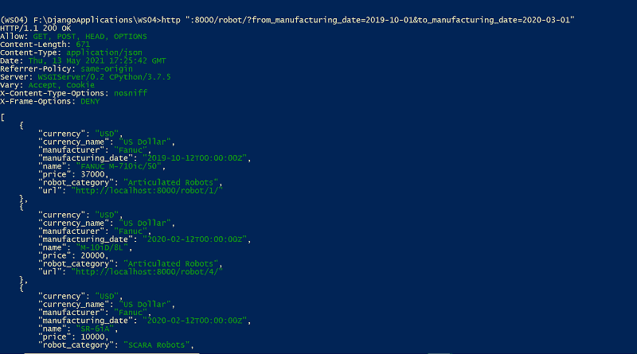
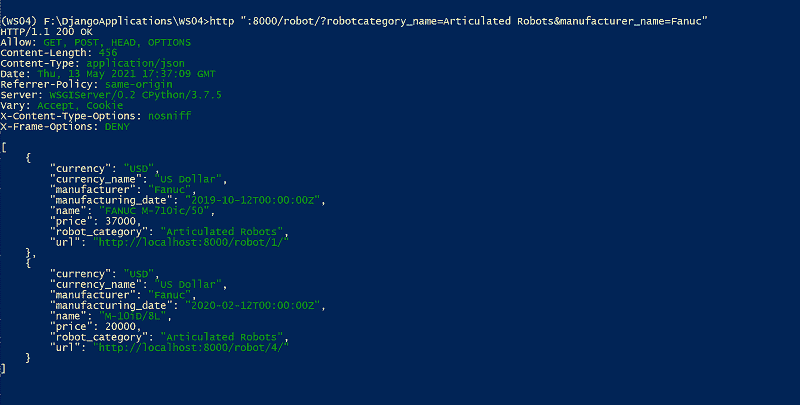
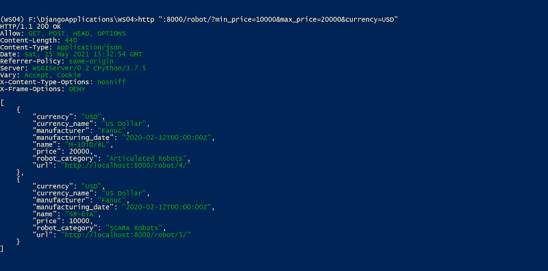
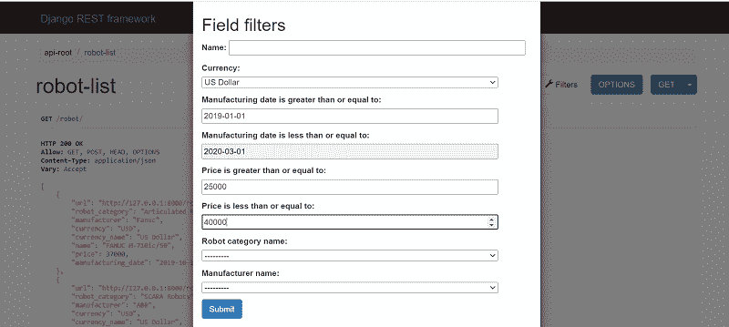
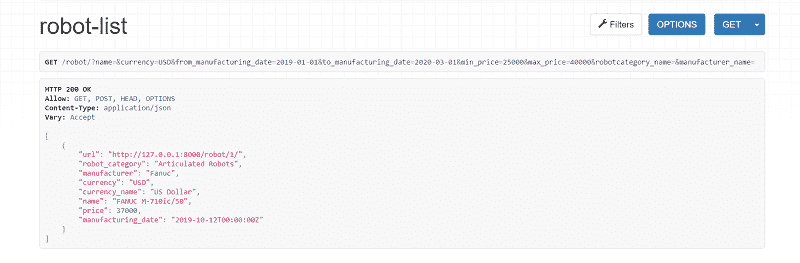

# 在 Django REST 框架中定制过滤器

> 原文:[https://www . geesforgeks . org/customizing-filters-in-django-rest-framework/](https://www.geeksforgeeks.org/customizing-filters-in-django-rest-framework/)

**先决条件:**  [](https://write.geeksforgeeks.org/post/2487371)【需要的文章已发布】

Django 过滤器便于过滤 queryset，以便根据分配给过滤器字段的值检索相关结果。但是，如果用户想要检索给定范围内的详细信息，该怎么办。比方说，用户需要根据价格范围获取机器人的详细信息。定制过滤器的必要性来了。让我们创建一个定制的过滤器并将其应用于机器人模型，以便用户可以通过提供机器人类别名称、制造商名称、货币、制造日期范围和/或价格范围来检索机器人详细信息。

我们将创建一个名为*机器人过滤器*的新类，它是 *django_filters 的子类。FilterSet* 类。让我们申报进口

## 蟒蛇 3

```py
from django_filters import FilterSet, AllValuesFilter
from django_filters import DateTimeFilter, NumberFilter
```

现在，您可以在 RobotList 类之前添加下面的代码。

## 蟒蛇 3

```py
class RobotFilter(FilterSet):
    from_manufacturing_date = DateTimeFilter(field_name='manufacturing_date',
                                             lookup_expr='gte')
    to_manufacturing_date = DateTimeFilter(field_name='manufacturing_date',
                                           lookup_expr='lte')
    min_price = NumberFilter(field_name='price', lookup_expr='gte')
    max_price = NumberFilter(field_name='price', lookup_expr='lte')
    robotcategory_name = AllValuesFilter(field_name='robot_category__name')
    manufacturer_name = AllValuesFilter(field_name='manufacturer__name')

    class Meta:
        model = Robot
        fields = (
            'name',
            'currency',
            'from_manufacturing_date',
            'to_manufacturing_date',
            'min_price',
            'max_price',
            'robotcategory_name',
            'manufacturer_name',
            )
```

让我们看看在 RobotFilter 类中声明的属性。

*   起始 _ 制造 _ 日期
*   至 _ 制造 _ 日期
*   最低价格
*   最高价格
*   robotcategory_name
*   制造商名称

**from_manufacturing_date:** 是一个 *django_filters。日期时间过滤器*实例属性，用于过滤制造日期值大于或等于指定日期时间值的机器人。在日期时间过滤器中，有两个名为*字段名称*和*查找表达式*的参数。字段名称具有制造日期(用于过滤)，并且“gte”(大于或等于)应用于 lookup_expr。

**to_manufacturing_date:** 是一个 *django_filters。日期时间过滤器*实例属性，用于过滤制造日期值小于或等于指定日期时间值的机器人。在日期时间过滤器中，有两个名为*字段名称*和*查找表达式*的参数。在字段名称中，我们提到了制造日期，并且“lte”(小于或等于)应用于 lookup_expr。

**min_price:** 是一个 *django_filters。NumberFilter* 实例属性，用于过滤价格值大于等于指定价格值的机器人。

**最高 _ 价格:**是一款*姜戈 _filters。NumberFilter* 实例属性，用于过滤价格值小于或等于指定价格值的机器人。

**robotcategory_name:** 是一个 *django_filters。AllValuesFilter* 实例属性，用于过滤机器人类别名称与指定字符串值匹配的机器人。您可以注意到，在提供给*字段名称*的值中，在机器人类别和名称之间有一个双下划线(__)。field_name 使用 Django 双下划线将其作为机器人类别模型的名称字段。这有助于根据机器人类别名称而不是 pk id 检索机器人的详细信息。

**厂家名称:**是一款*姜戈 _ 滤镜。AllValuesFilter* 实例属性，用于过滤制造商名称与指定字符串值匹配的机器人。字段名称使用 Django 双下划线将值“制造商名称”读取为制造商型号的名称字段。这有助于根据制造商名称而不是其 pk id 检索机器人的详细信息。

*机器人过滤器*类还定义了一个*元*内部类。这个类有两个属性*模型*和*字段*。模型属性指定要过滤的模型(机器人)。而且，字段属性保存字段名称和过滤器名称(作为字符串的元组)，以包含在所提到的模型(机器人)的过滤器中。

让我们在*机器人列表*类中使用*机器人过滤器*类。代码如下

## 蟒蛇 3

```py
class RobotList(generics.ListCreateAPIView):
    queryset = Robot.objects.all()
    serializer_class = RobotSerializer
    name = 'robot-list'
    # customized filter class
    filter_class = RobotFilter
    search_fields = (
        '^name',
    )
    ordering_fields = (
        'price',
    )
```

让我们过滤制造日期内的机器人。HTTPie 命令是

> http://8000/robot/？自 _ 制造 _ 日期= 2019-10-01 &至 _ 制造 _ 日期=2020-03-01”

**输出:**



让我们根据机器人类别名称和制造商名称过滤机器人。HTTPie 命令如下

> http://8000/robot/？robotcategory _ name =铰接式机器人&制造商 _name=Fanuc "

**输出:**



让我们根据价格范围过滤机器人。HTTPie 命令是

> http://8000/robot/？最小价格= 10000 &最大价格= 20000 cy =美元"

**输出:**



让我们使用可浏览的应用编程接口功能过滤机器人。您可以浏览下面的网址并点击过滤器按钮。

> http://127.0.0.1:8000/robot/

您可以填充值来过滤机器人。分享下面的截图



单击提交按钮，您将获得过滤结果。分享下面的截图

