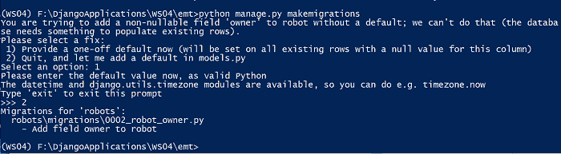
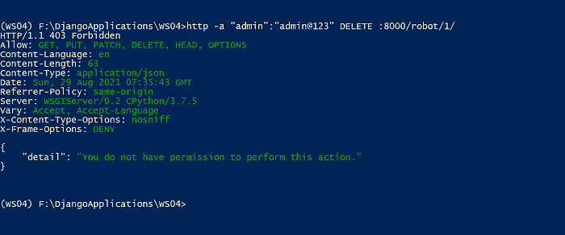
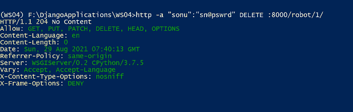

# 自定义对象级权限–Django REST 框架

> 原文:[https://www . geesforgeks . org/customizing-object-level-permissions-django-rest-framework/](https://www.geeksforgeeks.org/customizing-object-level-permissions-django-rest-framework/)

在本文中，我们将讨论如何在 Django REST 框架中自定义对象级权限。要在 Django REST 框架中自定义权限类，我们应该继承*REST _ Framework . permissions . base permission*类，并实现以下方法中的一种或两种:

*   。has_permission(自我、请求、查看)
*   。has_object_permission(自我、请求、视图、对象)

如果我们看看 Django REST Framework 中[可浏览 API 中提到的我们的机器人模型，我们可以注意到，任何经过身份验证的用户都可以删除机器人，即使在我们的 RESTFul web 服务中设置了权限策略。定制对象级权限的重要性来了，这样只有机器人所有者才能更新或删除现有的机器人。](https://www.geeksforgeeks.org/browsable-api-in-django-rest-framework/)

## 创建自定义权限类

转到拥有*view . py*文件的 robots 文件夹，创建一个名为 *custompermission.py* 的新文件。您可以在新文件中编写下面的代码。

## 蟒蛇 3

```
from rest_framework import permissions

class IsCurrentUserOwnerOrReadOnly(permissions.BasePermission):

    def has_object_permission(self, request, view, obj):
        if request.method in permissions.SAFE_METHODS:

            # The method is a safe method
            return True

        else:
            # The method isn't a safe method
            # Only owners are granted permissions for unsafe methods
            return obj.owner == request.user
```

*是从 *BasePermission* 类继承而来的，并覆盖了 *has_object_permission* 方法。方法返回一个布尔值，该值指示是否应该授予权限。*有 _object_permission* 区分安全方法和不安全方法，只有所有者才被授予不安全方法的权限。*

让我们将所有者字段添加到 robots/models.py 文件中。

```
owner = models.ForeignKey(
        'auth.User',
        related_name= 'robots',
        on_delete=models.CASCADE
    )
```

机器人类如下所示:

## 蟒蛇 3

```
class Robot(models.Model):
    CURRENCY_CHOICES = (
        ('INR', 'Indian Rupee'),
        ('USD', 'US Dollar'),
        ('EUR', 'Euro'),
    )

    name = models.CharField(max_length=150, unique=True)

    robot_category = models.ForeignKey(
        RobotCategory,
        related_name='robots',
        on_delete=models.CASCADE)

    manufacturer = models.ForeignKey(
        Manufacturer,
        related_name='robots',
        on_delete=models.CASCADE)

    currency = models.CharField(
        max_length=3,
        choices=CURRENCY_CHOICES,
        default='INR')

    price = models.IntegerField()

    manufacturing_date = models.DateTimeField()

    owner = models.ForeignKey(
        'auth.User',
        related_name='robots',
        on_delete=models.CASCADE
    )

    class Meta:
        ordering = ('name',)

    def __str__(self):
        return self.name
```

在上面的代码中，我们指定了模型。CASCADE 值，这样每当我们删除一个用户时，与该用户关联的机器人也会被删除。

现在让我们将所有者字段添加到 RobotSerializer . py 文件中提到的 RobotSerializer 类中。您可以添加以下代码

```
owner = serializers.ReadOnlyField(source='owner.username')
```

机器人串行器类如下所示:

## 蟒蛇 3

```
class RobotSerializer(serializers.HyperlinkedModelSerializer):

    robot_category = serializers.SlugRelatedField(
        queryset=RobotCategory.objects.all(), slug_field='name')

    manufacturer = serializers.SlugRelatedField(
        queryset=Manufacturer.objects.all(), slug_field='name')

    currency = serializers.ChoiceField(
        choices=Robot.CURRENCY_CHOICES)

    currency_name = serializers.CharField(
        source='get_currency_display',
        read_only=True)

    # Display the owner's username (read-only)
    owner = serializers.ReadOnlyField(source='owner.username')

    class Meta:
        model = Robot
        fields = '__all__'
```

让我们创建两个名为 UserRobotSerializer 类和 UserSerializer 类的新序列化程序类。您可以添加以下代码:

## 蟒蛇 3

```
class UserRobotSerializer(serializers.HyperlinkedModelSerializer):
    class Meta:
        model = Robot
        fields = (
            'url',
            'name')

class UserSerializer(serializers.HyperlinkedModelSerializer):
    robots = UserRobotSerializer(
        many=True,
        read_only=True)

    class Meta:
        model = User
        fields = (
            'url',
            'pk',
            'username',
            'robots')
```

UserRobotSerializer 类序列化与用户相关的无人机。这里我们没有使用 RobotSerializer，因为我们只需要序列化更少的字段。用户序列化程序类将“机器人”属性声明为用户机器人序列化程序类的实例。

接下来，我们需要保存发出请求的用户的信息。为此，我们需要覆盖在*视图. py* 文件中声明的*机器人列表*类中的 *perform_create* 方法。新的机器人列表类如下所示

## 蟒蛇 3

```
class RobotList(generics.ListCreateAPIView):

    queryset = Robot.objects.all()
    serializer_class = RobotSerializer
    name = 'robot-list'

    def perform_create(self, serializer):
        serializer.save(owner=self.request.user)
```

*execute _ create*方法使用 serializer.save 方法将所有者信息传递给创建方法。

在这里，我们为机器人表添加了一个新的所有者字段。您可以执行迁移以反映对数据库的更改。请记住，我们需要为表中现有的机器人分配一个默认所有者。让我们记下现有用户的 id，并在迁移过程中提供它。您可以使用 Django shell 获取 id。分享截图供参考:


现在让我们来完成迁移过程。在这里，Django 将显示以下消息:



现在运行“ *python manage.py migrate* ”命令来应用生成的迁移。

## 设置权限策略

您可以在 settings.py 文件中提到 BasicAuthentication 类。

```
REST_FRAMEWORK = {

    'DEFAULT_AUTHENTICATION_CLASSES':(
        'rest_framework.authentication.BasicAuthentication',

        )
}
```

现在，让我们为基于 RobotList 和 RobotDetail 类的视图配置权限策略。您应该导入权限和自定义权限。

```
from rest_framework import permissions
from robots import custompermission
```

新代码如下:

## 蟒蛇 3

```
class RobotList(generics.ListCreateAPIView):
    permission_classes = (
        permissions.IsAuthenticatedOrReadOnly,
        custompermission.IsCurrentUserOwnerOrReadOnly,
    )
    queryset = Robot.objects.all()
    serializer_class = RobotSerializer
    name = 'robot-list'

    def perform_create(self, serializer):
        serializer.save(owner=self.request.user)

class RobotDetail(generics.RetrieveUpdateDestroyAPIView):
    permission_classes = (
        permissions.IsAuthenticatedOrReadOnly,
        custompermission.IsCurrentUserOwnerOrReadOnly,
    )
    queryset = Robot.objects.all()
    serializer_class = RobotSerializer
    name = 'robot-detail'
```

## 发出 HTTP 请求

让我们试着了解机器人的细节。由于这是一种安全的方法，我们的自定义权限将提供机器人的详细信息，而无需任何用户凭据。HTTPie 命令如下:

> http :8000/robot/

输出如下:

```
HTTP/1.1 200 OK
Allow: GET, POST, HEAD, OPTIONS
Content-Language: en
Content-Length: 2116
Content-Type: application/json
Date: Sun, 29 Aug 2021 07:11:39 GMT
Referrer-Policy: same-origin
Server: WSGIServer/0.2 CPython/3.7.5
Vary: Accept, Accept-Language
X-Content-Type-Options: nosniff
X-Frame-Options: DENY

[
    {
        "currency": "USD",
        "currency_name": "US Dollar",
        "manufacturer": "Fanuc",
        "manufacturing_date": "2019-10-12T00:00:00Z",
        "name": "FANUC M-710ic/50",
        "owner": "sonu",
        "price": 37000,
        "robot_category": "Articulated Robots",
        "url": "http://localhost:8000/robot/1/"
    },
    {
        "currency": "USD",
        "currency_name": "US Dollar",
        "manufacturer": "ABB",
        "manufacturing_date": "2020-05-10T00:00:00Z",
        "name": "IRB 1100",
        "owner": "sonu",
        "price": 25000,
        "robot_category": "Articulated Robots",
        "url": "http://localhost:8000/robot/7/"
    },
]
```

现在让我们试着删除一个机器人。根据自定义权限类别，只有机器人所有者可以执行删除操作。让我们尝试通过提供超级用户凭据来删除机器人。HTTPie 命令如下:

> http-a " admin ":" admin @ 123 " DELETE:8000/robot/1/

**输出:**



让我们通过提供所有者凭据来尝试删除操作。命令如下:

> http-a " sonu ":" sn @ pswrd "删除:8000/robot/1/

**输出:**



您可以注意到机器人已成功从数据库中删除。