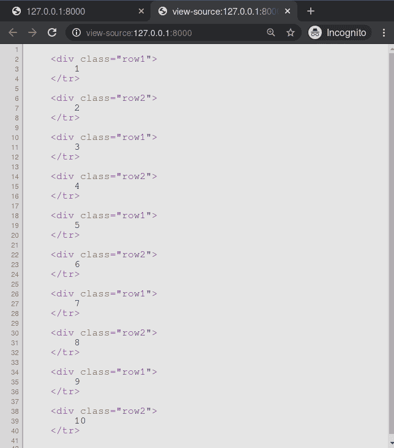

# 循环–姜戈模板标签

> 哎哎哎:# t0]https://www . geeksforgeeks . org/cycle-django 模板标签/

Django 模板是使用 Django 模板语言标记的文本文档或 Python 字符串。Django 是一个强大的包含电池的框架，为在模板中呈现数据提供了便利。Django 模板不仅允许在视图和模板之间传递数据，还提供了一些有限的编程特性，如变量、循环、注释、循环等。
本文围绕如何在模板中使用**循环标签**展开。每次遇到这个标记时，它都会生成一个参数。第一个论点产生于第一次相遇，第二个论点产生于第二次相遇，依此类推。一旦所有的参数都用完了，标签就会循环到第一个参数并再次生成它。

**语法:**

```

```

**示例:**
这个标签在循环中特别有用:

## 超文本标记语言

```

    <tr class="">
        ...
    </tr>

```

对于循环的每次迭代，第一次迭代生成引用类行 1 的 HTML，第二次迭代生成行 2，第三次迭代再次生成行 1，依此类推。

## 周期–姜戈模板标签说明

举例说明如何在姜戈模板中使用循环标签。考虑一个名为 geeksforgeeks 的项目，它有一个名为 geeks 的应用程序。

> 请参考以下文章，查看如何在 Django 中创建项目和应用程序。
> 
> *   [如何利用姜戈的 MVT 创建基础项目？](https://www.geeksforgeeks.org/how-to-create-a-basic-project-using-mvt-in-django/)
> *   [如何在姜戈创建 App？](https://www.geeksforgeeks.org/how-to-create-an-app-in-django/)

现在创建一个视图，我们将通过它传递上下文字典。

## 蟒蛇 3

```
# import Http Response from django
from django.shortcuts import render

# create a function
def geeks_view(request):
    # create a dictionary
    context = {
        "data" : [1, 2, 3, 4, 5, 6, 7, 8, 9, 10],
    }
    # return response
    return render(request, "geeks.html", context)
```

创建 url 路径以映射到此视图。在极客/URL . py 中，

## 蟒蛇 3

```
from django.urls import path

# importing views from views.py
from .views import geeks_view

urlpatterns = [
    path('', geeks_view),
]
```

在 templates/geeks.html 中创建模板，

## 超文本标记语言

```

    <div class="">
        {{ i }}
    </tr>

```

让我们检查一下“/”上显示的内容是否显示在模板中。


让我们检查相同的页面来源。



#### 高级用法

人们也可以使用变量。例如，如果您有两个模板变量，rowvalue1 和 rowvalue2，您可以像这样在它们的值之间交替:

## 超文本标记语言

```

    <tr class="">
        ...
    </tr>

```