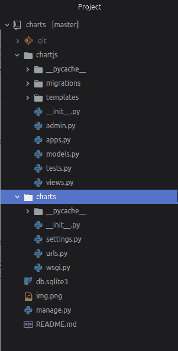
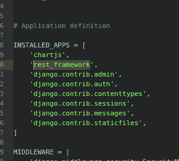
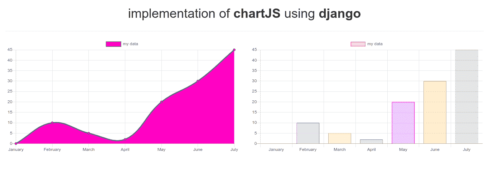

# 使用 Chartjs 和 Django 的数据可视化

> 原文:[https://www . geesforgeks . org/data-visualization-use-chart js-and-django/](https://www.geeksforgeeks.org/data-visualization-using-chartjs-and-django/)

**先决条件:** [django 安装](https://www.geeksforgeeks.org/django-introduction-and-installation/)
随着数据的增长，数据可视化在成为重要的一部分在这里我们将使用 chartjs 和 django 在我们的 web 应用程序中为我们的数据实现图表。 *Django* 是一个基于高级 Python Web 框架的 Web 框架， *chartjs* 是一个包含动画、交互式图形的简单方法。

**所需模块:**

*   **姜戈:** [安装姜戈](https://www.geeksforgeeks.org/django-introduction-and-installation/)
*   **【djanggorestframework】**

    ```
    $ pip install djangorestframework
    ```

**基本设置:**

通过以下命令启动项目–

```
$ django-admin startproject charts
```

将目录更改为图表–

```
$ cd charts
```

启动服务器-通过在终端中键入以下命令启动服务器–

```
$ python manage.py runserver
```

要检查服务器是否正在运行，请转到网络浏览器，输入 *http://127.0.0.1:8000/* 作为网址。

现在按 ctrl+C 停止服务器

**我们现在创建一个应用。**

```
$ python manage.py startapp chartjs
```

通过执行以下操作转到 chartjs/文件夹:

```
$ cd chartjs
```

并用 index.html 文件创建一个文件夹

```
$ mkdir -p templates/chartjs && cd templates/chartjs && touch index.html
```

使用文本编辑器打开项目文件夹。目录结构应该是这样的:


现在在**设置中的图表中添加 *chartjs* app 和 *rest_framework* 。
**

**编辑图表中的 urls.py 文件:**

```
from django.contrib import admin
from django.urls import path
from chartjs import views

urlpatterns = [
    path('admin/', admin.site.urls),
    path('', views.HomeView.as_view()),
    # path('test-api', views.get_data),
    path('api', views.ChartData.as_view()),
]
```

**编辑图表中的视图. py:**

```
# from django.http import JsonResponse

from django.shortcuts import render
from django.views.generic import View

from rest_framework.views import APIView
from rest_framework.response import Response

class HomeView(View):
    def get(self, request, *args, **kwargs):
        return render(request, 'chartjs/index.html')

####################################################

## if you don't want to user rest_framework

# def get_data(request, *args, **kwargs):
#
# data ={
#             "sales" : 100,
#             "person": 10000,
#     }
#
# return JsonResponse(data) # http response

#######################################################

## using rest_framework classes

class ChartData(APIView):
    authentication_classes = []
    permission_classes = []

    def get(self, request, format = None):
        labels = [
            'January',
            'February', 
            'March', 
            'April', 
            'May', 
            'June', 
            'July'
            ]
        chartLabel = "my data"
        chartdata = [0, 10, 5, 2, 20, 30, 45]
        data ={
                     "labels":labels,
                     "chartLabel":chartLabel,
                     "chartdata":chartdata,
             }
        return Response(data)
```

导航到 templates/chartjs/index.html 并编辑它。

```
<!DOCTYPE html>
<html lang="en" dir="ltr">

<head>
  <meta charset="utf-8">
  <title>chatsjs</title>
  <!-- Latest compiled and minified CSS -->
  <link rel="stylesheet" href="https://maxcdn.bootstrapcdn.com/bootstrap/3.4.1/css/bootstrap.min.css">

  <!-- jQuery library -->
  <script src="https://ajax.googleapis.com/ajax/libs/jquery/3.4.1/jquery.min.js"></script>

  <!-- Latest compiled JavaScript -->
  <script src="https://maxcdn.bootstrapcdn.com/bootstrap/3.4.1/js/bootstrap.min.js"></script>

</head>

<body class="container-fluid">
  <center class="row">
    <h1>implementation of <b>chartJS</b> using <b>django</b></h1>
  </center>
  <hr />
  <div class="row">
    <div class="col-md-6">
      <canvas id="myChartline"></canvas>
    </div>
    <div class="col-md-6">
      <canvas id="myChartBar"></canvas>
    </div>
  </div>

  <script src="https://cdn.jsdelivr.net/npm/chart.js@2.8.0"></script>

  <script>
    var endpoint = '/api';

    $.ajax({
      method: "GET",
      url: endpoint,
      success: function(data) {
        drawLineGraph(data, 'myChartline');
        drawBarGraph(data, 'myChartBar');
        console.log("drawing");
      },
      error: function(error_data) {
        console.log(error_data);
      }
    })

    function drawLineGraph(data, id) {
      var labels = data.labels;
      var chartLabel = data.chartLabel;
      var chartdata = data.chartdata;
      var ctx = document.getElementById(id).getContext('2d');
      var chart = new Chart(ctx, {
        // The type of chart we want to create
        type: 'line',

        // The data for our dataset
        data: {
          labels: labels,
          datasets: [{
            label: chartLabel,
            backgroundColor: 'rgb(255, 100, 200)',
            borderColor: 'rgb(55, 99, 132)',
            data: chartdata,
          }]
        },

        // Configuration options go here
        options: {
          scales: {
            xAxes: [{
              display: true
            }],
            yAxes: [{
              ticks: {
                beginAtZero: true
              }
            }]
          }
        }

      });
    }

    function drawBarGraph(data, id) {
      var labels = data.labels;
      var chartLabel = data.chartLabel;
      var chartdata = data.chartdata;
      var ctx = document.getElementById(id).getContext('2d');
      var myChart = new Chart(ctx, {
        type: 'bar',
        data: {
          labels: labels,
          datasets: [{
            label: chartLabel,
            data: chartdata,
            backgroundColor: [
              'rgba(255, 99, 132, 0.2)',
              'rgba(54, 162, 235, 0.2)',
              'rgba(255, 206, 86, 0.2)',
              'rgba(75, 192, 192, 0.2)',
              'rgba(153, 102, 255, 0.2)',
              'rgba(255, 159, 64, 0.2)'
            ],
            borderColor: [
              'rgba(255, 99, 132, 1)',
              'rgba(54, 162, 235, 1)',
              'rgba(255, 206, 86, 1)',
              'rgba(75, 192, 192, 1)',
              'rgba(153, 102, 255, 1)',
              'rgba(255, 159, 64, 1)'
            ],
            borderWidth: 1
          }]
        },
        options: {
          scales: {
            yAxes: [{
              ticks: {
                beginAtZero: true
              }
            }]
          }
        }
      });
    }
  </script>
</body>

</html>
```

**进行迁移并迁移:**

```
$ python manage.py makemigrations
$ python manage.py migrate

```

**现在你可以运行服务器查看你的应用:**

```
$ python manage.py runserver
```

[](https://github.com/itsvinayak/chartJS-django)