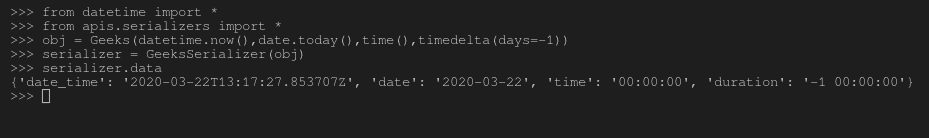
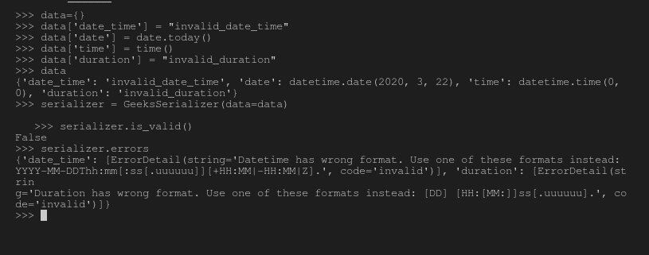

# 序列化程序中的日期和时间字段–姜戈 REST 框架

> 原文:[https://www . geesforgeks . org/date-and-time-field-in-serializer-django-rest-framework/](https://www.geeksforgeeks.org/date-and-time-fields-in-serializers-django-rest-framework/)

在 Django REST 框架中，序列化的概念就是将数据库数据转换成 javascript 可以使用的数据类型。每个序列化程序都带有一些将要被处理的字段(条目)。例如，如果您有一个名为 Employee 的类，其字段为 Employee_id、Employee_name、日期等。然后，您将需要自动字段、字符字段和日期字段来通过 Django 存储和操作数据。类似地，序列化程序也以相同的原理工作，并且具有用于创建序列化程序的字段。
本文围绕 Django REST 框架中序列化器中的日期和时间字段展开。有四个主要字段–日期时间字段、日期字段、时间字段和工期字段。

#### 日期时间字段

DateTimeField 是用于日期和时间表示的序列化程序字段。它与–[日期时间字段–姜戈模型](https://www.geeksforgeeks.org/datetimefield-django-models/)
相同，它有以下参数–

*   **格式**–表示输出格式的字符串。如果未指定，这将默认为与 DATETIME_FORMAT 设置键相同的值，除非设置为“iso-8601”。设置为格式字符串表示 to _ expression 返回值应该强制为字符串输出。格式字符串描述如下。将该值设置为“无”表示 Python 日期时间对象应该由 to _ representation 返回。在这种情况下，日期时间编码将由渲染器决定。
*   **输入格式**–表示可用于解析日期的输入格式的字符串列表。如果未指定，将使用 DATETIME_INPUT_FORMATS 设置，默认为['iso-8601']。
*   **default _ time zone**–表示时区的 pytz.timezone。如果未指定并且启用了“使用 TZ”设置，则默认为当前时区。如果禁用了 USE_TZ，那么日期时间对象将是幼稚的。

**语法–**

```py
field_name = serializers.DateTimeField(*args, **kwargs)
```

#### 戴达菲尔德

日期字段是用于日期表示的序列化程序字段。通常，人们需要存储日期，例如在博客模型中，每个帖子的日期都需要存储。此字段与[日期字段相同–姜戈模型](https://www.geeksforgeeks.org/datefield-django-models/)
它有以下参数–

*   **格式**–表示输出格式的字符串。如果未指定，这将默认为与 DATE_FORMAT 设置键相同的值，除非设置为“iso-8601”。设置为格式字符串表示 to _ expression 返回值应该强制为字符串输出。格式字符串描述如下。将该值设置为“无”表示 Python 日期对象应该由 to _ representation 返回。在这种情况下，日期编码将由渲染器决定。
*   **输入格式**–表示可用于解析日期的输入格式的字符串列表。如果未指定，将使用 DATE _ INPUT _ FORMATS 设置，默认为['iso-8601']。

**语法–**

```py
field_name = serializers.DateField(*args, **kwargs)
```

#### 时间字段

Timefield 是用于时间表示的序列化程序字段。通常，人们需要存储日期，例如在博客模型中，每个帖子的时间都需要存储。
它有以下参数–

*   **格式**–表示输出格式的字符串。如果未指定，这将默认为与 TIME_FORMAT 设置键相同的值，除非设置为“iso-8601”。设置为格式字符串表示 to _ expression 返回值应该强制为字符串输出。格式字符串描述如下。将该值设置为“无”表示 Python 时间对象应该由 to _ representation 返回。在这种情况下，时间编码将由渲染器决定。
*   **输入格式**–表示可用于解析日期的输入格式的字符串列表。如果未指定，将使用时间 _ 输入 _ 格式设置，默认为['iso-8601']。

**语法–**

```py
field_name = serializers.TimeField(*args, **kwargs)
```

#### 工期字段

持续时间字段是用于持续时间表示的序列化程序字段。该字段与[持续时间字段-姜戈模型](https://www.geeksforgeeks.org/durationfield-django-models/)
相同，它有以下参数–

*   **最大值**验证提供的持续时间不大于该值。
*   **min_value** 验证提供的持续时间不小于该值。

**语法–**

```py
field_name = serializers.DurationField(*args, **kwargs)
```

#### 如何在序列化程序中使用日期和时间字段？

为了解释日期和时间字段的用法，让我们从–[开始使用相同的项目设置如何使用 Django Rest 框架创建一个基本的 API？](https://geeksforgeeks.org/how-to-create-a-basic-api-using-django-rest-framework/)。
现在您的项目中有了一个名为序列化程序的文件，让我们创建一个包含日期时间字段、日期字段、时间字段和工期字段的序列化程序。

## 蟒蛇 3

```py
# import serializer from rest_framework
from rest_framework import serializers

class Geeks(object):
    def __init__(self, date_time, date, time, duration):
        self.date_time = date_time
        self.date = date
        self.time = time
        self.duration = duration

# create a serializer
class GeeksSerializer(serializers.Serializer):
    # initialize fields
    date_time = serializers.DateTimeField()
    date = serializers.DateField()
    time = serializers.TimeField()
    duration = serializers.DurationField()
```

现在让我们创建一些对象，并尝试序列化它们，检查它们是否真的在工作，运行，–

```py
Python manage.py shell
```

现在，在 shell 中运行以下 python 命令

```py
# import everything from datetime
>>> from datetime import *

# import everything from serializers
>>> from apis.serializers import *

# create a object of type Geeks
>>> obj = Geeks(datetime.now(), date.today(), time(), timedelta(days=-1))

# serialize the object
>>> serializer = GeeksSerializer(obj)

# print serialized data
>>> serializer.data
{'date_time': '2020-03-22T13:17:27.853707Z',
 'date': '2020-03-22', 'time': '00:00:00', 
 'duration': '-1 00:00:00'}
```

这是终端上所有这些操作的输出–



#### 日期和时间字段的验证

请注意，这些字段的主要座右铭是传递验证，例如 DateField 只验证到目前为止的数据。让我们检查这些验证是否有效–

```py
# Create a dictionary and add invalid values
>>> data={}
>>> data['date_time'] = "invalid_date_time"
>>> data['date'] = date.today()
>>> data['time'] = time()
>>> data['duration'] = "invalid_duration"

# dictionary created
>>> data
{'date_time': 'invalid_date_time', 
'date': datetime.date(2020, 3, 22),
'time': datetime.time(0, 0), 
'duration': 'invalid_duration'}

# deserialize the data
>>> serializer = GeeksSerializer(data=data)

# check if data is valid
>>> serializer.is_valid()
False

# check the errors
>>> serializer.errors
{'date_time': [ErrorDetail(string='Datetime has wrong format. Use one of these formats instead: YYYY-MM-DDThh:mm[:ss[.uuuuuu]][+HH:MM|-HH:MM|Z].', code='invalid')], 'duration': [ErrorDetail(strin
g='Duration has wrong format. Use one of these formats instead: [DD] [HH:[MM:]]ss[.uuuuuu].', code='invalid')]}
```

以下是这些命令的输出，它清楚地显示日期时间和持续时间无效–



#### 高级概念

验证是反序列化的一部分，不是序列化的一部分。如前所述，序列化是将已经生成的数据转换成另一种数据类型的过程，因此不需要这些默认的验证。反序列化需要验证，因为数据需要保存到数据库或指定的任何其他操作。所以如果你使用这些字段序列化数据。

## 序列化程序字段中的核心参数

<figure class="table">

| 争吵 | 描述 |
| --- | --- |
| [只读](https://www.geeksforgeeks.org/core-arguments-in-serializer-fields-django-rest-framework/#read_only) | 将该值设置为 True 以确保在序列化表示时使用该字段，但在反序列化期间创建或更新实例时不使用该字段 |
| [只写 _ 条](https://www.geeksforgeeks.org/core-arguments-in-serializer-fields-django-rest-framework/#write_only) | 将此设置为“真”，以确保该字段可以在更新或创建实例时使用，但在序列化表示时不包括在内。 |
| [必需](https://www.geeksforgeeks.org/core-arguments-in-serializer-fields-django-rest-framework/#required) | 将此设置为 False 还允许在序列化实例时从输出中省略对象属性或字典键。 |
| [默认](https://www.geeksforgeeks.org/core-arguments-in-serializer-fields-django-rest-framework/#default) | 如果设置，这将给出默认值，如果未提供输入值，该默认值将用于该字段。 |
| [允许 _ 空](https://www.geeksforgeeks.org/core-arguments-in-serializer-fields-django-rest-framework/#allow_null) | 通常情况下，如果将“无”传递给序列化程序字段，将会引发错误。如果“无”应被视为有效值，则将此关键字参数设置为“真”。 |
| [来源](https://www.geeksforgeeks.org/core-arguments-in-serializer-fields-django-rest-framework/#source) | 将用于填充字段的属性的名称。 |
| [验证器](https://www.geeksforgeeks.org/core-arguments-in-serializer-fields-django-rest-framework/#validators) | 应该应用于输入字段输入的验证函数列表，这些函数要么引发验证错误，要么简单地返回。 |
| [错误信息](https://www.geeksforgeeks.org/core-arguments-in-serializer-fields-django-rest-framework/#error_messages) | 错误信息的错误代码字典。 |
| 标签 | 一个短文本字符串，可用作 HTML 表单字段或其他描述性元素中的字段名称。 |
| [帮助 _ 文字](https://www.geeksforgeeks.org/core-arguments-in-serializer-fields-django-rest-framework/#help_text) | 一个文本字符串，可用作 HTML 表单字段或其他描述性元素中字段的描述。 |
| [初始](https://www.geeksforgeeks.org/core-arguments-in-serializer-fields-django-rest-framework/#initial) | 应该用于预先填充 HTML 表单字段值的值。 |

</figure>