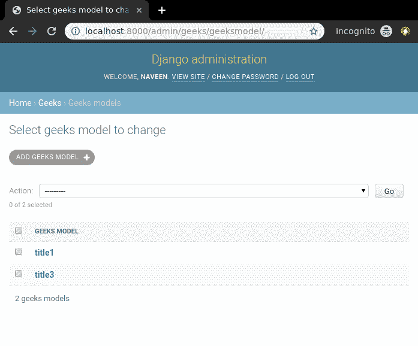

# 删除视图–基于功能的视图姜戈

> 原文:[https://www . geesforgeks . org/delete-view-function-based-view-django/](https://www.geeksforgeeks.org/delete-view-function-based-views-django/)

删除视图是指从数据库中删除表的特定实例的视图(逻辑)。它用于删除数据库中的条目，例如，删除 geeksforgeeks 上的一篇文章。因此，删除视图必须向用户显示确认消息，并且应该自动删除实例。Django 为删除视图提供了非常普通的支持，但是让我们通过一个基于函数的视图来检查它是如何手动完成的。本文围绕删除视图展开，涉及到[姜戈表单](https://www.geeksforgeeks.org/django-forms/)、[姜戈模型](https://www.geeksforgeeks.org/django-models/)等概念。

对于删除视图，我们需要一个带有一些模型和多个实例的项目，我们可以用它来删除。

## 姜戈删除视图–基于函数的视图

使用示例说明**如何创建和使用删除视图**。考虑一个名为 geeksforgeeks 的项目，它有一个名为 geeks 的应用程序。

> 请参考以下文章，查看如何在 Django 中创建项目和应用程序。
> 
> *   [如何利用姜戈的 MVT 创建基础项目？](https://www.geeksforgeeks.org/how-to-create-a-basic-project-using-mvt-in-django/)
> *   [如何在姜戈创建 App？](https://www.geeksforgeeks.org/how-to-create-an-app-in-django/)

在你有一个项目和一个应用程序后，让我们创建一个模型，我们将通过我们的视图创建实例。极客/模特。py，

## 蟒蛇 3

```
# import the standard Django Model
# from built-in library
from django.db import models

# declare a new model with a name "GeeksModel"
class GeeksModel(models.Model):

    # fields of the model
    title = models.CharField(max_length = 200)
    description = models.TextField()

    # renames the instances of the model
    # with their title name
    def __str__(self):
        return self.title
```

创建这个模型后，我们需要运行两个命令来为其创建数据库。

```
Python manage.py makemigrations
Python manage.py migrate
```

现在让我们使用 shell 创建这个模型的一些实例，运行 form bash，

```
Python manage.py shell
```

输入以下命令

```
>>> from geeks.models import GeeksModel
>>> GeeksModel.objects.create(
                       title="title1",
                       description="description1").save()
>>> GeeksModel.objects.create(
                       title="title2",
                       description="description2").save()
>>> GeeksModel.objects.create(
                       title="title2",
                       description="description2").save()
```

现在我们已经为后端做好了一切准备。验证实例是否已从[http://localhost:8000/admin/geeks/geeks model/](http://localhost:8000/admin/geeks/geeksmodel/)创建


现在让我们先创建我们的删除视图，在极客/视图中

## 蟒蛇 3

```
from django.shortcuts import (get_object_or_404,
                              render,
                              HttpResponseRedirect)

from .models import GeeksModel

# delete view for details
def delete_view(request, id):
    # dictionary for initial data with
    # field names as keys
    context ={}

    # fetch the object related to passed id
    obj = get_object_or_404(GeeksModel, id = id)

    if request.method =="POST":
        # delete object
        obj.delete()
        # after deleting redirect to
        # home page
        return HttpResponseRedirect("/")

    return render(request, "delete_view.html", context)
```

现在一个 url 映射到这个视图，带有一个正则表达式 id，在 geeks/urls.py 中为

## 蟒蛇 3

```
from django.urls import path

# importing views from views..py
from .views import delete_view
urlpatterns = [
    path('<id>/delete', delete_view ),
]
```

删除视图模板包括一个确认用户是否要删除实例的简单表单。在极客/模板/delete_view.html 中，

## 超文本标记语言

```
<div class="main">
    <!-- Create a Form -->
    <form method="POST">
        <!-- Security token by Django -->
        
        Are you want to delete this item ?
        <input type="submit" value="Yes" />
        <a href="/">Cancel </a>
    </form>
</div>
```

一切准备就绪，现在让我们检查它是否工作，访问[http://localhost:8000/2/delete](http://localhost:8000/2/delete)


让我们检查实例是否已被删除，



使用 **obj.delete()** 函数，可以根据需要以任何方式实现该视图。