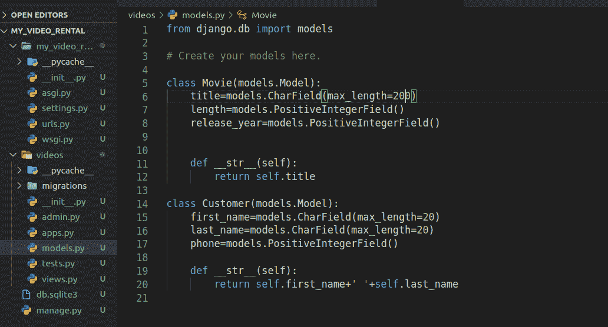
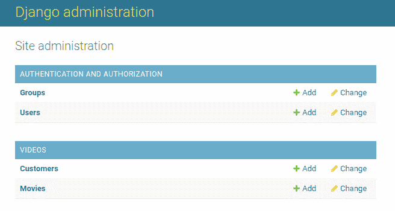
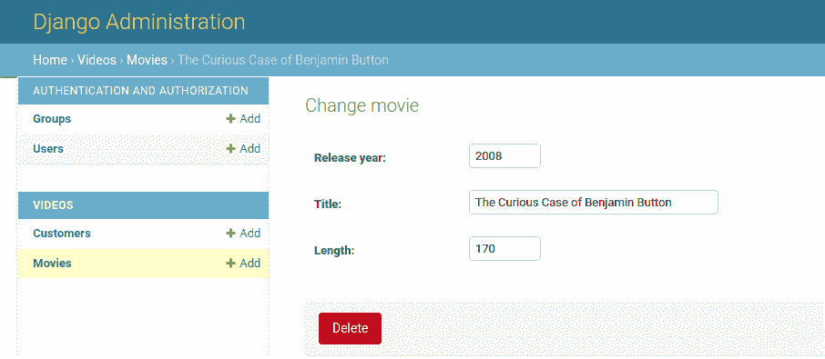
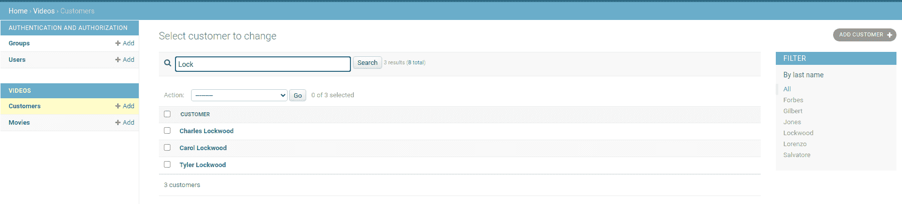
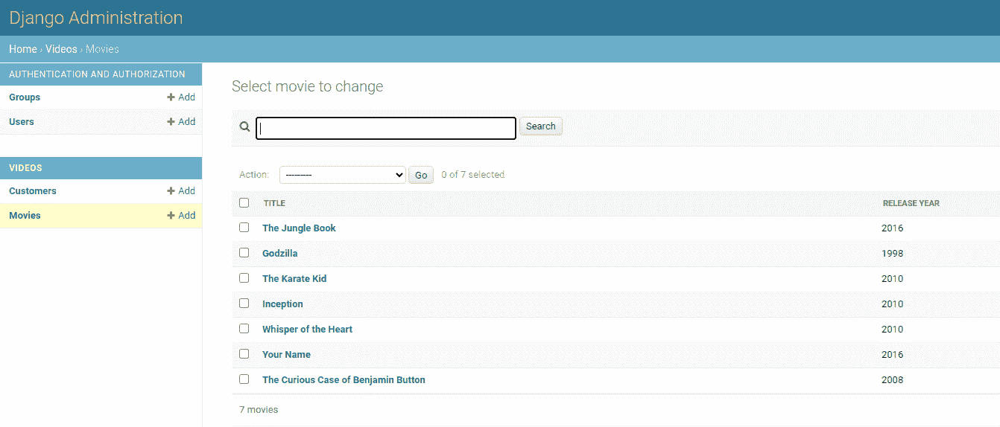
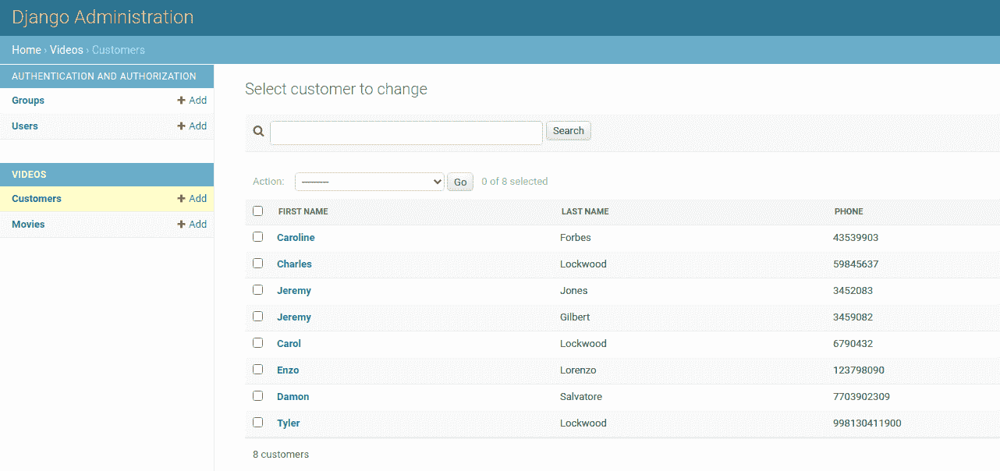
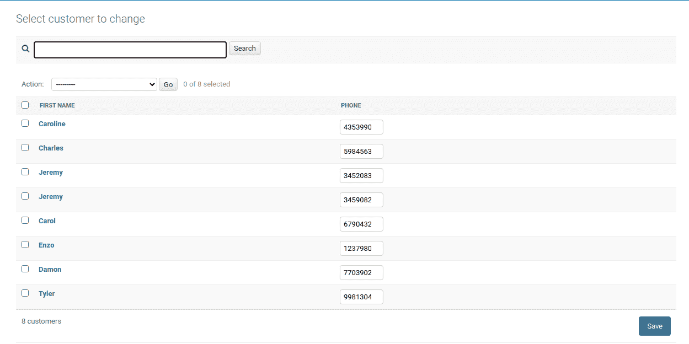
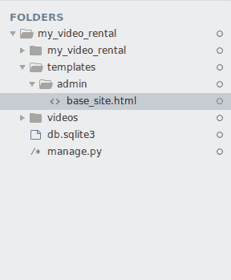
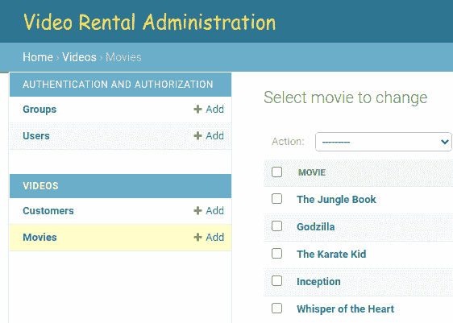

# 姜戈管理-重新设计和定制

> 原文:[https://www . geesforgeks . org/django-admin-重新设计和定制/](https://www.geeksforgeeks.org/django-admin-redesign-and-customization/)

通常默认的 Django 管理页面很棒，这是我们项目所需要的，但有时我们可能想扩展默认管理界面的功能。我们在 Django 有很多工具可以根据自己的需要进行定制，在本文中，我们将学习如何定制管理界面并添加多个功能:

让我们设置您的项目，将模型添加到模型中。复制并注册您的模型。



models.py

运行以下命令–

```
Python manage.py makemigrations
Python manage.py migrate
```

现在我们已经创建了以下模型，下面是它们在管理面板中的样子–



默认 Django 管理员

## 姜戈管理-重新设计和定制

让我们来看看如何在 Django 管理面板中添加多个功能。以下是定制列表–

### **1。更改字段顺序**T3

默认情况下，管理员将按照模型中定义的顺序在详细视图中显示字段。但是我们可以通过对 admin.py 文件进行一些编辑来改变这一点，而无需转到 models.py 并更改不同字段的顺序。

```
<u>Movie model:</u>
title
length
release_year
```

```
title=['release_year', 'title', 'length']
```

```
<u>Movie_Model:</u>
release_year
title
length
```

**admin.py**

## 计算机编程语言

```
from django.contrib import admin
from .models import Movie, Customer

class MovieAdmin(admin.ModelAdmin):
    title = ['release_year', 'title', 'length']

admin.site.register(Movie, MovieAdmin)
admin.site.register(Customer)
```



字段顺序已更改

### **2。添加搜索和过滤器**

目前，我们的模型中只有几个条目，但是如果条目由于用户数量增加而增加到数百或数千呢？如果我们通过查看每个条目来获取特定条目的数据，这将变得乏味。因此，我们需要添加一个搜索栏或一个过滤器功能，以允许条目被轻松访问。

```
Search by the following elements:
search_fields = ['title', 'length', 'release_year']
search_fields = ['first_name', 'last_name', 'phone']
```

```
Filter by the following elements:
list_filter = ['release_year']
list_filter = ['last_name']
```

**app_folder / admin.py**

## 计算机编程语言

```
from django.contrib import admin
from .models import Movie, Customer

class MovieAdmin(admin.ModelAdmin):
    # Let you to search with title name, release year and length of duration of movie
    search_fields = ['title', 'length', 'release_year']
    # There will be a filter on release year
    list_filter = ['release_year']

class CustomerAdmin(admin.ModelAdmin):
    # Let you to search with first name, last name and phone number of the customer
    search_fields = ['first_name', 'last_name', 'phone']
    # There will be a filter on last name
    list_filter = ['last_name']

admin.site.register(Movie, MovieAdmin)
admin.site.register(Customer, CustomerAdmin)
```


显示过滤和搜索的电影模型



显示搜索和筛选的客户模型

### **3。查看附加字段**

在管理界面中，我们通常在列表视图中只看到模型的一个字段。我们可以使用 list_display 添加更多字段来查看。

```
list_display=['title', 'release_year']
list_display=['first_name', 'last_name', 'phone']
```

**admin.py**

## 计算机编程语言

```
from django.contrib import admin
from .models import Movie, Customer

class MovieAdmin(admin.ModelAdmin):
  list_display =['title', 'release_year']

class customerAdmin(admin.ModelAdmin):
  list_display =['first_name', 'last_name', 'phone']

admin.site.register(Movie, MovieAdmin)
admin.site.register(Customer, CustomerAdmin)
```



电影模型中的标题和发行年份字段



客户模型中的名字、姓氏和电话号码字段

### **4。编辑列表视图**

您可以添加直接从列表视图编辑属性值的功能，而不是转到详细视图

```
editable_list = ['phone']
```

**admin.py**

## 计算机编程语言

```
from django.contrib import admin
from .models import Movie, Customer

class CustomerAdmin(admin.ModelAdmin):
    editable_list = ['phone']

admin.site.register(Movie)
admin.site.register(Customer, CustomerAdmin)
```



电话号码可在客户类中编辑

### **5。管理模板**

有时，您可能想要更改管理界面的布局和用户界面，为此您需要将自己的模板添加到项目中，然后将模板反映到您的 django 管理界面中。

在根文件夹中创建一个文件夹模板，并在其中创建另一个文件夹管理。现在在管理文件夹中添加你的 html 文件。



模板—->管理—->base_site.html

## 超文本标记语言

```


{{ subtitle }} | {{ title }} | {{ site_title|default:_('Django site admin') }}


<h1 id="site-name" style="font-family: cursive;" ><a href="">Video Rental Administration</a></h1>



```



标题已更改

这里，由于添加了 html 文件，管理界面中的标题发生了变化。有时模板不会应用于界面，为了避免这种情况，请确保在 settings.py 文件中进行了正确的模板配置。

```
import os

TEMPLATES=[

'DIRS': [os.path.join(BASE_DIR, 'templates')],

]
```

这就是你如何根据你的需求在姜戈定制管理模板。