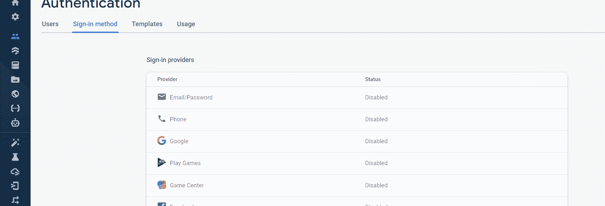
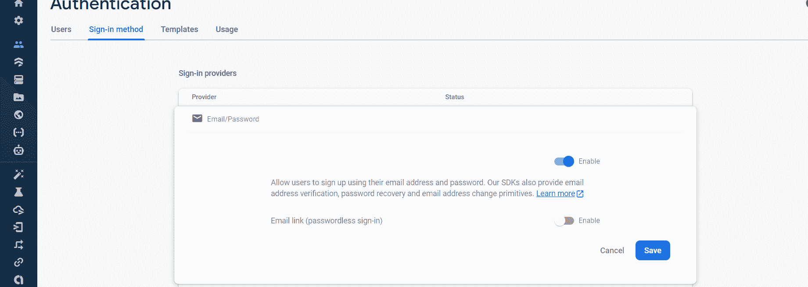
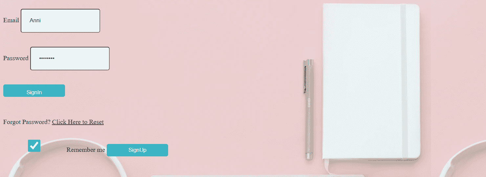
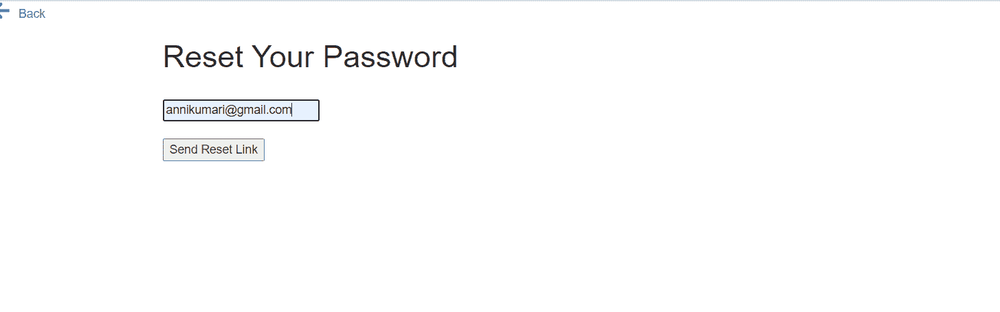
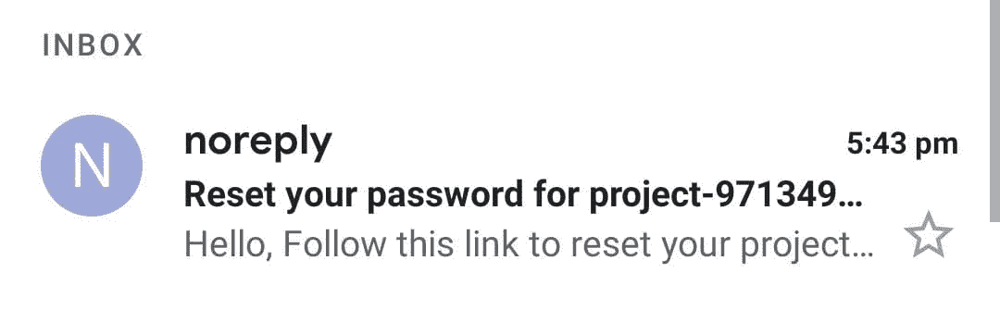
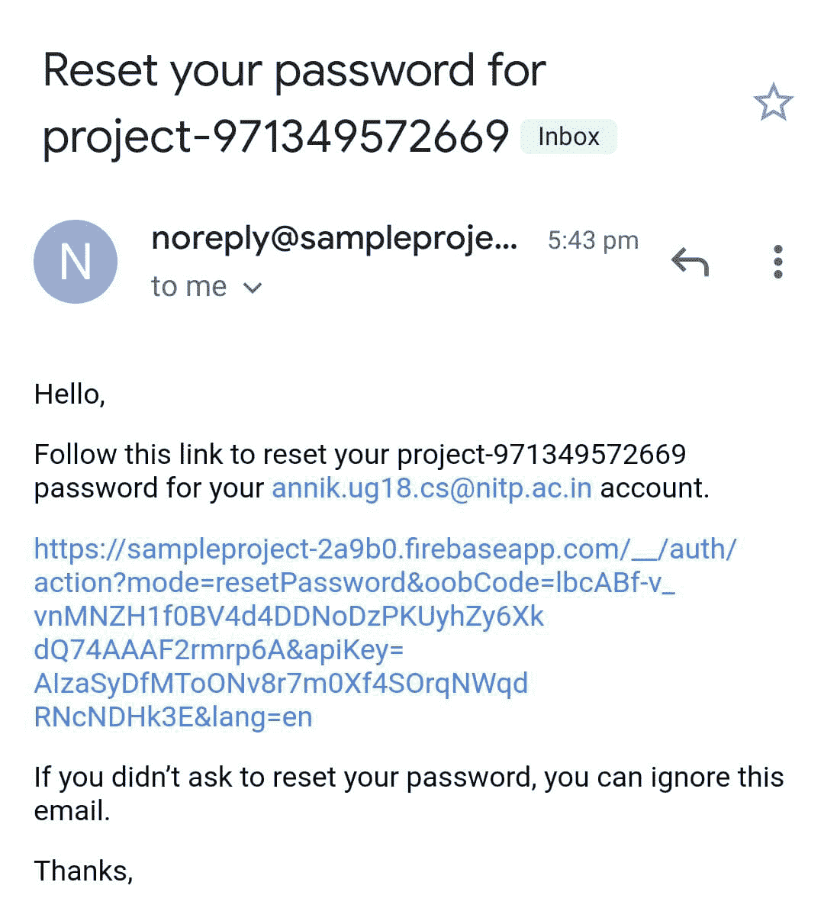
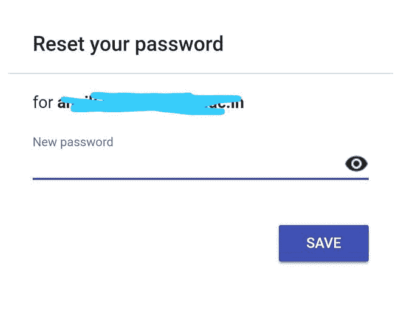
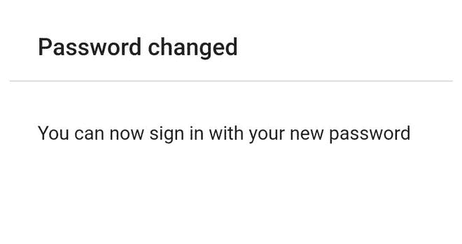

# 带 Firebase 的 Django 认证项目

> 原文:[https://www . geesforgeks . org/django-authentication-project-with-firebase/](https://www.geeksforgeeks.org/django-authentication-project-with-firebase/)

Django 是一个基于 Python 的网络框架，允许您快速创建高效的网络应用程序..当我们构建任何网站时，我们都需要一组组件:如何处理用户身份验证(注册、登录、注销)，管理我们网站的管理面板，如何上传文件等。Django 为我们提供了易于使用的现成组件。

> 如果您是 Django 的新手，那么您可以参考 [Django 介绍和安装](https://www.geeksforgeeks.org/django-introduction-and-installation/?ref=lbp)。
> 
> 要查看如何使用 django 和 firebase 创建新项目，请查看–[如何使用 Firebase 数据库在 Django 创建新项目？](https://www.geeksforgeeks.org/how-to-create-a-new-project-in-django-using-firebase-database/)

在这里，我们将学习如何使用 Firebase 作为数据库在 Django 创建登录和注册。在 Firebase 身份验证中，我们需要启用登录方法

### 授予对 Firebase 仪表板的权限–

**第一步:**前往**认证- >登录方式- >邮箱/密码。**



**第二步:**启用**邮件/密码**并点击**保存**。



现在，我希望你已经在姜戈创建了一个项目。如果没有，那么参考[如何在姜戈](https://www.geeksforgeeks.org/how-to-create-a-basic-project-using-mvt-in-django/?ref=lbp)使用 MVT 创建一个基础项目？

### 创建姜戈认证项目–

创建网址，将请求映射到*网址中*

## 蟒蛇 3

```
from django.contrib import admin
from django.urls import path
from . import views

urlpatterns = [
    path('admin/', admin.site.urls),
    # Here we are assigning the path of our url
    path('', views.signIn),
    path('postsignIn/', views.postsignIn),
    path('signUp/', views.signUp, name="signup"),
    path('logout/', views.logout, name="log"),
    path('postsignUp/', views.postsignUp),
]
```

**视图. py**

在这里，我们将使用我们的 firebase 凭据进行身份验证。

## 蟒蛇 3

```
from django.shortcuts import render
import pyrebase

config={
    apiKey: "Use Your Api Key Here",
    authDomain: "Use Your authDomain Here",
    databaseURL: "Use Your databaseURL Here",
    projectId: "Use Your projectId Here",
    storageBucket: "Use Your storageBucket Here",
    messagingSenderId: "Use Your messagingSenderId Here",
    appId: "Use Your appId Here"
}
# Initialising database,auth and firebase for further use
firebase=pyrebase.initialize_app(config)
authe = firebase.auth()
database=firebase.database()

def signIn(request):
    return render(request,"Login.html")
def home(request):
    return render(request,"Home.html")

def postsignIn(request):
    email=request.POST.get('email')
    pasw=request.POST.get('pass')
    try:
        # if there is no error then signin the user with given email and password
        user=authe.sign_in_with_email_and_password(email,pasw)
    except:
        message="Invalid Credentials!!Please ChecK your Data"
        return render(request,"Login.html",{"message":message})
    session_id=user['idToken']
    request.session['uid']=str(session_id)
    return render(request,"Home.html",{"email":email})

def logout(request):
    try:
        del request.session['uid']
    except:
        pass
    return render(request,"Login.html")

def signUp(request):
    return render(request,"Registration.html")

def postsignUp(request):
     email = request.POST.get('email')
     passs = request.POST.get('pass')
     name = request.POST.get('name')
     try:
        # creating a user with the given email and password
        user=authe.create_user_with_email_and_password(email,passs)
        uid = user['localId']
        idtoken = request.session['uid']
        print(uid)
     except:
        return render(request, "Registration.html")
     return render(request,"Login.html")
```

登录. html

## 超文本标记语言

```

<script>
    alert('{{ message }}');
</script>

<!DOCTYPE html>
<html lang="en">
<head>
    <meta charset="UTF-8">
    <title>Sign In</title>
    <style>
     body{
            background-image: url(https://images.unsplash.com/photo-1493723843671-1d655e66ac1c?ixlib=rb-1.2.1&ixid=eyJhcHBfaWQiOjEyMDd9&auto=format&fit=crop&w=1050&q=80);
        }
         input{
            margin-top:20px;
            height: 30px;
             padding: 12px 20px;
             width: 150px;
             margin: 8px 0;
            border-radius: 5px;
        }
        input[type="submit"]{
            background-color: rgba(7, 179, 185, 0.753);
            color: rgb(255, 255, 255);
            border: none;
            border-radius: 5px;
        }
        button{
            background-color: rgba(7, 179, 185, 0.753);
            color: white;
            width: 150px;
            height: 30px;
            border: none;
            border-radius: 5px;
        }
    </style>
</head>
<body>

<form action="/postsignIn/" method="post">
    
    <br/>
   <!-- Enter Your Email: -->
    <label for="Email">Email</label>
    <input type="email"id="Email" name="email"><br><br>
   <!-- Enter Your Password: -->
    <label for="Password">Password</label>
    <input type="password" id="Password" name="pass"><br><br>
    <input type="submit" value="SignIn"><br><br>
    <label>
      <input type="checkbox" checked="checked" name="remember"> Remember me
    </label>
    <button type="button" onclick="location.href=' '">SignUp</button>
</form>
</body>
</html>
```

**Registration.html**

## 超文本标记语言

```
<!DOCTYPE html>
<html lang="en">
<head>
    <meta charset="UTF-8">
    <title>Sign Up</title>
    <style>
     body{
            background-image: url(https://images.unsplash.com/photo-1493723843671-1d655e66ac1c?ixlib=rb-1.2.1&ixid=eyJhcHBfaWQiOjEyMDd9&auto=format&fit=crop&w=1050&q=80);
        }
        input{
            margin-top:20px;
            height: 30px;
            width: 150px;
            border-radius: 5px;

        }
        input[type="submit"]{
            background-color: rgba(7, 179, 185, 0.753);
            color: rgb(255, 255, 255);
            border: none;
            border-radius: 5px;
        }

    </style>
</head>
<body>

<form action="/postsignUp/" method="post">
    
    <br/>
      <h1>Sign Up</h1>

<p>Please fill in this form</p>

    <label for="username">Username</label>
    <input type="name" id="Username" name="name" placeholder="Your Name"><br><br>
    <!-- Email: -->
    <label for="Email" >Email</label>
    <input type="email" id="Email" name="email" placeholder="Your Email Id"><br><br>
    <!-- Password: -->
    <label for="Password">Password/label>
    <input type="password" id="Password" name="pass" placeholder="Password"><br><br>
    <!-- RepeatPassword: -->
    <label for="confirm_password">Confirm Password</label>
    <input type="password" id="confirm_password" name="pass-repeat" placeholder=" Repeat Password"><br><br>
    <label>
      <input type="checkbox" checked="checked" name="remember" style="margin-bottom:15px"> Remember me
    </label>

    <input type="submit" value="SignUp"><br><br>

</form>
</body>
</html>
```

**Home.html**

## 超文本标记语言

```
<!DOCTYPE html>
<html lang="en">
<head>
    <meta charset="UTF-8">
    <title>Welcome</title>
    <style>
        body{
            background-image: url(https://images.unsplash.com/photo-1493723843671-1d655e66ac1c?ixlib=rb-1.2.1&ixid=eyJhcHBfaWQiOjEyMDd9&auto=format&fit=crop&w=1050&q=80);
        }
        div{
        position:absolute;
        right:10px;
        top:5px;
        }
        p{
            font-size: 32px;
        }
        button{
            background-color: rgba(7, 179, 185, 0.753);
            color: white;
            width: 70px;
            height: 40px;
            border: none;
            border-radius: 5px;
        }
    </style>
</head>
<body>
<br><br>
<div>
<button type="button" onclick="location.href='' ">Logout</button>
</div>
</body>
</html>
```

现在转到您的项目目录，并使用给定的命令运行我们的项目:

```
python manage.py runserver
```

**登录页面**


**注册页面**


**首页**


### 实施重置密码功能–

在这里，我们将学习如何在姜戈重置密码与数据库作为 Firebase。像大多数时候一样，你会忘记密码，想要重设密码。因此，在本文中，我们将学习如何在姜戈做到这一点。

・T 0️ Urls.py ・T 1️

## 蟒蛇 3

```
path('reset/', views.reset),
path('postReset/', views.postReset),
```

**视图. py**

在这里，我们基本上是渲染到 Reset.html 页面，用户将输入他/她的注册电子邮件 id，并将获得一封重置密码的电子邮件。**send _ password _ reset _ email**是 firebase 预定义的重置密码的方法。

## 蟒蛇 3

```
def reset(request):
    return render(request, "Reset.html")

def postReset(request):
    email = request.POST.get('email')
    try:
        authe.send_password_reset_email(email)
        message  = "A email to reset password is successfully sent"
        return render(request, "Reset.html", {"msg":message})
    except:
        message  = "Something went wrong, Please check the email you provided is registered or not"
        return render(request, "Reset.html", {"msg":message})
```

登录. html

## 超文本标记语言

```

<script>
    alert('{{ message }}');
</script>

<!DOCTYPE html>
<html lang="en">
<head>
    <meta charset="UTF-8">
    <title>Sign In</title>
    <style>
     body{
            background-image: url(https://images.unsplash.com/photo-1493723843671-1d655e66ac1c?ixlib=rb-1.2.1&ixid=eyJhcHBfaWQiOjEyMDd9&auto=format&fit=crop&w=1050&q=80);
        }
         input{
            margin-top:20px;
            height: 30px;
             padding: 12px 20px;
             width: 150px;
             margin: 8px 0;
            border-radius: 5px;
        }
        input[type="submit"]{
            background-color: rgba(7, 179, 185, 0.753);
            color: rgb(255, 255, 255);
            border: none;
            border-radius: 5px;
        }
        button{
            background-color: rgba(7, 179, 185, 0.753);
            color: white;
            width: 150px;
            height: 30px;
            border: none;
            border-radius: 5px;
        }
    </style>
</head>
<body>

<form action="/postsignIn/" method="post">
    
    <br/>
   <!-- Enter Your Email: -->
    <label for="Email">Email</label>
    <input type="email"id="Email" name="email"><br><br>
   <!-- Enter Your Password: -->
    <label for="Password">Password</label>
    <input type="password" id="Password" name="pass"><br><br>
    <input type="submit" value="SignIn"><br><br>
    <p style="color: black;padding: 10px 0;">Forgot Password? <a href="/reset/" style="color: black;">Click Here to Reset</a></p>

    <label>
      <input type="checkbox" checked="checked" name="remember"> Remember me
    </label>
    <button type="button" onclick="location.href=' '">SignUp</button>
</form>
</body>
</html>
```

**Reset.html**

## 超文本标记语言

```
<!DOCTYPE html>


    <script>
        window.alert('{{msg}}');
    </script>

<html lang="en">
<head>
    <meta charset="UTF-8">
    <meta name="viewport" content="width=device-width, initial-scale=1.0">
    <title>Document</title>
    <link rel="stylesheet" href="">
    <link rel="stylesheet" type="text/css" href="">
    <link rel="stylesheet" href="https://cdnjs.cloudflare.com/ajax/libs/font-awesome/4.7.0/css/font-awesome.min.css">
    <link rel="stylesheet" href="https://www.w3schools.com/w3css/4/w3.css">
    <link rel="stylesheet" href="https://maxcdn.bootstrapcdn.com/bootstrap/3.3.6/css/bootstrap.min.css">
    <script src='https://kit.fontawesome.com/a076d05399.js'></script>
</head>
<body>
    <div class="back">
        <a href="/"><i class='fas fa-arrow-left' style='font-size:22px'>  </i>Back</a>
    </div>
    <div class="container">
        <div class="inner">
            <h1>Reset Your Password</h1><br>
            <form action="/postReset/" method="POST">
                
                <input type="email" name="email" id="email" placeholder="Enter Your email" required><br><br>
                <input type="submit" value="Send Reset Link">
            </form>
        </div>
    </div>
</body>
</html>
```

现在转到您的项目目录，并使用给定的命令运行我们的项目:

```
python manage.py runserver
```

点击**点击这里重置**，然后你会被重定向到另一个页面。



输入您的电子邮件并点击**发送重置链接**，然后您将在您的电子邮件上获得一个更改密码的链接。



将出现一个警告框，确认邮件已发送。


现在，你会收到这样一封邮件

。点击查看邮件的**描述**。



在这里，点击给定的**链接**更改您的密码。



在这里，输入新密码，点击**保存**。



现在，您可以使用您的**新密码登录。**

