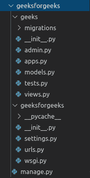

# 姜戈基础应用模型–进行迁移和迁移

> 原文:[https://www . geesforgeks . org/django-basic-app-model-make migrations-and-migration/](https://www.geeksforgeeks.org/django-basic-app-model-makemigrations-and-migrate/)

在本文中，我们将创建一个应用程序的基本模型。比方说，我们有一个项目 **geeksforgeeks** ，在这个项目中，我们将创建一个新的应用程序，以简化和制造独立的模型单元。

要通过终端创建应用程序运行命令:

```py
python manage.py startapp geeks
```

并将极客添加到`settings.py`中的 INSTALLED_APPS 列表中。现在应用程序的目录结构将是，



现在转到极客应用中的`models.py` ，这里我们将创建我们的第一个模型。要创建模型，您需要首先从 `django.db.models`库中导入模型。

现在 models.py 看起来像，

```py
# importing Model from django
from django.db.models import Model
```

根据[姜戈文档](https://docs.djangoproject.com/en/2.2/topics/db/models/)，模型是关于你的数据的单一的、确定的信息来源。它包含您存储的数据的基本字段和行为。通常，每个模型映射到一个数据库表。

Django 提供了许多预定义的字段和方法来创建模型。要创建模型，您需要首先指定模型名称。

将以下代码输入`models.py`

```py
from django.db import models
from django.db.models import Model
# Created an empty model 
class GeeksModel(Model):
    pass
```

类似的语法总是用于创建模型。
在对任何应用程序的模型文件进行任何更改后，您需要从终端运行以下命令

```py
 Python manage.py makemigrations
```

在此命令之后，运行以下命令以最终实现相应的数据库更改

```py
 Python manage.py migrate 
```

在运行 makemigrations 和 migration 之后，将会在数据库中创建一个新表。你可以从极客-> make migrations-> 0001 _ initial . py 中查看。

```py
# Generated by Django 2.2.5 on 2019-09-25 06:00

from django.db import migrations, models

class Migration(migrations.Migration):
    initial = True

    dependencies = []

    operations = [
        migrations.CreateModel(
            name ='GeeksModel',
            fields =[
                ('id', models.AutoField(auto_created = True,
                  primary_key = True, serialize = False,
                  verbose_name ='ID')),], ),
    ]
```

让我们清楚地了解 MakeMigrates 和 migration 是做什么的。

### 进行迁移–

**makemigrations** 基本上为预安装的应用程序(可以在 settings.py 中的已安装应用程序中查看)和您在已安装应用程序中添加的新创建的应用程序模型生成 SQL 命令。它不会执行数据库文件中的那些命令。所以在 makemigrations 之后不会创建表。

在应用 make migration 之后，您可以看到那些带有 SQL grid 的 SQL 命令，它显示了 make migration 生成的所有 SQL 命令。要查看更多关于 makemigrations 的信息，请访问–[Django 应用程序模型–Python manage . py make migrations 命令](https://www.geeksforgeeks.org/django-app-model-python-manage-py-makemigrations-command/)

### 迁移–

migrate 执行数据库文件中的那些 SQL 命令。因此，执行迁移后，所有已安装应用程序的表都将在数据库文件中创建。

您可以通过安装 [sqlite 浏览器](http://sqlitebrowser.org/)并打开`db.sqlite3`来确认这一点，在执行迁移命令后，您可以看到所有的表都出现在数据库文件中。要查看更多关于 makemigrations 的信息，请访问 [Django manage.py migrate 命令| Python](https://www.geeksforgeeks.org/django-manage-py-migrate-command-python/)