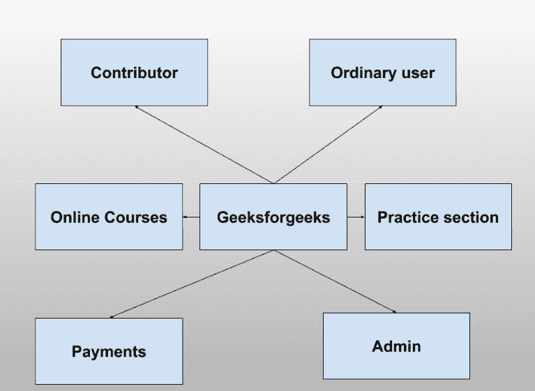
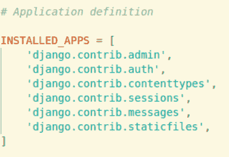

# 姜戈–创建应用|设置–1

> 原文:[https://www.geeksforgeeks.org/django-creating-apps-set-1/](https://www.geeksforgeeks.org/django-creating-apps-set-1/)

**先决条件** : [姜戈–处理警告](https://www.geeksforgeeks.org/django-dealing-with-warnings/)

**我们为什么需要应用？**
在 [Django Set 2(创建项目)](https://www.geeksforgeeks.org/django-introduction-set-2-creating-a-project/)中，我们看到了如何使用 Django 在浏览器中显示文本，但这不是最好的和 pythonic 式的方式。Django 建议使用项目-应用程序关系来构建 Django 项目。
任何网站包含不同的版块。例如 **Geeksforgeeks** 为用户、投稿人、练习编程、在线课程、支付等提供了不同的版块。所有这些部分都有不同的属性、格式和授权人员，就像只有拥有管理员权限的用户才能访问、查看和更改付款详细信息一样。对于所有这些不同的部分，我们创建了不同的 Django 应用程序。

### 使用 Django 应用程序的好处

*   Django 应用程序是可重用的，即一个 Django 应用程序可以用于多个项目。
*   我们有[松散耦合的](https://en.wikipedia.org/wiki/Loose_coupling)，也就是几乎独立的组件
*   多个开发人员可以处理不同的组件
*   调试和代码组织很容易。Django 拥有优秀的调试器工具。

### 预安装的应用程序

Django 为用户提供了一些预装的应用。要查看预安装的应用程序，请导航至
T2 极客网站–>极客网站–>设置。在您的`settings.py`文件中，您将找到**已安装的应用程序**。在 INSTALLED_APPS 中列出的应用程序是由 Django 提供的，以方便开发人员。

我们将在项目中使用其中一些应用。