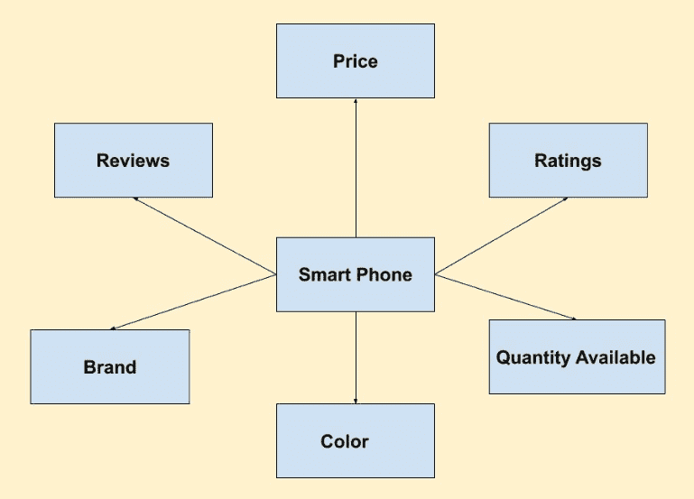
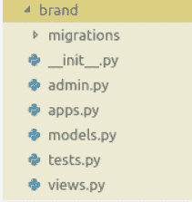
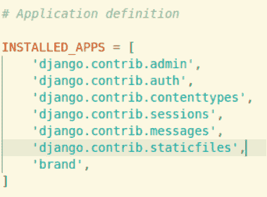

# 姜戈–创建应用|设置–2

> 原文:[https://www.geeksforgeeks.org/django-creating-apps-set-2/](https://www.geeksforgeeks.org/django-creating-apps-set-2/)

在[之前的文章](https://www.geeksforgeeks.org/django-creating-apps-set-1/)中，我们讨论了为什么应用程序在 Django 项目管理中很重要？使用 Django 应用程序有什么好处？在本文中，我们将讨论我们要构建什么，以及应用程序如何在 Django 项目中发挥重要作用？

### 项目大纲–

我们将建立一个本地主机电子商务手机网站，可以向我们展示像 Flipkart 这样的细节。智能手机有哪些细节？

*   价格
*   品牌
    *   商标名称
    *   国家
*   规范
    *   随机存取存储
    *   只读存储器
    *   照相机
    *   电池
    *   颜色
*   等级
*   复习
*   可用数量



### 制作应用–

从上面的列表中，我们可以看到品牌本身可以是数据库中不同的表。为了用户的舒适，Django 本身提供了 SQLite3 数据库，我们将在本系列中使用它。在部署期间，我们可以使用不同的数据库。要了解更多关于数据库的信息，请查看[数据库管理系统](https://www.geeksforgeeks.org/database-management-system-introduction-set-1/)。
要为**品牌**创建应用程序，请在您的终端中运行以下命令

```
python manage.py startapp brand
```

现在，品牌文件夹应该看起来像


### 这些文件是什么？

> **__init__。py** :这是一个[蟒包](https://www.geeksforgeeks.org/create-access-python-package/)。
> **admin.py** :在 python 文件中，我们将编写与 admin 相关的代码。
> T9】models . py:在这个 python 文件中，我们将编写围绕数据库处理的代码。
> **tests.py** :在这个 python 文件中，我们可以编写测试代码，在将代码中所做的更改包含到我们的主代码中之前，测试它们是否工作正常。
> **view . py**:在这个 python 文件中，我们将按照文件名的建议，写出用户应该在网页上查看什么。
> **迁移**:这是一个文件夹，用来存储我们在数据库中将要进行的所有更改。最初，它是空的，因为它只包含自己的`__init__.py`，我们还没有与数据库交互。

现在，转到`geeks_site/settings.py`，在`INSTALLED_APPS`中，添加品牌。它将把*品牌应用*整合到你的项目*极客网站*中。
