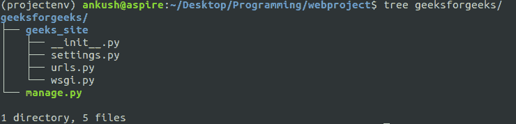
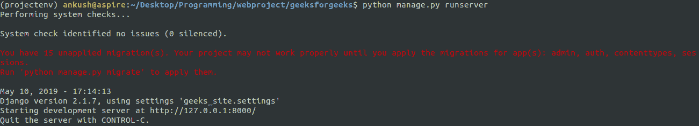
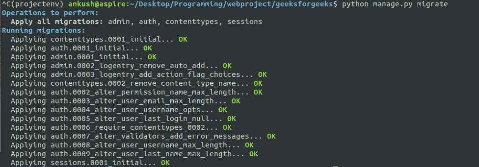

# 姜戈-处理警告

> 原文:[https://www.geeksforgeeks.org/django-dealing-with-warnings/](https://www.geeksforgeeks.org/django-dealing-with-warnings/)

先决条件:[姜戈–创建项目](https://www.geeksforgeeks.org/django-introduction-set-2-creating-a-project/)

Django 是一个很棒的框架，它为您提供了很多预定义的服务和工作流，因此您可以完美地工作。Django 应用程序旨在使您的代码干净和可重用。姜戈致力于 **DRY** 的概念，意思是 **D** 而不是 **R** 重剑 **Y** 我们自己。

创建项目后，您的目录应该如下所示:


看起来是不是有点迷惑？两个同名文件夹？好消息是。您可以更改外部文件夹的名称，因为它只是一个包含项目的文件夹，但请不要更改内部文件夹的名称。让我们将外部文件夹重命名为 geeksforgeeks。

现在，它应该看起来像:



**未应用的迁移**

完成第 2 集后，您已经让 Django 服务器工作–

但是您注意到红色的警告了吗？

您有 15 个未应用的迁移…


关于这样的警告我们后面会讨论。为了简单起见，现在让我们删除这些警告。使用 CTRL+C 停止您的服务器。在您的终端中运行以下命令:

```py
python manage.py migrate
```

现在在你的命令提示符下，你会看到类似这样的内容:


现在运行命令

```py
python manage.py runserver
```

祝贺您，您已经关闭了所有警告

#### 走向 Django 应用程序–

我们可以去掉`views.py`，因为 Django 应用程序应该处理视图。另外，从相关文件中删除这两行。

```py
from geeks_site.views import hello_geeks
path('geek/', hello_geek),

```