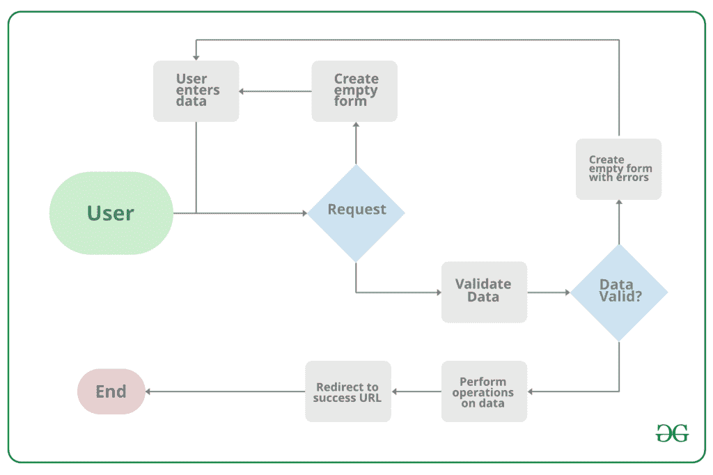

# 姜戈表格

> 原文:[https://www.geeksforgeeks.org/django-forms/](https://www.geeksforgeeks.org/django-forms/)

当创建一个**表单**类时，最重要的部分是定义表单的字段。每个字段都有自定义验证逻辑，以及一些其他挂钩。本文围绕表单中可以使用的各个领域以及与 Django 表单相关的各种特性和技术展开。表单基本上用于以某种方式从用户那里获取输入，并将这些信息用于数据库的逻辑操作。例如，通过将输入作为用户的姓名、电子邮件、密码等来注册用户。

Django 将 Django 表单中定义的字段映射到 HTML 输入字段中。Django 处理表单中涉及的三个不同部分的工作:

*   准备和重组数据，使其为渲染做好准备
*   为数据创建 HTML 表单
*   接收和处理客户提交的表格和数据



请注意，由 Django 表单完成的所有类型的工作都可以用高级的 HTML 材料来完成，但是 Django 使它变得更加容易和高效，尤其是验证部分。一旦你掌握了姜戈表单，你就会忘记 HTML 表单。

**语法:**
姜戈字段的工作方式类似于姜戈模型字段，语法如下:

```
 field_name = forms.FieldType(**options) 
```

**示例:**

## 蟒蛇 3

```
from django import forms

# creating a form
class GeeksForm(forms.Form):
    title = forms.CharField()
    description = forms.CharField()
```

## 使用姜戈表格

要使用 Django 表单，需要有一个项目和一个应用程序在其中工作。启动应用程序后，您可以在 app/forms.py 中创建表单。在开始使用表单之前，让我们检查一下如何启动项目和实现 Django Forms。

> 请参考以下文章，查看如何在 Django 中创建项目和应用程序。
> 
> *   [如何利用姜戈的 MVT 创建基础项目？](https://www.geeksforgeeks.org/how-to-create-a-basic-project-using-mvt-in-django/)
> *   [如何在姜戈创建 App？](https://www.geeksforgeeks.org/how-to-create-an-app-in-django/)

### 创建姜戈表单

在 Django 中创建表单与创建模型完全相似，需要指定表单中存在哪些字段以及字段的类型。例如，为了输入，注册表单可能需要名字(字符域)、卷号(整数域)等等。

**语法:**

```
from django import forms

class FormName(models.Model):
         # each field would be mapped as an input field in HTML
        field_name = models.Field(**options)
```

要创建表单，请在极客/表单中。输入代码，

## 蟒蛇 3

```
# import the standard Django Forms
# from built-in library
from django import forms

# creating a form 
class InputForm(forms.Form):

    first_name = forms.CharField(max_length = 200)
    last_name = forms.CharField(max_length = 200)
    roll_number = forms.IntegerField(
                     help_text = "Enter 6 digit roll number"
                     )
    password = forms.CharField(widget = forms.PasswordInput())
```

要了解更多关于如何使用 Django 表单创建表单的信息，请访问[如何使用 Django 表单创建表单？](https://www.geeksforgeeks.org/how-to-create-a-form-using-django-forms/)。

### 渲染姜戈表单

Django 表单域有几个内置方法来简化开发人员的工作，但是有时需要手动实现一些东西来定制用户界面。一个表单带有 3 个内置方法，可以用来呈现 Django 表单域。

*   [{{ form.as_table }}](https://www.geeksforgeeks.org/form-as_table-render-django-forms-as-table/) 会将它们渲染为包裹在< tr >标签中的表格单元格
*   [{{ form.as_p }}](https://www.geeksforgeeks.org/form-as_p-render-django-forms-as-paragraph/) 将使它们包裹在< p >标签中
*   [{{ form.as_ul }}](https://www.geeksforgeeks.org/form-as_ul-render-django-forms-as-list/) 将使它们包裹在< li >标签中

要将此表单渲染到视图中，请移动到 views.py 并创建一个 home_view，如下所示。

## 蟒蛇 3

```
from django.shortcuts import render
from .forms import InputForm

# Create your views here.
def home_view(request):
    context ={}
    context['form']= InputForm()
    return render(request, "home.html", context)
```

在视图中，只需要在 forms.py 中创建上面创建的表单类的一个实例

## 超文本标记语言

```
<form action = "" method = "post">
    
    {{form }}
    <input type="submit" value=Submit">
</form>
```

现在，访问 [http://localhost:8000/](http://localhost:8000/)


。
要查看如何使用姜戈表单呈现的数据，请访问[呈现姜戈表单字段](https://www.geeksforgeeks.org/render-django-form-fields-manually/)

### 从模型创建姜戈表单

Django ModelForm 是一个用于将模型直接转换为 Django 表单的类。如果您正在构建一个数据库驱动的应用程序，很有可能您将拥有与 Django 模型紧密对应的表单。现在当我们的项目准备好了，用极客/模型创建一个模型。

## 蟒蛇 3

```
# import the standard Django Model
# from built-in library
from django.db import models

# declare a new model with a name "GeeksModel"
class GeeksModel(models.Model):
        # fields of the model
    title = models.CharField(max_length = 200)
    description = models.TextField()
    last_modified = models.DateTimeField(auto_now_add = True)
    img = models.ImageField(upload_to = "images/")

        # renames the instances of the model
        # with their title name
    def __str__(self):
        return self.title
```

要直接为此模型创建表单，请深入极客/表单. py 并输入以下代码:

## 蟒蛇 3

```
# import form class from django
from django import forms

# import GeeksModel from models.py
from .models import GeeksModel

# create a ModelForm
class GeeksForm(forms.ModelForm):
    # specify the name of model to use
    class Meta:
        model = GeeksModel
        fields = "__all__"
```

现在访问 [http://127.0.0.1:8000/](http://127.0.0.1:8000/) ，

### 关于姜戈表格的更多信息:

*   [在姜戈](https://www.geeksforgeeks.org/render-html-forms-get-post-in-django/)渲染 HTML 表单(获取&帖子)
*   [{ { form . as _ p } }–将姜戈表单渲染为段落](https://geeksforgeeks.org/form-as_p-render-django-forms-as-paragraph/)
*   [{ { form . as _ table } }–将姜戈表单渲染为表格](https://geeksforgeeks.org/form-as_table-render-django-forms-as-table/)
*   [{ { form . as _ ul } }–将姜戈表单渲染为列表](https://geeksforgeeks.org/form-as_ul-render-django-forms-as-list/)
*   [姜戈表单域自定义小部件](https://www.geeksforgeeks.org/django-form-field-custom-widgets/)
*   [Python |使用 django 进行表单验证](https://www.geeksforgeeks.org/python-form-validation-using-django/)
*   [姜戈模型表单–从模型创建表单](https://geeksforgeeks.org/django-modelform-create-form-from-models/)
*   [手动渲染姜戈表单字段](https://write.geeksforgeeks.org/render-django-form-fields-manually/)
*   [姜戈模具集](https://www.geeksforgeeks.org/django-formsets/)
*   [姜戈模型集](https://write.geeksforgeeks.org/django-modelformsets/)

### 基本表单数据类型和字段列表

表单最重要的部分，也是唯一需要的部分是它定义的字段列表。字段由类属性指定。以下是 Django 中使用的所有表单域类型的列表

<figure class="table">

| 名字 | 班级 | HTML 输入 |
| --- | --- | --- |
| [布林栏位](https://www.geeksforgeeks.org/booleanfield-django-forms/) | BooleanField 类(**kwargs) | 复选框输入 |
| [夏菲尔德](https://www.geeksforgeeks.org/charfield-django-forms/) | 类 CharField(**kwargs) | TextInput 组件 |
| [选择字段](https://www.geeksforgeeks.org/choicefield-django-forms/) | 类别选择字段(**kwargs) | 挑选 |
| [type dchoeecefield](https://www.geeksforgeeks.org/typedchoicefield-django-forms/) | class type dchoisefield(* * kwargs) | 挑选 |
| 约会场 | 类日期字段(**kwargs) | 文件位置 |
| [日期时间字段](https://www.geeksforgeeks.org/datetimefield-django-forms/) | 类日期时间字段(**kwargs) | 日期时间输入 |
| [十进制字段](https://www.geeksforgeeks.org/decimalfield-django-forms/) | 十进制字段(* *夸脱) | 当 Field.localize 为 False 时为数字输入，否则为文本输入 |
| 耐久性场 | 类工期字段(**kwargs) | TextInput 组件 |
| [EmailField](https://www.geeksforgeeks.org/emailfield-django-forms/) | 类 EmailField(**kwargs | 电子邮件输入 |
| [文件字段](https://www.geeksforgeeks.org/filefield-django-forms/) | 类别文件字段(**kwargs) | ClearableFileInput |
| [FilePathField](https://www.geeksforgeeks.org/filepathfield-django-forms/) | 类别文件路径字段(**kwargs) | 挑选 |
| [浮动字段](https://www.geeksforgeeks.org/floatfield-django-forms/) | 类浮动字段(**kwargs) | 当 Field.localize 为 False 时为数字输入，否则为文本输入 |
| [图像场](https://www.geeksforgeeks.org/imagefield-django-forms/) | ImageField 类(**kwargs) | ClearableFileInput |
| [整数文件](https://www.geeksforgeeks.org/integerfield-django-forms/) | IntegerField 类(**kwargs) | 当 Field.localize 为 False 时为数字输入，否则为文本输入 |
| [genericispaddresfield](https://www.geeksforgeeks.org/genericipaddressfield-django-forms/) | 类 GenericIPAddressField(**kwargs) | TextInput 组件 |
| [多选择字段](https://www.geeksforgeeks.org/multiplechoicefield-django-forms/) | 类别多重选择字段(**kwargs) | 选择多个 |
| [类型多代码字段](https://www.geeksforgeeks.org/typedmultiplechoicefield-django-forms/) | 类类型多代码字段(**kwargs) | 选择多个 |
| [零乌头田](https://www.geeksforgeeks.org/nullbooleanfield-django-forms/) | 类 NullBooleanField(**kwargs) | nullbooleansselect |
| [regexffield](https://www.geeksforgeeks.org/regexfield-django-forms/) | 类 RegexField(**kwargs) | TextInput 组件 |
| [斯拉格菲尔德](https://www.geeksforgeeks.org/slugfield-django-models/) | 类 SlugField(**kwargs) | TextInput 组件 |
| [时间域](https://www.geeksforgeeks.org/timefield-django-forms/) | 班级时间字段(**kwargs) | 时间输入 |
| 尖叫场 | 类 URLField(**kwargs) | URLInput |
| [UUIDField](https://www.geeksforgeeks.org/uuidfield-django-forms/) | 类 UUIDField(**kwargs) | TextInput 组件 |

</figure>

### 核心字段参数

核心字段参数是为每个字段提供的参数，用于对特定字段应用某种约束或赋予特定特征。例如，向 CharField 添加一个必需的参数= False 将使用户可以将其留空。每个字段类构造函数至少接受这些参数。有些字段类采用额外的、特定于字段的参数，但以下参数应始终被接受:

<figure class="table">

| 字段选项 | 描述 |
| --- | --- |
| [必需](https://www.geeksforgeeks.org/required-django-form-field-validation/) | 默认情况下，每个字段类都假定该值是必需的，因此要使其不是必需的，您需要将 required 设置为 False |
| 标签 | label 参数允许您为此字段指定“人性化”标签。当字段显示在表单中时使用。 |
| [标签 _ 后缀](https://www.geeksforgeeks.org/label-django-form-field-validation/) | 标签后缀参数允许您在每个字段的基础上覆盖表单的[标签后缀](https://docs.djangoproject.com/en/2.2/ref/forms/fields/#label-suffix)。 |
| 小部件 | widget 参数允许您指定呈现此字段时要使用的 Widget 类。有关更多信息，请参见[小部件](https://docs.djangoproject.com/en/2.2/ref/forms/widgets/)。 |
| [帮助 _ 文字](https://www.geeksforgeeks.org/help_text-django-form-field-validation/) | 帮助文本参数允许您为此字段指定描述性文本。如果提供 help_text，当字段通过方便的表单方法之一呈现时，它将显示在字段旁边。
 |
| [错误信息](https://www.geeksforgeeks.org/error_messages-django-form-field-validation/) | error_messages 参数允许您覆盖该字段将引发的默认消息。传入一个字典，其关键字与您想要覆盖的错误消息相匹配。 |
| [验证器](https://www.geeksforgeeks.org/django-form-field-custom-widgets/) | validators 参数允许您为此字段提供一个验证函数列表。
 |
| [本地化](http://localize) | localize 参数允许对表单数据输入以及呈现的输出进行本地化。 |
| [禁用](https://www.geeksforgeeks.org/disabled-django-form-field-validation/)。 | 禁用的布尔参数设置为真时，使用禁用的 HTML 属性禁用表单字段，这样用户就无法编辑它。
 |

</figure>