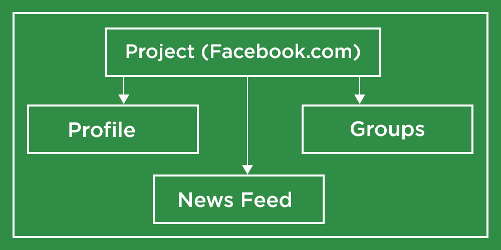

# 姜戈面试问题&为初级开发人员提供实用技巧的答案

> 原文:[https://www . geesforgeks . org/django-面试-问题-答案-初级开发人员实用技巧/](https://www.geeksforgeeks.org/django-interview-questions-answers-with-practical-tips-for-junior-developers/)

[**【姜戈……**](https://www.geeksforgeeks.org/django-tutorial/)***是不是你最喜欢的框架？(尤其是如果你是编程世界的新手)***

**没错。它是…**

***你有没有尝试学习这个框架，做一些项目？***

**如果答案是 ***是*** 那么接下来就是问题了…**

***你了解项目的完整流程了吗？***

**再次如果答案是**是**那么这里还有一个问题(现在不要生气…哈哈…)**

***你能用自己的话表达你从项目中学到的概念吗？***

**如果答案又是**是**那么恭喜你不需要阅读大量关于姜戈面试问题的文章……你只需要看一看问题，答案就会自动弹出你的脑海。**

**这个框架是行业中最受欢迎的框架，这也是大多数人投入其中的原因(当然钱是另一个因素)。如果你是一个有经验的开发人员，那么你肯定会检查它受欢迎的原因，为此，你会检查 Django 可以在应用程序中解决什么问题？为什么它比其他框架更好，或者为什么在 Django 上构建应用程序很好？**

****

**如果你已经努力建立了一些项目并理解了这个框架的概念，那么你所需要做的就是申请合适的工作并面对面试。**

**现在进入这个博客的主要标题，我们将讨论一些你在面试中可能会遇到的姜戈面试问题，但是在我们继续之前，我们建议你仔细阅读下面给出的台词。**

### **快速笔记！**

**如果你只是在寻找面试问题，并且认为阅读这些问题并记住它们的答案将有助于你完成面试，那么我的朋友，当你面临面试时，这是行不通的。**

**永远记住，面试官会更喜欢雇佣一个有实践经验并且能解决 Django 申请中的问题的候选人。最有可能的是，他们不会雇佣一个来面试的人，在没有任何实际接触的情况下阅读 20-30 个姜戈面试问题。**

**只看 30-40 个面试问题(任何语言或框架)，面对面试没有任何实际接触，在软件开发中是行不通的。因为在那里你不会被要求为一些理论考试写论文。**

**在那里，你必须构建实际的软件，在这种情况下，无论面试官会问什么样的问题，他/她唯一的意图都是检查候选人对框架的理解能力，对概念的理解能力，对事物如何联系的理解能力，对框架完整流程的理解能力。**

**你可以读理论，读问题然后建一些项目，也可以建一些项目然后读理论和面试问题。但在这里，整个想法是两者兼而有之……不要错过任何一件事。**

**现在让我们开始讨论面试问题…**

**我们还将讨论面试官在寻找什么样的答案，或者他/她为什么会问一个特定的问题。**

### **姜戈采访问题**

**无论我们在这里讨论什么问题，不要期望在每次面试中都有相同的问题。不是每个面试都是一样的。问题可能不同，取决于参加面试的人。但是是的，这些是最基本的问题，也是最常见的问题，我们考虑到初级 Django 开发人员的职位，编制了这个问题。**

**这些问题很可能是在面试中提出的，目的是检查候选人至少对框架有基本了解的能力。在申请工作之前，确保你在你的投资组合中提到了这个项目。提及你在项目中使用这个惊人的框架所做的事情。您构建了哪些功能，或者解决了哪些问题。这将让你深入了解这个框架。**

**面试官不想进行问答环节。他/她会试着和你建立关系，他/她会试着理解你。因此，如果面试官问的是项目或你目前正在做的事情，那就平稳地谈论它，并努力控制面试。扩展你的答案，深入细节，而不是只给出是或否的答案。**

**面试不要装模作样。与面试官建立融洽的关系，把你的面试官当成一个团队成员或导师，将来会和你一起做一些项目。当你进入项目的细节时，面试官明白你已经知道的事情。你只要限制自己的问题数量，面试官就不会问出他/她的清单上的 50 个问题。**

**如果你在某个问题上陷入困境，那么不要给出错误的答案，只要让面试官知道你是否了解这个项目。你可以说“我已经在我的项目中做到了这一点，但事情只是空白。我不记得确切的命令是什么，但我认为是这样的”。现在你可以试着详细阐述这些问题。对面试官来说完全可以，不会给人留下什么负面印象。**

**现在让我们从问题开始…**

****1。你对 Python 有多满意？****

****注:**面试官在找一些前提条件。他/她想知道你的 Python 技能。你对它有多熟悉，你用 Python 做了什么。他不会在这上面花太多时间，但是很明显，如果你是一个姜戈开发者，那么你需要知道这一点。**

****回答:**让面试官知道你学过什么课程，建过什么样的项目，用这门语言拓展了自己多少。书籍和其他资源等。**

****2。姜戈是什么？****

****注意:**从这里，面试官将深入细节，他/她将试图理解你对姜戈的了解程度。当然，这个问题也取决于你在你的投资组合中如何解释你的姜戈项目。如果面试官对你在姜戈的知识有疑问，那么他/她肯定会抛出这个问题。**

****回答:**“Django 是基于 Python 的 web 框架。就像我们使用 ExpressJS 或 NodeJS 来构建 JavaScript，使用 Laravel 来构建应用程序的后端部分一样，Django 也是为了同样的目的而使用 Python 的”。不限于给出相同的回答，但是这个回答会澄清你知道“框架是什么”。如果你在回答中提到了几个框架，那么面试官会理解你知道框架的概念，不需要深入框架概念的细节。**

****3。你能用姜戈建造什么？****

****注:**基本上面试官期待的答案是你知道 Django 的能力。你知道姜戈是干什么用的。通常，人们会给出这样的例子:Django 可以用来建立社交媒体网络、电子商务网站，但如果你想给出一个好的回应，那就提到一些公司的名字。**

****回答:**“Django 的能力是任何东西，像 Udemy、Pinterest、Instagram、Dropbox 等公司都在使用它。”面试官会明白你了解姜戈，你明白它有很大的能力。你在理解已经做了什么和它能做什么。您还可以提到 API 以及 API 如何有助于构建一些好的应用程序。**

**正确解释第 4 题和第 5 题真的很重要。如果你不能解释 Django 是什么，它能做什么，那么面试官会很担心。**

**从这里，面试官可能会进入细节，他/她会快速问一些问题，以确保你已经与它合作。你没有听说过这个框架，或者你没有做过任何形式的死记硬背。面试官在这里的判断会很轻，因为没有人记得开发中的每一个命令或确切的代码。大多数人只是用谷歌搜索出这些东西，然后解决问题。但是你应该记住 Django 中最基本的命令或者最基本的东西。**

****4。项目和应用程序有什么区别？****

****注意:**在你的回答中加入例子来区分两者。**

****回答:“**一个项目就像一个整体环境。它是你网站的基础，一个应用程序就像那个网站的一个组件，保存着项目逻辑。项目就像网站的配置，而应用程序是项目的组成部分，是为了在应用程序中做特定的事情而创建的。**

**一个项目由许多应用程序组成，因此一个项目可以有 n 个应用程序，一个应用程序可以在多个项目中。“在这里，你可以举一个 facebook.com 的例子，把它组织起来，以便更好地解释它。脸书将被视为一个项目，新闻源、个人资料、群组是整个脸书不同应用的组成部分。**

**因此，对于不同的任务，一个项目可以分成各种小应用程序，这些应用程序专注于特定的功能领域。**

****

****5。我们如何初始化一个项目？****

****答案:**$ django-admin start project project name**

****6。我们如何初始化应用程序？****

****回答:**$ python manage . py startapp app appname**

****7。settings.py 文件是做什么的？****

****注意:** settings.py 是项目中最重要的文件，保存了应用程序的所有配置。请给出您对 settings.py 文件的最佳解释。面试官会检查你对姜戈的技术理解。**

****答案:** settings.py 保存项目的配置，比如您的数据库连接、apps 配置、绝对路径值、静态文件配置以及项目的整体命令中心。**

****8。我们如何启动开发服务器？****

****回答:** $ python manage.py runserver**

****9。姜戈的 MVT 结构是什么？什么是模型？什么是观点？什么是模板？****

****回答:**模型是数据库表的基于类的表示。它代表数据库结构。**

**视图基本上是业务逻辑，不处理  *如何* *数据看起来(像是在 MVC 结构中)。它代表数据实际上是什么。*视图决定点击特定网址时应该触发哪些数据*。*需要返回的内容如模板、回复等。 基本上视图返回的是模板，是模型和模板之间的连接。**

**模板层返回 HTML 布局。处理回复的呈现部分。如何向用户呈现响应。**

**有了这个答案，面试官会看到你对模型、视图和模板的理解。**

****10。什么是姜戈管理面板？****

****注:**这是 Django 的关键特征之一，所以面试官可能会问你这个问题。**T3】****

****回答:** Django 管理面板是一种图形用户界面，用于管理任务。默认情况下，管理面板是用 Django 构建的，您不需要像我们在其他语言中那样从头构建它。您可以快速设置管理面板来管理和访问您的数据。开发过程变得更快，开发人员也更容易执行管理活动。**

****11 时。什么是网址模式？****

****注意:**这是 Django 的另一个基础的东西，你肯定应该知道。面试官想知道你了解如何在 Django app 中配置 URL。**

****回答:**用 URL 模式适当解释路由在 Django 中是如何工作的。**

**网址决定网站的路由。我们在应用程序中创建一个 python 模块或文件**URL . py**。这个文件决定了你网站的导航。当用户在浏览器中找到一个特定的网址路径时，它会与 urls.py 文件中的网址相匹配。之后，检索相应的视图方法，然后用户获得对所请求的网址的响应。**

****12 时。以下命令是做什么的？****

*   ****python manage . py make migrations****
*   ****python manage.py 迁移****

****注:**这是姜戈的另一个基础素材。您只需要解释这两个命令在 Django 应用程序中的作用。**

****回答:** makemigration 命令扫描应用程序中的模型，并根据我们在模型文件中所做的更改创建一组新的迁移。该命令生成 SQL 命令，执行该命令后，我们会得到一个新的迁移文件。运行此命令后，不会在数据库中创建表。**

**现在，为了在我们的数据库中应用这些更改，我们执行 migrate 命令。migrate 命令执行 SQL 命令(在 makemigrations 中生成)并强制执行对数据库的更改。运行此命令后将创建表。**

****13。我们在哪里存储模板？****

****回答:**存储模板有不同的方式。我们可以将其存储在默认的 app 结构中。Django 应用程序通常会告诉您将模板存储在一个名为 templates 的文件夹中的子文件夹中(无论您的应用程序名称是什么)，然后您可以将所有模板都放在那里。您也可以手动将该值分配到 settings.py 文件中。在这个文件中，你会发现一个变量“模板”，在这个变量中，你会发现一个名为 DIRS 的列表。在这里，您可以提到模板的路径，并让姜戈知道在哪里可以找到它们。**

****14。Django 模板语言:双花括号是什么意思，百分号是什么意思？(面试官可能会举一个例子)****

```py
**<h2>{{name}}</h2>**
```

****注意:**面试官想知道你很清楚如何使用模板工作。你对它有很好的理解，你知道如何传递数据，然后在模板中设置变量。**

****回答:**花括号只是变量的占位符。这样我们可以输出动态数据。带百分号的大括号是代码块，我们可以在这里编写模板中的后端 Pythonic 逻辑。现在你可以在这里写一个例子。您可以在模板的代码块中编写 for 循环或 if 语句。**

```py

<tr>
   <td>{{customer.name}}</td>
</tr>

```

****15。如何在应用程序中包含和继承文件？****

****回答:“**使用**包含**标签我们可以包含另一个 HTML 模板的部分”。对继承和扩展的正确解释是“如果我们有一个 main.html 文件，并且我们需要继承这个文件，那么我们可以在我们想要扩展它的模板中使用**扩展**标签，然后我们可以添加块标签来扩展模板。”(阅读文章[姜戈模板标签](https://www.geeksforgeeks.org/extends-django-template-tags/)详细阐述你的答案)**

```py



     <h2>Template</h2>

```

****16。您更喜欢使用什么数据库系统，我们如何在 Django 应用程序中设置数据库？****

****注意:**默认情况下，Django 自带 SQLite 数据库，但在现实生活中，公司是不会使用它的。所以在这里，面试官想听听你对 SQLite 数据库系统以外的东西有什么了解，你不仅仅依赖于默认的数据库系统。您还了解如何连接另一个数据库，如 MySQL 或 PostgreSQL。提及在 Django 项目中可以在哪里配置数据库。**

****回答:**我们需要在 settings.py 文件中配置我们的数据库。默认情况下，这里会提到 SQLite，我们需要相应地更改此设置。您还可以举一个设置数据库的例子，比如 MySQL 或 PostgreSQL。**

****17。什么是静态文件？****

****回答:**这是我们存储附加文件的地方，比如 CSS 文件、JavaScript 文件、图像或者任何一种静态文件。我们通常将它们存储在单独的文件夹中，比如在 **js** 文件夹中我们存储了所有的 JavaScript 文件，在 **images** 文件夹中，我们存储了所有的图像。我们将这些文件存储在名为 **static 的项目 app 子目录中。****

****18。什么是媒体根？****

****回答:**媒体根用于上传用户生成的内容。我们可以从 MEDIA_ROOT 提供用户上传的媒体文件。**

****19。如何查询数据库表中的所有项目？****

****回答:****XYZ . objects . all()**这里 XYZ 是模型中创建的某个类。**

****20。如何从数据库表中查询一个项目？**T3】**

****回答:****XYZ . objects . get(id = 1)**其中 XYZ 是模型中创建的某个类。**

****注意:**我们刚才提到了两个数据库查询的问题示例，但是面试官可能会问更多的查询。他/她可以增加查询的复杂性，然后你必须回答它。所以在 Django 准备更多的数据库查询。**

****21。什么是 CSRF 代币？****

****回答:** CSRF 令牌有助于抵御跨站点请求伪造攻击。这可能是从恶意网站发送的。Django 内置了针对 CSRF 的防护。我们可以在帖子中使用，放入或删除请求。我们通常把这些和我们的表格一起发送。简而言之、我们只是在保护我们的数据、免受任何形式的恶意活动。我们可以在模板的表单中加入{% csrf _ token % }来保护我们的数据。**

****22。HTML/CSS/Bootstrap 技能水平？****

****注意:**这是另一个前提问题，因为在开发中你肯定会遇到 HTML 和 CSS 中的代码。您将不得不使用 Django 动态地处理它。所以面试官想检查你对两者的基本理解。**

****回答:**同样，如果你已经构建了一些项目，那么让他们知道你在 HTML 和 CSS 中做了什么，或者你是如何动态处理的。页面或模板是如何构建的，以及您如何在应用程序中使用 Django 对它们进行编码。您还可以通过提及您在 HTML 和 CSS 中设计了什么样的模板或页面以及如何动态呈现它来扩展答案。**

****23。你研究过 JavaScript 吗？有经验吗？****

****注意:**如果你不懂 JavaScript，那么面试官很可能不会因此而把你扣下，但是如果你在 Django 做项目的时候也学过的话，那就更好了。作为一名网络开发人员，你将会经常使用 JavaScript，并且有这方面的经验会给你带来一些优势。如果你不知道，那完全没问题，但是了解 JavaScript 会增加被选中的机会。**

****回答:**如果你懂 JavaScript，那就让面试官知道你用 JavaScript 做了什么，或者你和 Django 一起内置了什么样的 JavaScript 特性。**

### **最终想法**

**采访问题不限于姜戈。有很多概念需要了解，但最主要的是你在你的投资组合中提到了什么，你在你的项目中做了什么。你会从那里发现大多数问题。这还取决于面试官、公司名称、工作性质和你申请的职位。构建项目，面对问题，解决问题，你会学到更多关于 Django 的知识。这就是你如何为姜戈面试问题做好更多准备的方法。**