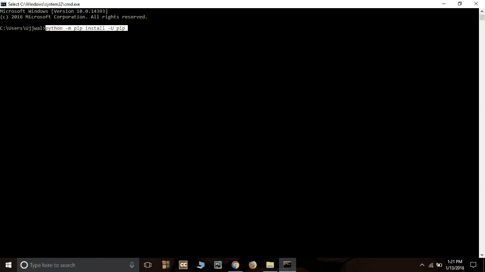
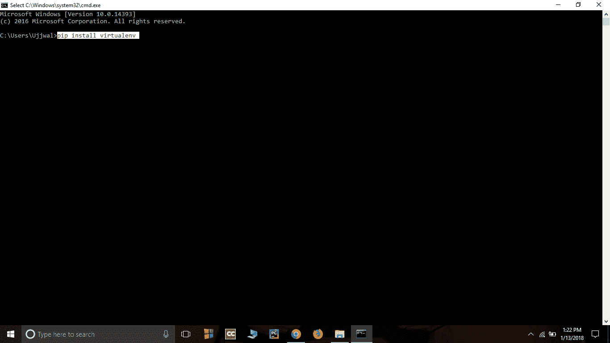
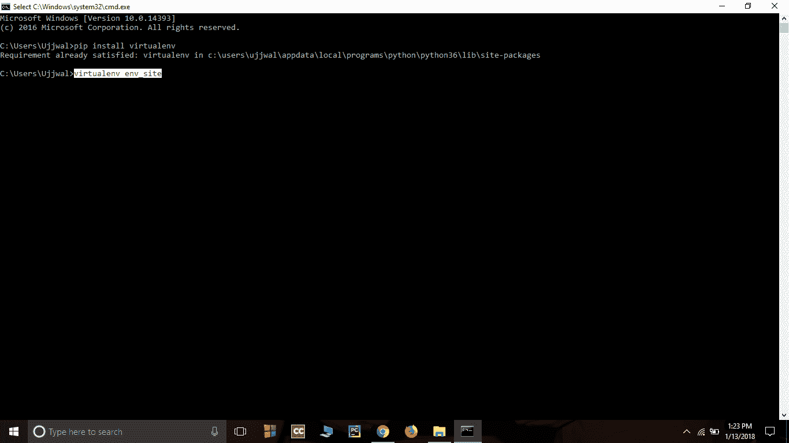
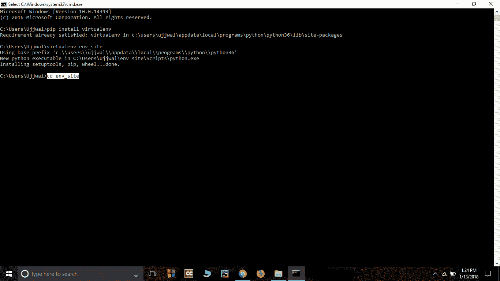
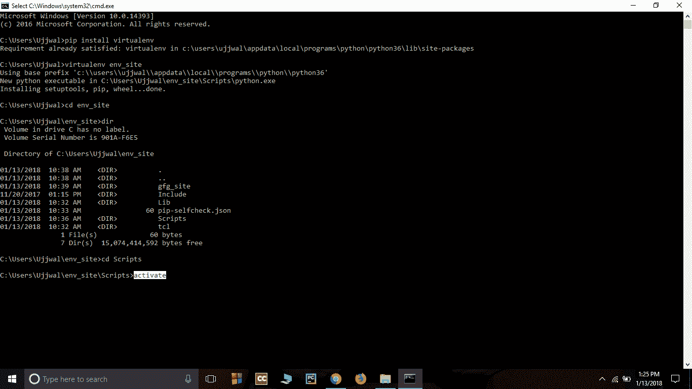
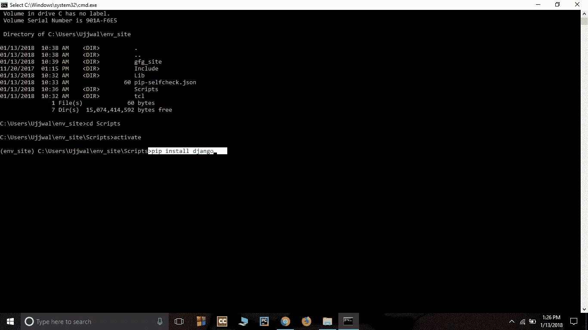
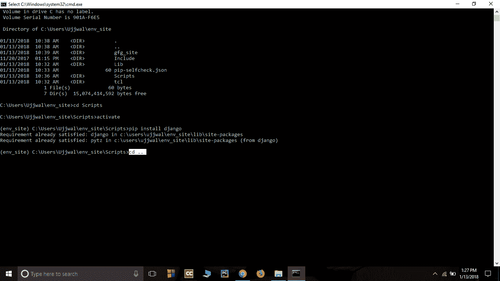
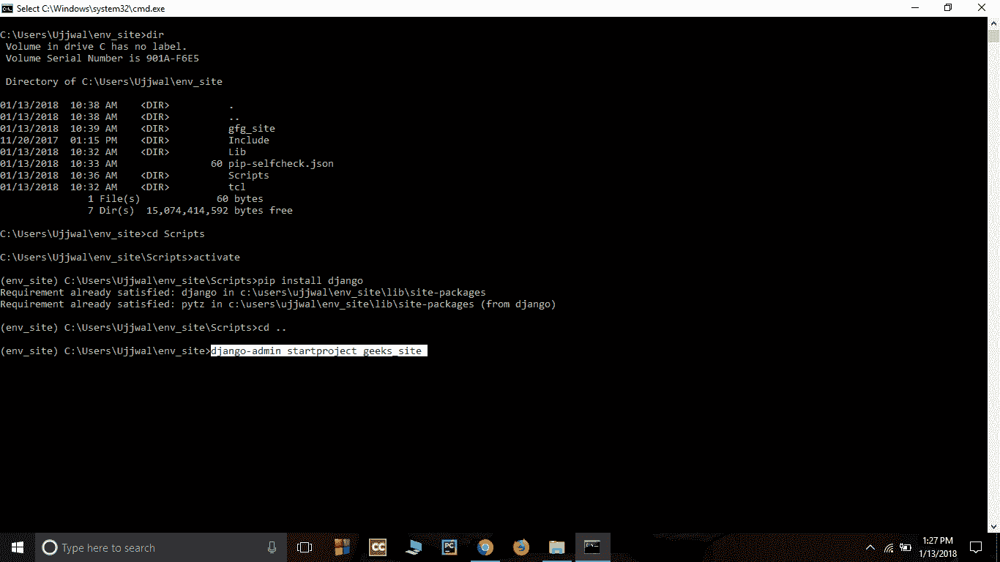
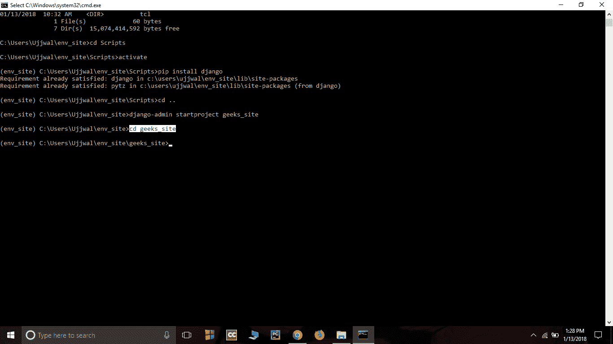
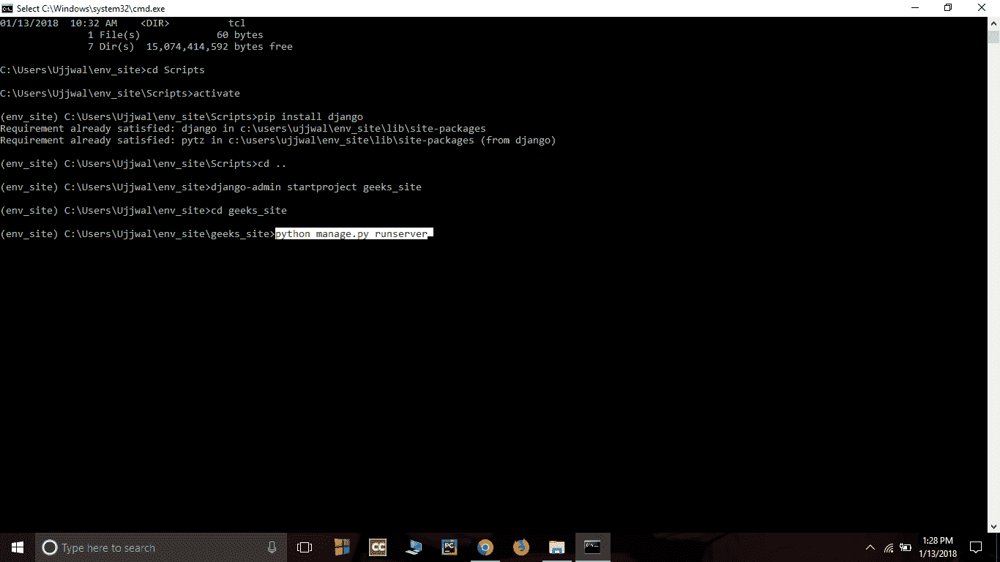

# 姜戈介绍及安装

> 原文:[https://www . geesforgeks . org/django-introduction-and-installation/](https://www.geeksforgeeks.org/django-introduction-and-installation/)

#### 姜戈是什么？

Django 是一个基于 Python 的 web 框架，它允许您快速创建 web 应用程序，而没有其他框架通常会遇到的所有安装或依赖问题。
当你在构建一个网站时，你总是需要一组相似的组件:一种处理用户身份验证(注册、登录、注销)的方式，一个网站、表单的管理面板，一种上传文件的方式等。Django 为您提供现成的组件供您使用。

#### 为什么是姜戈？

1.  在 Django 框架中切换数据库非常容易。
2.  它有内置的管理界面，这使得它很容易工作。
3.  Django 是一个功能齐全的框架，不需要其他东西。
4.  它有数千个额外的软件包可用。
5.  它是非常可扩展的。

#### 姜戈的受欢迎程度

Django 在许多热门网站上使用，如:Disqus、Instagram、骑士基金会、麦克阿瑟基金会、Mozilla、国家地理等。基于 Django 框架的在线网站超过 5000 个。(来源)
像 Hot Frameworks 这样的网站通过统计每个平台的 GitHub 项目和 StackOverflow 问题的数量来评估一个框架的受欢迎程度，这里 Django 排在第 6 位。基于对处理任何特定任务的正确方式的看法，Web 框架经常称自己为“固执己见”或“不固执己见”。Django 有些固执己见，因此在两个世界都传递了(固执己见&不固执己见)。

#### 姜戈的特色

**Django 的多功能性**
Django 几乎可以搭建任何类型的网站。它还可以与任何客户端框架一起工作，并可以以任何格式交付内容，如 HTML、JSON、XML 等。一些可以用姜戈建立的网站是维基、社交网络、新网站等。

**安全性**
由于 Django 框架是为了让网络开发变得容易而制造的，因此它被设计成自动做正确的事情来保护网站。例如，在 Django 框架中，不是将密码放在 cookies 中，而是将哈希密码存储在其中，这样黑客就不会轻易获取密码。

**可扩展性**
姜戈网络节点没有存储状态，它们是水平扩展的——只需在需要时启动更多节点。能够做到这一点是良好可扩展性的本质。Instagram 和 Disqus 是两个基于 Django 的产品，拥有数百万活跃用户，这被作为 Django 可扩展性的一个例子。

**可移植性**
Django 框架的所有代码都是用 Python 编写的，Python 运行在很多平台上。这导致 Django 在 Linux、Windows、Mac OS 等很多平台上运行过多。

**安装姜戈**

*   Install python3 if not installed in your system ( according to configuration of your system and OS) from [here](https://www.python.org/downloads/) . Try to download the latest version of python it’s python3.6.4 this time.

    **注意-**Django 在 Linux 和 mac 中的安装是类似的，这里我是在 windows 中展示的对于 Linux 和 Mac 来说只需要打开终端代替命令提示符，并通过以下命令。

*   **Install pip-** Open command prompt and enter following command-

    ```py
    python -m pip install -U pip
    ```

    

*   **Install virtual environment-** Enter following command in cmd-

    ```py
    pip install virtualenv
    ```

    

*   **设置虚拟环境-** 设置虚拟环境将允许您编辑依赖关系，这通常是您的系统不允许的。
    按照以下步骤设置虚拟环境-

1.  Create a virtual environment by giving this command in cmd-

    ```py
    virtualenv env_site
    ```

    

2.  Change directory to env_site by this command-

    ```py
    cd env_site
    ```

    

3.  Go to Scripts directory inside env_site and activate virtual environment-

    ```py
    cd Scripts
    ```

    ```py
    activate
    ```

    

*   **Install Django-** Install django by giving following command-

    ```py
    pip install django
    ```

    

    *   Return to the env_site directory-

    ```py
    cd ..
    ```

    

    *   Start a project by following command-

    ```py
    django-admin startproject geeks_site
    ```

    

    *   Change directory to geeks_site

    ```py
    cd geeks_site
    ```

    

    *   **Start the server-** Start the server by typing following command in cmd-

    ```py
    python manage.py runserver
    ```

    

    *   To check whether server is running or not go to web browser and enter **http://127.0.0.1:8000/** as url.

    

    **姜戈架构的优势–**

    *   迅速发展
    *   松散耦合
    *   易于修改

    **MVC 架构的缺点–**

    *   模型组件负载过大
    *   开发复杂性很高
    *   两个组件控制视图