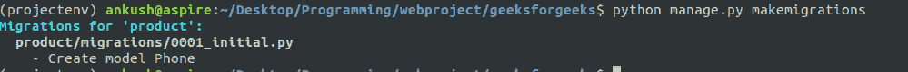
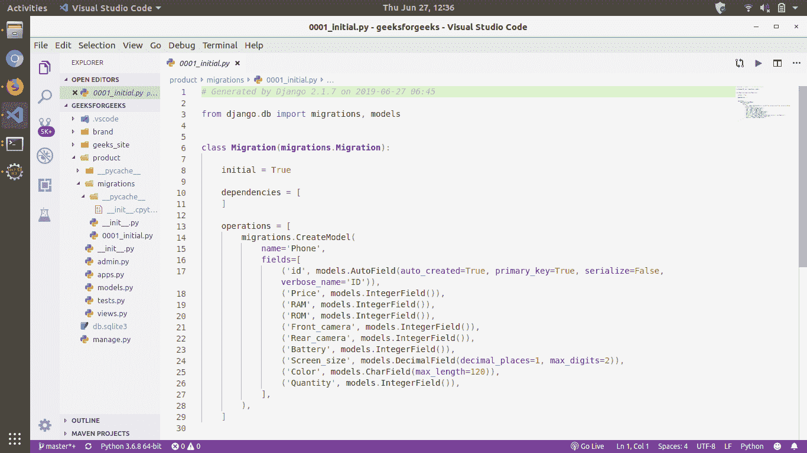
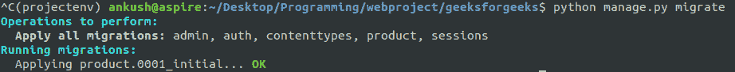

# 姜戈迁移| Python

> 哎哎哎:# t0]https://www . geeksforgeeks . org/django-migration-python/

先决条件:[姜戈车型](https://www.geeksforgeeks.org/django-models-set-2/)

### 没有这样的桌子？–

在`product/models.py`中定义的类仅仅是我们的数据库将会是什么样子的想法，但是它没有在数据库中创建任何表。我们可以假设类**电话**为概念图式。在创建任何表之前，如果我们试图在创建之前访问该表，它会抛出这样一个错误。

```py
OperationalError at /admin/product/phone/
no such table: product_phone
```

### makemigrations 命令–

为了方便用户，Python 提供了一些命令，这样用户就可以与数据库进行交互，而无需深入 SQL 的细节。现在，我们已经创建了类(数据库的概念模式)，我们可以使用 migrate 命令在数据库中创建实际的模式。如果正在运行，请使用 CTRL+C 停止服务器，并在数据库中运行以下命令。

```py
python manage.py makemigrations
```

上面的命令将让项目知道我们想要在数据库中进行更改。你会看到以下引用**创建模型电话**。

这个命令是做什么的？如果我们希望对数据库进行更改，这个命令将生成应该执行的 SQL 语句。
如果您想查看生成的命令，请导航至**产品/迁移/0001_initial.py** 。如果您现在尝试使用命令运行服务器，您将看到文件内容


```py
python manage.py runserver
```

你会看到的

> 您有 1 个未应用的迁移。在您为应用程序:产品应用迁移之前，您的项目可能无法正常工作。运行“python manage.py migrate”来应用它们。

如警告中所写，运行

```py
python manage.py migrate
```

在你的终端。这将导致在数据库中创建表。
