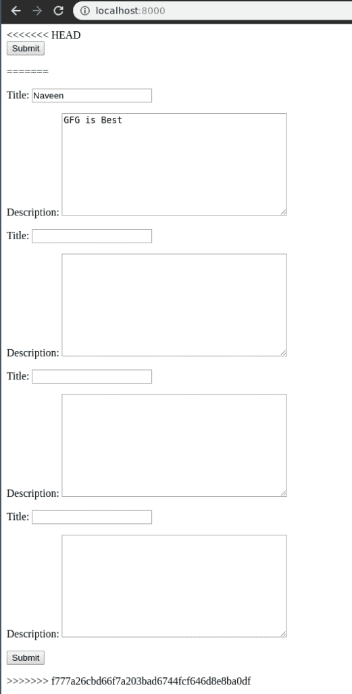
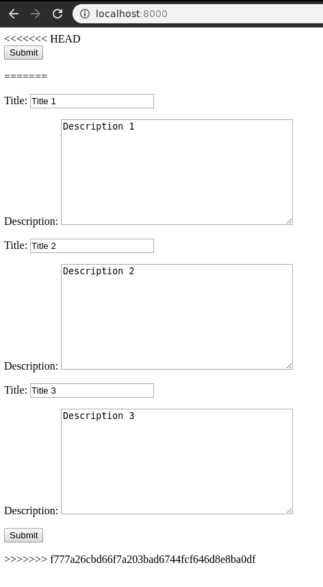
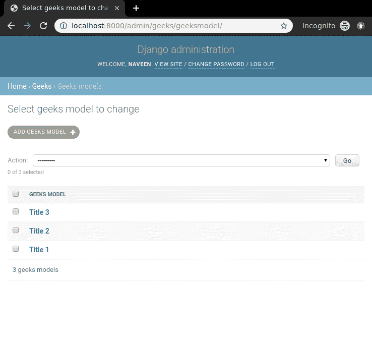

# 姜戈模型集

> 原文:[https://www.geeksforgeeks.org/django-modelformsets/](https://www.geeksforgeeks.org/django-modelformsets/)

Django 中的 ModelFormsets 是处理使用模型创建的多个表单并使用它们创建模型实例的一种高级方式。换句话说，模型表单集是姜戈的一组表单。例如，您可能希望在单个页面上初始化多个表单，所有这些表单都可能涉及多个 POST 请求

```
class GeeksModel(models.Model):
    title = models.CharField(max_length = 200)
    description = models.TextField()

```

现在，如果想为这个模型创建一个 modelformset，就需要使用 modelformset_factory。表单集是一个抽象层，用于处理同一页面上的多个表单。最好将其与数据网格进行比较。

```
from django.forms import formset_factory
GeeksFormSet = modelformset_factory(GeeksModel)

```

### 创建和使用 Django 模型表单集

使用示例手动渲染姜戈模型表单集的图示**。考虑一个名为`geeksforgeeks`的项目，它有一个名为`geeks`的应用程序。**

> 请参考以下文章，查看如何在 Django 中创建项目和应用程序。
> 
> *   [如何利用姜戈的 MVT 创建基础项目？](https://www.geeksforgeeks.org/how-to-create-a-basic-project-using-mvt-in-django/)
> *   [如何在姜戈创建 App？](https://www.geeksforgeeks.org/how-to-create-an-app-in-django/)

在你的极客应用程序中，创建一个名为 models.py 的新文件，你将在其中制作所有的模型。要创建一个 Django 模型，您需要使用 Django 模型。让我们演示一下如何在您的 `models.py`中输入以下内容:

```
# import the standard Django Model
# from built-in library
from django.db import models

# declare a new model with a name "GeeksModel"
class GeeksModel(models.Model):

    # fields of the model
    title = models.CharField(max_length = 200)
    description = models.TextField()

    # renames the instances of the model
    # with their title name
    def __str__(self):
        return self.title
```

让我们解释一下到底发生了什么，左边表示字段的名称，右边对应地定义输入字段的各种功能。字段的语法表示为
**语法:**

```
Field_name = models.FieldType(attributes)
```

现在要创建这个表单的一个简单的表单集，移动到 views.py 并创建一个`formset_view`，如下所示。

```
from django.shortcuts import render

# relative import of forms
from .forms import GeeksForm

# importing formset_factory
from django.forms import formset_factory

def formset_view(request):
    context ={}

    # creating a formset
    GeeksFormSet = modelformset_factory(GeeksForm)
    formset = GeeksFormSet()

    # Add the formset to context dictionary
    context['formset']= formset
    return render(request, "home.html", context)
```

要通过 html 呈现表单集，请创建一个 HTML 文件“home.html”。现在我们来编辑`templates > home.html`

```
<form method="POST" enctype="multipart/form-data">
    
    {{ formset.as_p }}
    <input type="submit" value="Submit">
</form>
```

一切就绪，检查我们的表单集是否工作让我们访问 [http://localhost:8000/](http://localhost:8000/) 。
T3】

我们的`modelformset`完全工作了。让我们学习如何修改这个表单集以使用这个表单集的额外功能。

### 如何使用 Django 模型表单集创建多个表单

Django 表单集用于处理表单的多个实例。使用姜戈表单集的`extra`属性可以轻松创建多个表单。在**极客/观点. py** 中，

```
from django.shortcuts import render

# relative import of forms
from .models import GeeksModel

# importing formset_factory
from django.forms import modelformset_factory

def modelformset_view(request):
    context ={}

    # creating a formset and 5 instances of GeeksForm
    GeeksFormSet = modelformset_factory(GeeksModel, fields =['title', 'description'], extra = 3)
    formset = GeeksFormSet()

    # Add the formset to context dictionary
    context['formset']= formset
    return render(request, "home.html", context)
```

关键字参数`extra`对同一个表单进行多次复制。如果你想创建 5 个表单，请输入`extra = 5`，其他表单也是如此。访问 [http://localhost:8000/](http://localhost:8000/) 查看是否创建了 5 个表单。


### 使用 Django 表单集处理多个表单

创建表单比在后端处理输入这些字段的数据容易得多。让我们尝试演示如何在视图中轻松使用模型表单集的数据。当试图处理表单集时，Django 表单集需要一个额外的参数**{ { formset . management _ data } }**。要了解更多关于管理数据的信息，[了解管理表单](https://docs.djangoproject.com/en/3.0/topics/forms/formsets/#understanding-the-managementform)。
在`templates/home.html`中，

```
<form method="POST" enctype="multipart/form-data">

    <!-- Management data of formset -->
    {{ formset.management_data }}

    <!-- Security token -->
    

    <!-- Using the formset -->
    {{ formset.as_p }}

    <input type="submit" value="Submit">
</form>
```

现在要检查数据的呈现方式和类型，请编辑 **formset_view** 来打印数据。在`geeks/view.py`中，

```
from django.shortcuts import render

# relative import of forms
from .forms import GeeksForm

# importing formset_factory
from django.forms import formset_factory

def formset_view(request):
    context ={}

    # creating a formset and 5 instances of GeeksForm
    GeeksFormSet = formset_factory(GeeksForm, extra = 3)
    formset = GeeksFormSet(request.POST or None)

    # print formset data if it is valid
    if formset.is_valid():
        for form in formset:
            print(form.cleaned_data)

    # Add the formset to context dictionary
    context['formset']= formset
    return render(request, "home.html", context)
```

现在让我们尝试通过[http://localhost:8000/](http://localhost:8000/)
在表单集中输入数据

点击提交，数据将保存在服务器运行的极客模型中。现在人们可以方便地以任何方式使用这些数据。
