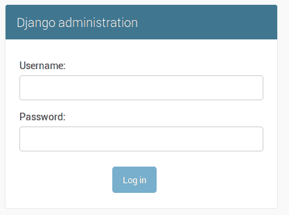
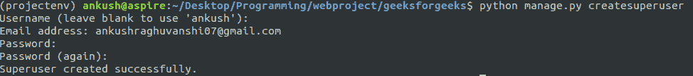
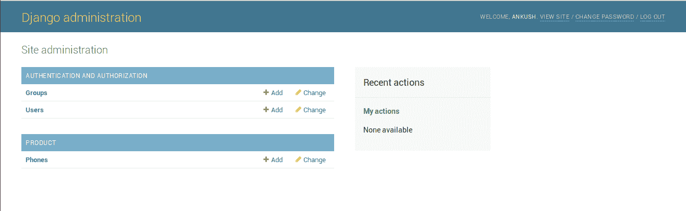
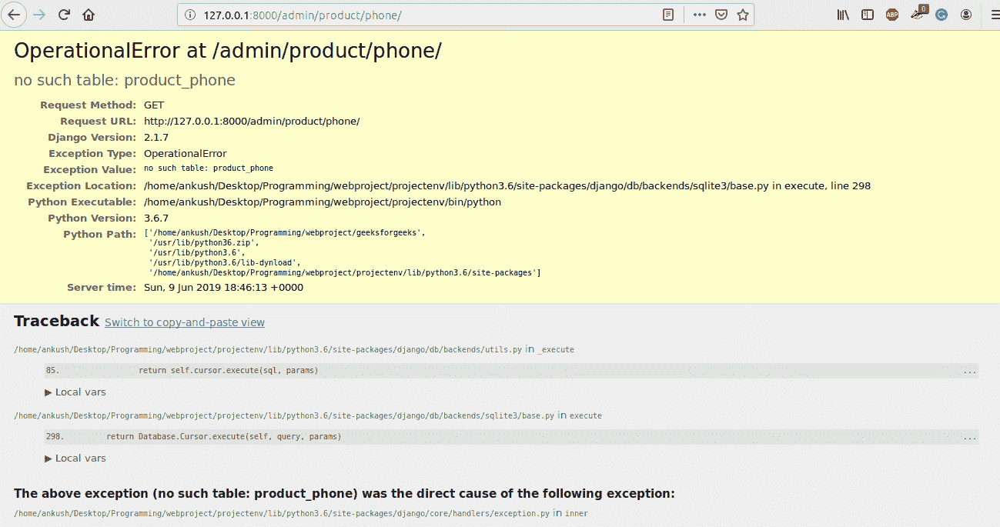

# 姜戈车型|套装–2

> 原文:[https://www.geeksforgeeks.org/django-models-set-2/](https://www.geeksforgeeks.org/django-models-set-2/)

### 模型字段–

模型字段定义将存储在提供的变量中的数据类型。要存储价格，整数类型更合适。储存高度、长度等。浮点/十进制类型更适合。要存储标题或标题，最好提供字符限制。写文章，最好有一个没有字符限制的文本框。

### 示例:

```py
Price = models.IntegerField()
Screen_size = models.DecimalField(max_digits = 2, decimal_places = 2)
Color = models.CharField(max_length = 120)
Description = models.TextField()
```

对于某些字段，某些参数是必需的。下面列出了其中一些最常用的方法:

*   十进制字段有两个必需属性。
    *   最大位数
    *   小数位数
*   CharField 有**最大长度**作为必需属性。
*   ForeignKey 有 **on_delete** 作为必选属性。

模型字段及其详细信息的完整参考可以在姜戈官方网站上找到。

### 管理界面–

在`/models.py`中定义的类中定义属性名称及其类型后，使用以下命令启动服务器:

```py
python manage.py runserver
```

现在，在本地主机地址中打开管理面板:

```py
127.0.0.1:8000/admin
```

系统将提示您登录页面。

创建[这篇](https://www.geeksforgeeks.org/python-django-admin-interface/)文章中提到的超级用户。

按照下面提到的步骤创建超级用户:

*   使用 CTRL+C 停止服务器。
*   运行命令**python manage . py create super user**
*   输入将用于登录的用户名
*   输入您的电子邮件地址
*   输入您的密码。为了避免任何警告，请确保密码不是很常见，并且完全是数字。


现在，再次运行您的服务器并转到 **127.0.0.1:8000/admin** 。

提供您的凭据并登录。

点击用户，会看到所有用户和详细信息。现在，我们只有一个用户是我们的管理员。

现在点击手机，你会看到一个错误页面显示在
下方

```py
OperationalError at /admin/product/phone/
no such table: product_phone
```

回溯可帮助您轻松调试代码，但在部署期间应关闭调试模式，否则任何用户都可以利用您网站的关键信息。