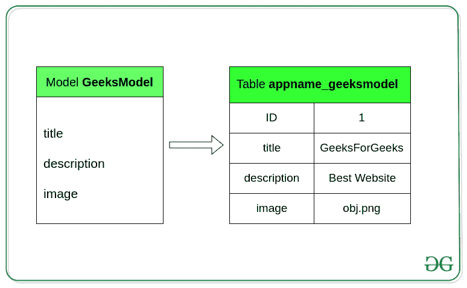
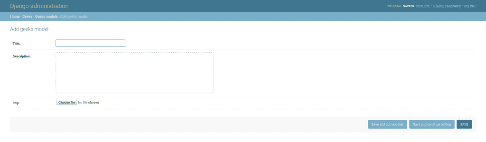
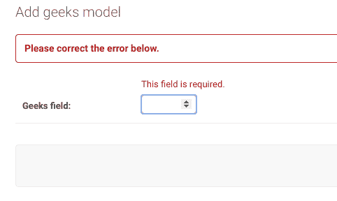

# 姜戈车型

> 原文:[https://www.geeksforgeeks.org/django-models/](https://www.geeksforgeeks.org/django-models/)

一个 **Django 模型**是 Django 用来创建表、它们的字段和各种约束的内置特性。简而言之，Django 模型是一个与 Django 一起使用的数据库的 SQL。SQL(结构化查询语言)是复杂的，涉及许多不同的查询来创建、删除、更新或任何其他与数据库相关的东西。Django 模型简化了任务并将表格组织成模型。通常，每个模型映射到一个数据库表。
本文围绕如何使用 Django 模型方便地在数据库中存储数据展开。此外，我们可以使用 Django 的管理面板来创建、更新、删除或检索模型的字段以及各种类似的操作。Django 模型提供了简单性、一致性、版本控制和高级元数据处理。模型的基础包括–

*   每个模型都是一个 Python 类，它子类化`django.db.models.Model`。*   模型的每个属性代表一个数据库字段。*   With all of this, Django gives you an automatically-generated database-access API; see [Making queries](https://docs.djangoproject.com/en/3.0/topics/db/queries/).

    **示例–**

    ```
    from django.db import models

    # Create your models here.
    class GeeksModel(models.Model):
        title = models.CharField(max_length = 200)
        description = models.TextField()
    ```

    Django 将 Django 模型中定义的字段映射到数据库的表字段中，如下所示。
    

    ## 使用姜戈模型

    要使用姜戈模型，需要有一个项目和一个应用程序在其中工作。启动应用程序后，您可以在 app/models.py 中创建模型。在开始使用模型之前，让我们检查一下如何启动项目并创建名为 geeks.py 的应用程序

    > 请参考以下文章，查看如何在 Django 中创建项目和应用程序。
    > 
    > *   [如何利用姜戈的 MVT 创建基础项目？](https://www.geeksforgeeks.org/how-to-create-a-basic-project-using-mvt-in-django/)
    > *   [如何在姜戈创建 App？](https://www.geeksforgeeks.org/how-to-create-an-app-in-django/)

    ### 创建模型

    **语法**

    ```
    from django.db import models

    class ModelName(models.Model):
            field_name = models.Field(**options)

    ```

    要创建模型，在`geeks/models.py`中输入代码，

    ```
    # import the standard Django Model
    # from built-in library
    from django.db import models

    # declare a new model with a name "GeeksModel"
    class GeeksModel(models.Model):
            # fields of the model
        title = models.CharField(max_length = 200)
        description = models.TextField()
        last_modified = models.DateTimeField(auto_now_add = True)
        img = models.ImageField(upload_to = "images/")

            # renames the instances of the model
            # with their title name
        def __str__(self):
            return self.title
    ```

    每当我们创建一个模型，删除一个模型，或者更新我们项目的任何模型中的任何东西。我们需要运行两个命令`makemigrations`和`migrate`。makemigrates 基本上为预安装的应用程序(可以在 settings.py 中的已安装应用程序中查看)和您在已安装应用程序中添加的新创建的应用程序模型生成 SQL 命令，而 migration 则在数据库文件中执行这些 SQL 命令。
    所以当我们奔跑的时候，

    ```
    Python manage.py makemigrations
    ```

    在创建表时创建上述模型的 SQL 查询，并且

    ```
     Python manage.py migrate
    ```

    在数据库中创建表。

    现在我们已经创建了一个模型，我们可以执行各种操作，比如为表创建一个行，或者根据 Django 创建一个模型实例。要了解更多信息，请访问–[姜戈基础应用模型–“进行迁移和迁移”](https://www.geeksforgeeks.org/django-basic-app-model-makemigrations-and-migrate/)

    ### 在姜戈管理界面中渲染模型

    要在 Django admin 中渲染一个模型，我们需要修改`app/admin.py`。转到极客应用程序中的 admin.py 并输入以下代码。从 models.py 导入相应的模型，并将其注册到管理界面。

    ```
    from django.contrib import admin 

    # Register your models here. 
    from .models import GeeksModel 

    admin.site.register(GeeksModel) 
    ```

    现在我们可以检查模型是否已经在 Django Admin 中渲染。Django 管理界面可用于图形化实现 CRUD(创建、检索、更新、删除)。
    
    要在姜戈管理中查看更多渲染模型，请访问–[姜戈管理界面中的渲染模型](https://www.geeksforgeeks.org/render-model-in-django-admin-interface/)

    ### django CRUD–插入、更新和删除数据

    Django 允许我们使用一个名为 ORM(对象关系映射器)的数据库抽象 API 与它的数据库模型交互，即添加、删除、修改和查询对象。我们可以通过在项目目录中运行以下命令来访问 Django ORM。

    ```
    python manage.py shell
    ```

    **添加对象**。
    要创建相册模型的对象并将其保存到数据库中，我们需要编写以下命令:

    ```
    >>> a = GeeksModel(
             title = “GeeksForGeeks”,  
             description = “A description here”,
             img = “geeks/abc.png”
             )
    >>> a.save()

    ```

    **检索对象**
    要检索模型的所有对象，我们编写以下命令:

    ```
    >>> GeeksModel.objects.all()
    <QuerySet [<GeeksModel: Divide>, <GeeksModel: Abbey Road>, <GeeksModel: Revolver>]>

    ```

    **修改现有对象**
    我们可以如下修改现有对象:

    ```
    >>> a = GeeksModel.objects.get(id = 3)
    >>> a.title = "Pop"
    >>> a.save()

    ```

    **删除对象**
    要删除单个对象，我们需要编写以下命令:

    ```
    >>> a = Album.objects.get(id = 2)
    >>> a.delete()

    ```

    要查看姜戈表单(对象)的详细帖子，请访问[姜戈表单-插入、更新&删除数据](https://www.geeksforgeeks.org/django-orm-inserting-updating-deleting-data/)

    ### 模型中字段的验证

    Django 模型中的内置字段验证是所有 Django 字段预定义的默认验证。每个字段都带有来自 Django 验证器的内置验证。例如，IntegerField 附带了内置验证，它只能存储整数值以及特定范围内的整数值。
    在**极客** app 的`models.py`文件中输入以下代码。

    ```
    from django.db import models
    from django.db.models import Model
    # Create your models here.

    class GeeksModel(Model):
        geeks_field = models.IntegerField()

        def __str__(self):
            return self.geeks_field
    ```

    在 Django 上运行 makemigrations 和 migration 并渲染上述模型后，让我们尝试使用字符串“ **GfG 为 Best** ”创建一个实例。
    
    你可以在管理员界面看到，在一个 IntegerField 中不能输入字符串。同样，每个字段都有自己的验证。欲了解更多验证信息，请访问[内置现场验证-姜戈模型](https://www.geeksforgeeks.org/built-in-field-validations-django-models/)

    ### 关于姜戈模型的更多信息–

    *   [使用 __str__ 函数更改对象显示名称–姜戈模型](https://www.geeksforgeeks.org/change-object-display-name-using-__str__-function-django-models-python/)
    *   [姜戈模型中的自定义字段验证](https://geeksforgeeks.org/custom-field-validations-in-django-models/)
    *   [姜戈 python manage.py 迁移命令](https://www.geeksforgeeks.org/django-manage-py-migrate-command-python/)
    *   [姜戈应用模型–Python manage . py make migrations 命令](https://www.geeksforgeeks.org/django-app-model-python-manage-py-makemigrations-command/)
    *   [姜戈模型数据类型和字段列表](https://contribute.geeksforgeeks.org/django-model-data-types-and-fields-list/)
    *   [如何使用 Django 字段选择？](https://www.geeksforgeeks.org/how-to-use-django-field-choices/)
    *   [覆盖保存方法–姜戈模型](https://www.geeksforgeeks.org/overriding-the-save-method-django-models/)

    ## 基本模型数据类型和字段列表

    模型最重要的部分，也是模型唯一需要的部分是它定义的数据库字段列表。字段由类属性指定。以下是姜戈使用的所有字段类型的列表。

    | 字段名 | 描述 |
    | --- | --- |
    | [自动场](https://www.geeksforgeeks.org/autofield-django-models/) | 它是一个自动递增的整数域。 |
    | [大汽车场](https://www.geeksforgeeks.org/bigautofield-django-models/) | 它是一个 64 位的整数，很像一个自动字段，除了它保证适合从 1 到 9223372036854775807 的数字。 |
    | [【big integrieffield】](https://www.geeksforgeeks.org/bigintegerfield-django-models/) | 它是一个 64 位整数，很像一个整数字段，除了它保证适合从-9223372036854775808 到 922372036854775807 的数字。 |
    | [BinaryField](https://www.geeksforgeeks.org/binaryfield-django-models/) | 存储原始二进制数据的字段。 |
    | [布林栏位](https://www.geeksforgeeks.org/booleanfield-django-models/) | 真/假字段。
    该字段的默认表单小部件是 CheckboxInput。 |
    | [夏菲尔德](https://www.geeksforgeeks.org/charfield-django-models/) | 它是一个日期，在 Python 中用 datetime.date 实例表示。 |
    | 约会场 | 日期，在 Python 中由 datetime.date 实例表示 |
    |  | 它用于日期和时间，在 Python 中由 datetime.datetime 实例表示。 |
    | [十进制字段](https://www.geeksforgeeks.org/decimalfield-django-models/) | 它是一个固定精度的十进制数，在 Python 中用十进制实例表示。 |
    | 耐久性场 | 用于存储时间段的字段。 |
    | [EmailField](https://www.geeksforgeeks.org/emailfield-django-models/) | 它是一个字符域，用于检查该值是否是有效的电子邮件地址。 |
    | [文件字段](https://www.geeksforgeeks.org/filefield-django-models/) | 这是一个文件上传字段。 |
    | [浮动字段](https://www.geeksforgeeks.org/floatfield-django-models/) | 它是一个浮点数，在 Python 中由一个浮点数实例表示。 |
    | [图像场](https://www.geeksforgeeks.org/imagefield-django-models/) | 它继承了 FileField 的所有属性和方法，但也验证了上传的对象是有效的图像。 |
    | [整数文件](https://www.geeksforgeeks.org/integerfield-django-models/) | 它是一个整数字段。从-2147483648 到 2147483647 的值在 Django 支持的所有数据库中都是安全的。 |
    | [genericispaddresfield](https://www.geeksforgeeks.org/genericipaddressfield-django-models/) | 字符串格式的 IPv4 或 IPv6 地址(例如 192.0.2.30 或 2a02:42fe::4)。 |
    | [零乌头田](https://www.geeksforgeeks.org/nullbooleanfield-django-forms/) | 像 BooleanField，但允许空值作为选项之一。 |
    | [正积分场](https://www.geeksforgeeks.org/positiveintegerfield-django-models/) | 像整数字段，但必须是正数或零(0)。 |
    | [正小积分域](https://www.geeksforgeeks.org/positivesmallintegerfield-django-models/) | 像 PositiveIntegerField，但只允许某个特定点(依赖于数据库)下的值。 |
    | [斯拉格菲尔德](https://www.geeksforgeeks.org/slugfield-django-models/) | 鼻涕虫是一个报纸术语。鼻涕虫是某物的简称，只包含字母、数字、下划线或连字符。它们通常用于网址。 |
    | [模型整合场](https://www.geeksforgeeks.org/smallintegerfield-django-models/) | 它就像一个 IntegerField，但是只允许在某个(数据库相关的)点下的值。 |
    | [TextField](https://www.geeksforgeeks.org/textfield-django-models/) | 一个大的文本字段。此字段的默认表单小部件是文本区域。 |
    | [时间域](https://www.geeksforgeeks.org/timefield-django-models/) | 时间，在 Python 中由 datetime.time 实例表示。 |
    | 尖叫场 | 网址的字符域，由网址验证器验证。 |
    | [UUIDField](https://www.geeksforgeeks.org/uuidfield-django-models/) | 用于存储通用唯一标识符的字段。使用 Python 的 UUID 类。当在 PostgreSQL 上使用时，它存储在 uuid 数据类型中，否则存储在 char(32)中。 |

    #### 关系字段

    Django 还定义了一组表示关系的字段。

    | 字段名 | 描述 |
    | --- | --- |
    | [外键](https://www.geeksforgeeks.org/python-relational-fields-in-django-models/) | 多对一的关系。需要两个位置参数:与模型相关的类和 on_delete 选项。 |
    | [ManyToManyField](https://www.geeksforgeeks.org/python-relational-fields-in-django-models/) | 多对多的关系。需要一个位置参数:与模型相关的类，其工作原理与 ForeignKey 完全相同，包括递归和惰性关系。 |
    | [一个字段](https://www.geeksforgeeks.org/python-relational-fields-in-django-models/) | 一对一的关系。从概念上讲，这类似于唯一=真的外键，但是关系的“反向”端将直接返回单个对象。 |

    ## 字段选项

    字段选项是为每个字段提供的参数，用于对特定字段应用某些约束或赋予特定特征。例如，向 CharField 添加参数`null = True`将使它能够在关系数据库中存储该表的空值。
    以下是 CharField 可以使用的字段选项和属性。

    | 字段选项 | 描述 |
    | --- | --- |
    | [零](https://www.geeksforgeeks.org/nulltrue-django-built-in-field-validation/) | 如果**为真**，姜戈会在数据库中将空值存储为**空值**。默认为**假**。 |
    | [空白](https://www.geeksforgeeks.org/blanktrue-django-built-in-field-validation/) | 如果**为真**，则该字段允许为空。默认为**假**。 |
    | 数据库 _ 列 | 用于此字段的数据库列的名称。如果没有给出，Django 将使用字段的名称。 |
    | [默认](https://www.geeksforgeeks.org/default-django-built-in-field-validation/) | 该字段的默认值。这可以是一个值或一个可调用对象。如果可调用，它将在每次创建新对象时被调用。 |
    | [帮助 _ 文字](https://www.geeksforgeeks.org/help_text-django-built-in-field-validation/) | 要与表单小部件一起显示的额外“帮助”文本。即使您的字段没有在表单上使用，它对文档也很有用。 |
    | [主键](https://www.geeksforgeeks.org/primary_key-django-built-in-field-validation/) | 如果为真，则该字段是模型的主键。 |
    | [可编辑](https://www.geeksforgeeks.org/editablefalse-django-built-in-field-validation/) | 如果**为假**，该字段将不会显示在管理或任何其他模型表单中。在模型验证期间也会跳过它们。默认为**真**。 |
    | [错误信息](https://www.geeksforgeeks.org/error_messages-django-built-in-field-validation/) | error_messages 参数允许您覆盖该字段将引发的默认消息。传入一个字典，其关键字与您想要覆盖的错误消息相匹配。 |
    | [帮助 _ 文字](https://www.geeksforgeeks.org/help_text-django-built-in-field-validation/) | 要与表单小部件一起显示的额外“帮助”文本。即使您的字段没有在表单上使用，它对文档也很有用。 |
    | [verbose_name](https://www.geeksforgeeks.org/verbose_name-django-built-in-field-validation/) | 该字段的可读名称。如果没有给出详细名称，Django 将使用字段的属性名称自动创建它，将下划线转换为空格。 |
    | [验证器](https://www.geeksforgeeks.org/custom-field-validations-in-django-models/) | 为此字段运行的验证程序列表。更多信息参见[验证器文档](https://docs.djangoproject.com/en/2.2/ref/validators/)。 |
    | [独特](https://www.geeksforgeeks.org/uniquetrue-django-built-in-field-validation/) | 如果为真，则该字段在整个表中必须是唯一的。 |