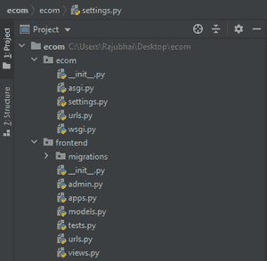

# 姜戈项目——打造展示产品的基础电商网站

> 原文:[https://www . geesforgeks . org/django-project-creating-a-basic-电商-网站-展示-产品/](https://www.geeksforgeeks.org/django-project-creating-a-basic-e-commerce-website-for-displaying-products/)

**项目名称**–使用 Django 的基础电商网站

Django 是一个基于 python 的强大框架。这里我们将看到如何在姜戈创建一个基本的电子商务网站。该项目包括将产品存储在数据库中，并在网站上展示。

> *参考以下文章，查看如何在 Django 中创建项目和应用。*
> 
> *   [*如何在姜戈用 MVT 创建基础项目？*T3】](https://www.geeksforgeeks.org/how-to-create-a-basic-project-using-mvt-in-django/)
> *   [*如何在姜戈创建 App？*T3】](https://www.geeksforgeeks.org/how-to-create-an-app-in-django/)

### 如何使用 Django 创建一个基本的电子商务网站？

现在当你成功安装了 Django。创建新项目–

```py
django-admin startproject ecom 
```

现在在 ecom 项目中创建一个名为 frontend 的新应用程序。现在我们有一个项目和一个项目内的应用程序。]

```py
django-admin startapp frontend
```

**目录结构–**



#### **创建网址–**

在*ECOM>URL . py*中添加以下行。这个文件处理主项目网址。但是我们不想打扰它，所以我们将在前端>URL . py 中工作。为此，我们需要在 ECOM>URL 中包含前端>URL。

```py
urlpatterns = [
    path('admin/', admin.site.urls),
    path('', include('frontend.urls')),
]
```

#### 创建模型–

在此添加产品型号。

```py
class Product(models.Model):
    productname = models.CharField(max_length=200)
    price = models.DecimalField(max_digits=5, decimal_places=2)
    description = models.TextField()
    image = models.CharField(max_length=5000, null=True, blank=True)
```

要了解更多关于 Django 车型的信息，请查看–[Django 车型](https://www.geeksforgeeks.org/django-models/)

#### 向管理员注册模型–

在创建模型之后，我们应该将该表单注册到 admin . py

```py
from django.contrib import admin
from .models import *

admin.site.register(Product)
```

#### 创建用于展示产品的视图–

在*前端>视图中，我们编写了一个函数来获取和显示数据库中的产品。*

```py
from django.shortcuts import render
from .models import *

def products(request):
    productss = Product.objects.all()
    return render(request, 'products.html', {'productss':productss})
```

#### 为产品创建 URl–

在这里，我们将设置动态网址，这可能有助于显示我们的产品。在*前端>URL . py*

```py
from django.urls import path
from . import views

urlpatterns = [

    path('products/', views.products, name='products'),

]
```

#### 创建模板–

创建模板取决于您希望如何在网站上显示产品。为了展示产品，我们分享了一个简单的代码。将其添加到*前端>模板>products.html*中

```py

<div class="card" style="width: 18rem;">
  
  <div class="card-body">
    <h5 class="card-title">{{ product.productname }}</h5>
    <p class="card-text">{{ product.description }}</p>
    <p class="card-text">Price - {{ product.price }}</p>
    <a href="#" class="btn btn-primary">Buy Now</a>
  </div>
</div>

```

#### 进行迁移和迁移–

现在是时候将我们的模型移植到数据库中了。首先，我们必须创建迁移。为此，请在终端中键入以下代码。

```py
python manage.py makemigrations
```

创建迁移后，键入以下代码来应用这些迁移

```py
python manage.py migrate
```

要了解更多关于进行迁移和迁移的信息，请查看–[<u>基本应用模型–</u>](https://www.geeksforgeeks.org/django-basic-app-model-makemigrations-and-migrate/)

#### **创建超级用户–**

现在，创建 Django 超级用户来处理管理事务。在终端
输入以下命令

```py
django-admin createsuperuser
```

然后它会询问用户名、电子邮件和密码。

#### 运行应用程序

创建超级用户后，在终端类型中，

```py
python manage.py runserver
```

要启动服务器并转到管理面板(**http://localhost:8000/admin**)并向数据库添加一些产品。

#### 输出–


就是这样。你的基本电子商务网站已经准备好，你可以在那里展示你的产品