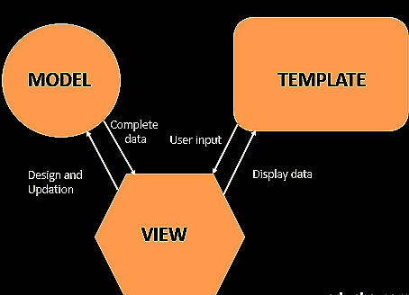
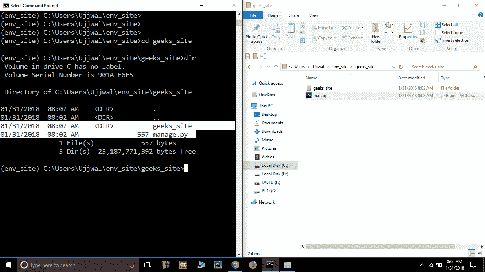
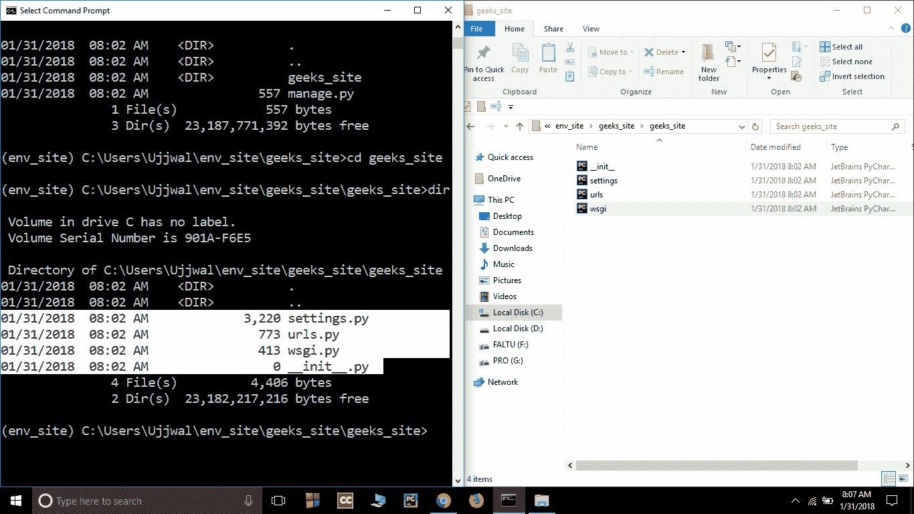

# 姜戈项目 MVT 结构

> 原文:[https://www.geeksforgeeks.org/django-project-mvt-structure/](https://www.geeksforgeeks.org/django-project-mvt-structure/)

Django 基于 **MVT(模型-视图-模板)**架构。MVT 是一个开发 web 应用程序的软件设计模式。

**MVT 结构有以下三部分–**

**模型:**模型将作为你数据的接口。它负责维护数据。它是整个应用程序背后的逻辑数据结构，由数据库(通常是关系数据库，如 MySql、Postgres)表示。要查看更多信息，请访问–[姜戈模型](https://www.geeksforgeeks.org/django-models/)

**视图:**视图是用户界面——渲染网站时在浏览器中看到的内容。它由 HTML/CSS/Javascript 和 Jinja 文件表示。要查看更多信息，请访问–[姜戈视图](https://www.geeksforgeeks.org/views-in-django-python/)。

**模板:**模板由所需 HTML 输出的静态部分以及一些描述如何插入动态内容的特殊语法组成。要查看更多信息，请访问–[姜戈模板](https://www.geeksforgeeks.org/django-templates/)



### 项目结构:

Django 项目在初始化时默认包含基本文件，如 manage.py、view.py 等。一个简单的项目结构足以创建一个单页应用程序。以下是主要文件及其说明。在 geeks_site 文件夹(项目文件夹)里面会有以下文件-



**manage.py-** 该文件用于通过命令行与您的项目进行交互(启动服务器、同步数据库等)。要获取可由 manage.py 执行的命令的完整列表，请在命令窗口中键入以下代码-

```
$ python manage.py help
```

**文件夹(geeks _ site)–**这个文件夹包含你项目的所有包。最初，它包含四个文件–



*   **_init_。py–**是一个 python 包。当包或包中的模块被导入时调用。我们通常用它来执行包初始化代码，例如包级数据的初始化。
*   **settings . py–**顾名思义，它包含了所有的网站设置。在这个文件中，我们注册我们创建的任何应用程序、静态文件的位置、数据库配置细节等。
*   **URLs . py–**在这个文件中，我们存储了项目的所有链接和要调用的函数。
*   **wsgi . py–**这个文件用于在 WSGI 中部署项目。它用于帮助您的 Django 应用程序与 web 服务器进行通信。