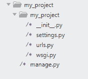
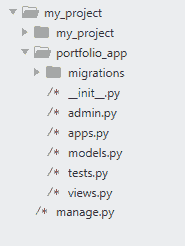
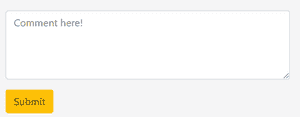

# 姜戈项目创建评论系统

> 原文:[https://www . geesforgeks . org/django-project-to-create-a-comments-system/](https://www.geeksforgeeks.org/django-project-to-create-a-comments-system/)

对帖子进行评论是帖子最常见的特性，在 Django 中实现比在其他框架中容易得多。要实现这个特性，需要遵循一些步骤，但首先让我们从创建一个新项目开始。

## 如何在姜戈创建评论功能？

*   打开命令提示符并运行以下命令。

启动一个新的 django 项目，如:

```
django-admin startproject my_project
```

执行此命令后，您将看到 django 为您创建的以下文件和文件夹。要查看这个文件夹，您可以使用命令提示符下的 tree 命令，或者在 ide 中打开该文件夹，在我的例子中，我使用了*崇高文本编辑器*。



创建新应用程序，如下所示:

```
python manage.py startapp portfolio_app
```

Django 会自动创建文件，这样您就可以专注于您的任务，而不用担心其他事情，比如制作文件和构建文件。



在本文中，我们将制作一个帖子模型来发布图片:

该职位由以下字段组成:

```
1.Image
2.Caption or description
3.Date posted
4.Author of the image.
```

首先，导入**模型中需要的模块。**

```
from django.db import models
from django.utils import timezone
from django.contrib.auth.models import User
```

现在，继续使用 models.py 模块，追加下面的代码片段。

## 蟒蛇 3

```
class Post(models.Model):
    image = models.ImageField(
        default ="default_foo.png", upload_to ="post_picture")
    caption = models.TextField()
    date_posted = models.DateTimeField(default = timezone.now)
    author = models.ForeignKey(User, on_delete = models.CASCADE)

    def __str__(self):
        return f'{self.author.username}\'s Post- {self.title}'

    def save(self, *args, **kwargs):
        super().save(*args, **kwargs)
        img = Image.open(self.image.path)
        if img.height > 400 or img.width > 400:
            output_size = (300, 300)
            img.thumbnail(output_size)
            img.save(self.image.path)
```

模型的名称是 post 模型(它可以是您选择的任何一个)。让我们了解所使用的每个字段的详细信息。

**图像字段:**该字段允许在数据库中存储图像。默认值包括一个默认图像，我把它命名为 default_foo.png。当没有图片可用或用户发布时，它会自动保存。此图像位于我的项目目录中名为“媒体”的文件夹中。如果用户上传图片，它将被上传到名为 post_picture 的目录中，该目录由属性 upload_to 设置。

**标题:**该字段描述了被命名为图像字段标题的图像描述。

**发布日期**:此字段考虑图像上传的时间和日期。默认值 timezone.now 保存创建这篇文章的时间。如果帖子在发布后更新，时间/日期不会改变。

**作者:**该属性考虑了发布此帖子的用户。它将 django 用户作为参数来执行此操作。on_delete 字段关注如果用户被删除，帖子可能会出现的异常。当用户被删除时，模型、级联字段同时删除所有与用户相关的帖子数据。

**__str__ 方法:**这些方法在 python 中也被称为魔法方法。它以自我为属性。这个方法向后端的 django 管理员显示标题信息。

**保存方法:**该方法为覆盖保存用户自定义值的帖子。如果我们想在数据库中保存特定大小的图像，可以使用 save 方法。为此，ypu 必须在您的 models.py 模块中导入 PIL 才能读取图像。通过 Open 方法将图像打开到一个变量中，并将其以特定的输出大小存储在数据库中，以避免在数据库中存储大型图像。

成功创建 post 模型后，在终端上运行以下命令，进行更改并将其保存在数据库中。

```
python manage.py makemigrations
python manage.py migrate
```

这将在您的数据库中创建发布表。我用的是 django 默认数据库。

*为了可视化您的表和数据库，我建议您下载 sqlite 的**数据库浏览器，它将为您提供查看、编辑所有模式的界面。***

*在实现你的帖子模型之后，现在是时候在你的帖子上实现评论功能了。*

1.  在 forms.py 模块中制作一个表单来获取数据。
2.  创建一个函数来保存或删除 views.py 模块中的注释。
3.  从 html 文件中获取注释。

制作表格收集**表单. py 模块**中的评论内容。如果您的 django 应用程序中没有 form.py，请创建一个。

Django 有内置的表单来创建和直接访问它，而无需从头开始编写新的表单。

## 蟒蛇 3

```
from django import forms
from .models import Comment

class CommentForm(forms.ModelForm):
    content = forms.CharField(label ="", widget = forms.Textarea(
    attrs ={
        'class':'form-control',
        'placeholder':'Comment here !',
        'rows':4,
        'cols':50
    }))
    class Meta:
        model = Comment
        fields =['content']
```

转到**view . py**模块，处理和保存来自 html 表单的数据，下面的代码继续。我在帖子细节视图中实现了评论功能，你可以在任何你想用的地方使用它，方法是一样的。

## 蟒蛇 3

```
from .forms import CommentForm

def post_detailview(request, id):

  if request.method == 'POST':
    cf = CommentForm(request.POST or None)
    if cf.is_valid():
      content = request.POST.get('content')
      comment = Comment.objects.create(post = post, user = request.user, content = content)
      comment.save()
      return redirect(post.get_absolute_url())
    else:
      cf = CommentForm()

    context ={
      'comment_form':cf,
      }
    return render(request, 'socio / post_detail.html', context)
```

从 forms.py 模块导入 *CommentForm* ，制作 CommentForm 对象，检查是否有效。Django 提供内置功能，通过 *is_valid* 方法检查表单凭证和格式。

用 get 方法抓取帖子内容，用 create 方法创建新的评论，然后用 Save 方法保存在数据库中创建新帖子时创建的对象的数据。

cf 对象通过上下文字典传递到 html 中，以访问 HTML 中的所有注释。

最后，为了从 html 表单中获取数据，表单标签与 post 方法一起使用，因为我们必须将数据发送到服务器。下面的代码片段显示了如何从 html 表单中获取值。

## 超文本标记语言

```

<html>
  <head>
  <title></title>
  </head>
<body> 
  <form method="POST">
    
    {{comment_form.as_p}}
  </form>
</body>
```

这里， *Csrf_token* 用于安全目的。Django 通过这个令牌处理表单加密。

*as_p* 方法采用段落方式展现形式，更好的可视化。

**输出–**

[](https://media.geeksforgeeks.org/wp-content/uploads/20200608014818/gfgimg-300x117.PNG)

盒子怎么用

您可以通过 HTML 中的 for 循环显示所有注释。Django 提供了新的 HTML 语言来访问在 views.py 模块的上下文中传递的数据和变量，该模块包含 for 循环、if-else 条件等。

您可以在我的 github 中的我的社交媒体网站项目中查看此功能。

[https://github . com/Shikhamma 16/社交媒体-网站-使用-django](https://github.com/Shikharm16/social-media-site-using-django)