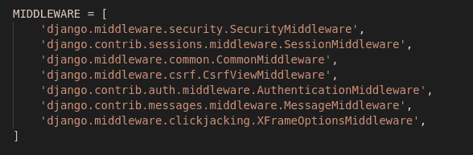
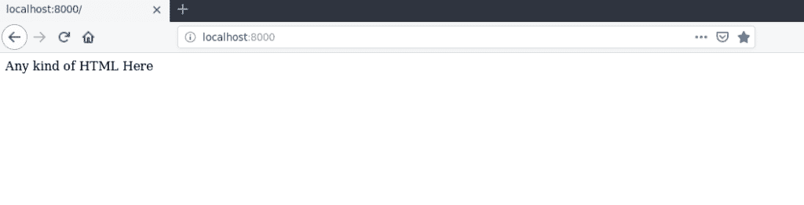

# 姜戈请求和响应周期–http Request 和 HttpResponse 对象

> 原文:[https://www . geesforgeks . org/django-请求和响应周期-http request-和-httpresponse-objects/](https://www.geeksforgeeks.org/django-request-and-response-cycle-httprequest-and-httpresponse-objects/)

**先决条件–**[视图在姜戈| Python](https://www.geeksforgeeks.org/views-in-django-python/)
中，在我们开始使用视图附带的便利方法之前，让我们来谈谈请求和响应周期。因此，当一个请求发生在一个 Django 服务器上时，会发生一些事情。其中之一就是中间件。

**中间件**
中间件就像是请求和响应之间的中间地带。它就像一个数据通过的窗口。就像在窗户里一样，光线进出房子。类似地，当发出一个请求时，它通过中间件移动到视图，数据作为响应通过中间件传递。
以下是安装在姜戈的默认中间件。



你可以添加你的中间产品。我们将在接下来的文章中讨论这个问题。

### 请求和响应对象:

Django 使用请求和响应对象通过系统传递状态。
当请求一个页面时，Django 创建一个包含请求元数据的 HttpRequest 对象。然后，Django 加载适当的视图，将 HttpRequest 作为第一个参数传递给视图函数。每个视图负责返回一个 HttpResponse 对象。

#### HttpRequest 和 HttpResponse 对象示例

*   为了解释这些对象，让我们创建一个视图主页，如下图所示

## 蟒蛇 3

```
# importing HttResponse from library
from django.http import HttpResponse

def home(request):
    # request is handled using HttpResponse object
    return HttpResponse("Any kind of HTML Here")
```

*   为了处理这个请求，让我们在**URL . py**
    中映射一个 URL 到这个视图

## 蟒蛇 3

```
# importing view from views.py
from .views import home

urlpatterns = [
    path('', home),

]
```

*   现在可以运行服务器在浏览器
    中看到以下内容



#### HttpRequest 属性–姜戈

您可以将以下属性与 HttpRequest 一起用于高级操作

<figure class="table">

| 属性 | 描述 |
| --- | --- |
| HttpRequest.scheme | 表示请求方案的字符串(通常是 HTTP 或 HTTPS)。 |
| HttpRequest.body | 它以字节字符串的形式返回原始的 HTTP 请求体。 |
| HttpRequest.path | 它返回不包含方案或域的请求页面的完整路径。 |
| HttpRequest.path_info | 它显示路径的路径信息部分。 |
| HttpRequest.method | 它显示了请求中使用的 HTTP 方法。 |
| HttpRequest.encoding | 它显示了用于解码表单提交数据的当前编码。 |
| HttpRequest.content_type | 它显示了从 CONTENT_TYPE 头解析的请求的 MIME 类型。 |
| HttpRequest.content_params | 它返回 CONTENT_TYPE 头中包含的键/值参数的字典。 |
| HttpRequest。得到 | 它返回一个类似字典的对象，包含所有给定的 HTTP GET 参数。 |
| HttpRequest。邮政 | 它是一个类似字典的对象，包含所有给定的 HTTP POST 参数。 |
| HttpRequest。饼干 | 它会返回所有可用的 cookies。 |
| HttpRequest。文件 | 它包含所有上传的文件。 |
| HttpRequest.META | 它显示所有可用的 Http 头。 |
| HttpRequest.resolver_match | 它包含一个表示解析的网址的 ResolverMatch 实例。 |

</figure>

#### HttpRequest 方法–姜戈

您可以使用以下方法配合 HttpRequest 进行高级操作

<figure class="table">

| 属性 | 描述 |
| --- | --- |
| HttpRequest.get_host() | 它返回请求的原始主机。 |
| HttpRequest.get_port() | 它返回请求的起始端口。 |
| HttpRequest.get_full_path() | 如果适用，它返回路径和附加的查询字符串。 |
| http request . build _ absolute _ uri*(位置)* | 它返回位置的绝对 URI 形式。 |
| http request . get _ signed _ cookie*(键，默认=RAISE_ERROR，salt=，max_age=None)* | 它为签名的 cookie 返回一个 cookie 值，或者如果签名不再有效，则引发 django . core . signing . BadSignature 异常。 |
| HttpRequest.is_secure() | 如果请求是安全的，则返回真；也就是说，如果它是用 HTTPS 制造的。 |
| HttpRequest.is_ajax() | 如果请求是通过 XMLHttpRequest 发出的，则返回真。 |

</figure>

#### http 响应属性–姜戈

您可以将以下属性与 HttpResponse 一起用于高级操作

<figure class="table">

| 属性 | 描述 |
| --- | --- |
| HttpResponse.content | 表示内容的字节串，必要时从字符串中编码。 |
| HttpResponse.charset | 它是一个字符串，表示将对响应进行编码的字符集。 |
| HttpResponse.status_code | 这是响应的 **HTTP 状态代码**。 |
| HttpResponse.reason _ 短语 | 响应的 HTTP 原因短语。 |
| HttpResponse.streaming | 默认为假。 |
| HttpResponse.closed | 如果响应已关闭，则为真。 |

</figure>

#### http 响应方法–姜戈

可以使用以下方法配合 HttpResponse 进行高级操作

<figure class="table">

| 方法 | 描述 |
| --- | --- |
| http 响应。__init__ *(content=，content _ type =无，状态=200，原因=无，字符集=无)* | 它用于用给定的页面内容和内容类型实例化一个 HttpResponse 对象。 |
| http 响应。__setitem__ *(表头，数值)* | 它用于将给定的标头名称设置为给定值。 |
| http 响应。__delitem__ *(表头)* | 它删除具有给定名称的标头。 |
| http response(http 响应)。_ _ _ _ _ getitem _*(标题)* | 它返回给定标题名称的值。 |
| HttpResponse.has_header *(表头)* | 根据对具有所提供名称的标头不区分大小写的检查，它返回“真”或“假”。 |
| HttpResponse.setdefault *(表头，数值)* | 用于设置默认表头。 |
| HttpResponse.write *(内容)* | 用于创建类文件对象的响应对象。 |
| HttpResponse.flush() | 它用于刷新响应对象。 |
| HttpResponse.tell() | 此方法使 HttpResponse 实例成为类似文件的对象。 |
| HttpResponse.getvalue（） | 它用于获取 HttpResponse.content 的值。 |
| HttpResponse .可读() | 此方法用于创建 HttpResponse 类的类似流的对象。 |
| HttpResponse.seekable() | 它用于使响应对象可查找。 |

</figure>