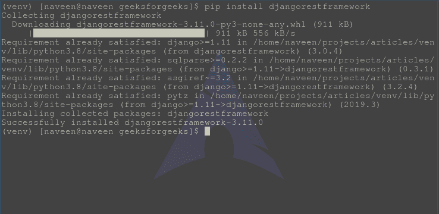

# Django REST 框架安装

> 原文:[https://www . geesforgeks . org/django-rest-framework-installation/](https://www.geeksforgeeks.org/django-rest-framework-installation/)

Django REST 框架可以通过类似 [Django 安装](https://www.geeksforgeeks.org/django-introduction-and-installation/)的 pip 包进行安装。由于 Django REST 框架是默认 Django 框架的包装器，要安装它，Django 应该已经安装了。现在要安装 rest 框架，请遵循以下过程。

#### 先决条件

*   [蟒蛇](https://www.geeksforgeeks.org/download-and-install-python-3-latest-version/)
*   [Pip](https://www.geeksforgeeks.org/how-to-install-pip-on-windows/)
*   [Django](https://www.geeksforgeeks.org/django-introduction-and-installation/)

    #### 如何安装 Django REST 框架

    要在 Windows、Linux 或任何操作系统上安装 Django REST 框架，需要 pip 包。要检查如何在您的操作系统上安装画中画，请检查-画中画安装-[窗口](https://www.geeksforgeeks.org/how-to-install-pip-on-windows/)|[Linux](https://www.geeksforgeeks.org/how-to-install-pip-in-linux/)。
    现在，运行一个简单的命令，

    ```py
    pip install djangorestframework
    ```

    等待和放松，休息框架将很快安装。
    

    #### 使用源代码安装 Django REST 框架

    可以直接使用源代码安装 Django REST 框架，先安装 git 命令行，然后

    ```py
    git clone https://github.com/encode/django-rest-framework
    ```

    克隆后，它将其添加到安装 django 的 bin 目录中。

    #### 将 rest_framework 添加到 INSTALLED_APPS

    为了让 Django REST 框架在 Django 之上工作，您需要在 INSTALLED_APPS 中的 settings.py 中添加 rest_framework。

    ```py
    INSTALLED_APPS = (
        'django.contrib.admin',
        'django.contrib.auth',
        'django.contrib.contenttypes',
        'django.contrib.sessions',
        'django.contrib.messages',
        'django.contrib.staticfiles',
        'rest_framework'
    )

    ```

    宾果游戏..！！Django REST 框架安装成功，一个案例在 Django 的任何应用中使用。