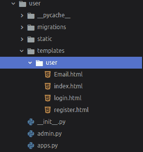
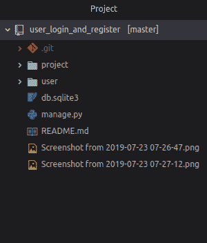
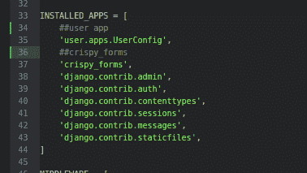
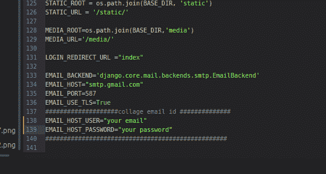

# Django 注册并使用确认邮件登录| Python

> 原文:[https://www . geesforgeks . org/django-注册并登录-确认-电子邮件-python/](https://www.geeksforgeeks.org/django-sign-up-and-login-with-confirmation-email-python/)

Django 默认提供一个*认证系统配置*。**用户**对象是认证系统的核心，今天我们将实现 Django 的认证系统。

**所需模块:**

*   姜戈:[姜戈安装](https://www.geeksforgeeks.org/django-introduction-and-installation/)
*   脆皮形式:

```
pip install --upgrade django-crispy-forms
```

**基本设置:**
通过以下命令启动项目–

```
 django-admin startproject project
```

将目录更改为项目–

```
 cd project
```

启动服务器-通过在终端中键入以下命令启动服务器–

```
 python manage.py runserver
```

要检查服务器是否正在运行，请转到网络浏览器，输入 *http://127.0.0.1:8000/* 作为网址。
现在按停止服务器

```
ctrl-c
```

**我们现在创建一个名为“用户”的应用。**

```
python manage.py startapp user
```

通过执行以下操作转到用户/文件夹: *cd 用户*并创建文件夹*模板*以及文件*index.html、login.html、Email.html、register.html*文件。



使用文本编辑器打开项目文件夹。目录结构应该是这样的:



现在在 settings.py 的 todo_site 中添加“用户”应用程序和“脆皮表单”,然后添加

```
CRISPY_TEMPLATE_PACK = 'bootstrap4'
```

设置结束。py



在 setting.py:
中配置*电子邮件设置*



*将您的电子邮件和密码放在这里。*

**在项目中编辑*****URL . py*****文件:**

## 蟒蛇 3

```
from django.contrib import admin
from django.urls import path, include
from user import views as user_view
from django.contrib.auth import views as auth

urlpatterns = [

    path('admin/', admin.site.urls),

    ##### user related path##########################
    path('', include('user.urls')),
    path('login/', user_view.Login, name ='login'),
    path('logout/', auth.LogoutView.as_view(template_name ='user/index.html'), name ='logout'),
    path('register/', user_view.register, name ='register'),

]
```

**在用户中编辑 URL . py:**

## 蟒蛇 3

```
from django.urls import path, include
from django.conf import settings
from . import views
from django.conf.urls.static import static

urlpatterns = [
         path('', views.index, name ='index'),
]
```

**在用户:**中编辑 ***视图***

## 蟒蛇 3

```
from django.shortcuts import render, redirect
from django.contrib import messages
from django.contrib.auth import authenticate, login
from django.contrib.auth.decorators import login_required
from django.contrib.auth.forms import AuthenticationForm
from .forms import UserRegisterForm
from django.core.mail import send_mail
from django.core.mail import EmailMultiAlternatives
from django.template.loader import get_template
from django.template import Context

#################### index#######################################
def index(request):
    return render(request, 'user/index.html', {'title':'index'})

########### register here #####################################
def register(request):
    if request.method == 'POST':
        form = UserRegisterForm(request.POST)
        if form.is_valid():
            form.save()
            username = form.cleaned_data.get('username')
            email = form.cleaned_data.get('email')
            ######################### mail system ####################################
            htmly = get_template('user/Email.html')
            d = { 'username': username }
            subject, from_email, to = 'welcome', 'your_email@gmail.com', email
            html_content = htmly.render(d)
            msg = EmailMultiAlternatives(subject, html_content, from_email, [to])
            msg.attach_alternative(html_content, "text/html")
            msg.send()
            ##################################################################
            messages.success(request, f'Your account has been created ! You are now able to log in')
            return redirect('login')
    else:
        form = UserRegisterForm()
    return render(request, 'user/register.html', {'form': form, 'title':'reqister here'})

################ login forms###################################################
def Login(request):
    if request.method == 'POST':

        # AuthenticationForm_can_also_be_used__

        username = request.POST['username']
        password = request.POST['password']
        user = authenticate(request, username = username, password = password)
        if user is not None:
            form = login(request, user)
            messages.success(request, f' wecome {username} !!')
            return redirect('index')
        else:
            messages.info(request, f'account done not exit plz sign in')
    form = AuthenticationForm()
    return render(request, 'user/login.html', {'form':form, 'title':'log in'})
```

在此配置您的电子邮件。

**现在在用户中创建一个 forms . py:**

## 蟒蛇 3

```
from django import forms
from django.contrib.auth.models import User
from django.contrib.auth.forms import UserCreationForm

class UserRegisterForm(UserCreationForm):
    email = forms.EmailField()
    phone_no = forms.CharField(max_length = 20)
    first_name = forms.CharField(max_length = 20)
    last_name = forms.CharField(max_length = 20)
    class Meta:
        model = User
        fields = ['username', 'email', 'phone_no', 'password1', 'password2']
```

**导航至** ***模板/用户/*** **并编辑文件:**

*   [链接到 index.html 文件](https://github.com/itsvinayak/user_login_and_register/blob/master/user/templates/user/index.html)
*   [链接到 Email.html](https://github.com/itsvinayak/user_login_and_register/blob/master/user/templates/user/Email.html)
*   [链接到 login.html](https://github.com/itsvinayak/user_login_and_register/blob/master/user/templates/user/login.html)
*   [链接到 register.html](https://github.com/itsvinayak/user_login_and_register/blob/master/user/templates/user/register.html)

**进行迁移并迁移。**

```
python manage.py makemigrations
python manage.py migrate
```

**现在你可以运行服务器查看你的应用了。**

```
python manage.py runserver
```

