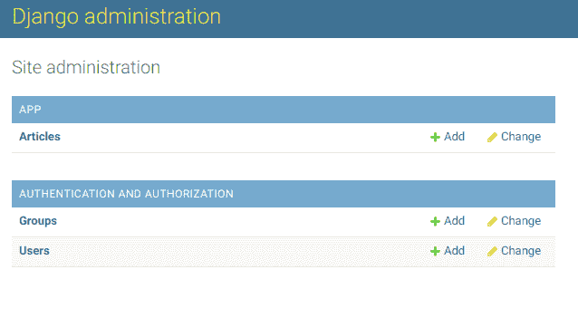
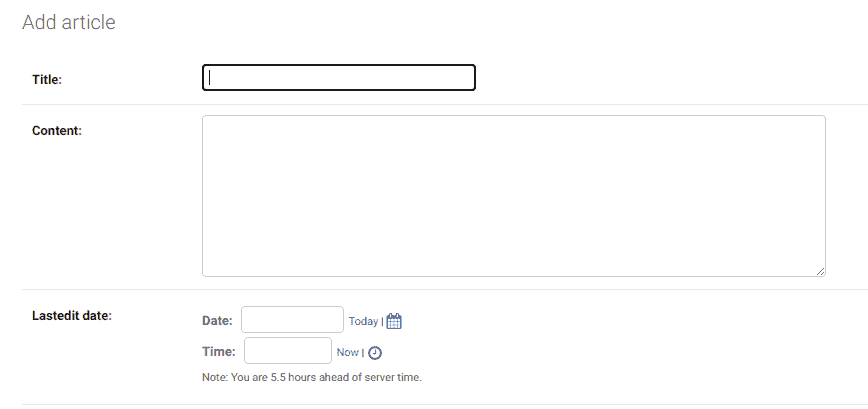
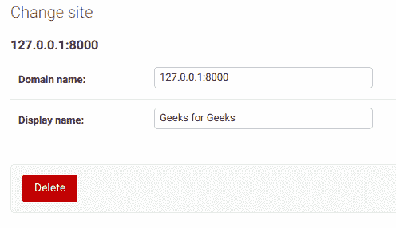
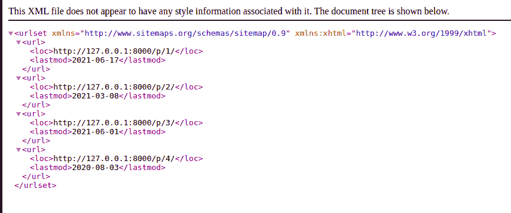

# 姜戈–网站地图框架

> 原文:[https://www.geeksforgeeks.org/django-sitemap-framework/](https://www.geeksforgeeks.org/django-sitemap-framework/)

**先决条件:** [姜戈介绍和安装](https://www.geeksforgeeks.org/django-introduction-and-installation/)

搜索引擎对网站的网址进行抓取和索引，以在搜索结果中显示它们。搜索引擎建议明确提交一个 XML 文件，该文件包含您网站的所有重要和更新的网址，以便更快地进行搜索和索引。Django 提出了一个站点地图框架来简化生成 XML 文件和搜索引擎抓取的过程。

让我们以极客为例来了解一下网站地图的创建。假设极客网站每天发布 100 篇文章，我们必须创建一个由这些文章的网址组成的 XML 文件。

按照 [Django 介绍安装](https://www.geeksforgeeks.org/django-introduction-and-installation/)设置虚拟环境，安装 Django。

**步骤 1:** 通过以下命令启动项目

```py
django-admin startproject geeks_site
```

**第二步:**将目录改为极客 _ 站点

```py
cd geeks_site
```

**第三步:**创建一个名为**博客的应用**

```py
python manage.py startapp blog
```

**第 4 步:**将你的应用添加到设置中。py

## 蟒蛇 3

```py
INSTALLED_APPS = [
    'django.contrib.admin',
    'django.contrib.auth',
    'django.contrib.contenttypes',
    'django.contrib.sessions',
    'django.contrib.messages',
    'django.contrib.staticfiles',
    'blog.apps.BlogConfig',
]
```

**第五步:**在**博客** app 中创建名为**文章**的模型

*   **字段:**
    *   **标题:**存储文章对象的标题
    *   **lastedit_date:** 存储文章对象的最后更新日期
*   **方法:**
    *   **get_absolute_url:** 返回指向对象的绝对 url

**车型. py**

## 蟒蛇 3

```py
class Article(models.Model):
    title = models.CharField(max_length=200)
    lastedit_date = models.DateTimeField()

    def get_absolute_url(self):
        return "/p/%i/" % self.id
```

**第六步:**在**博客/admin.py** 注册你的模型，这样它就会出现在管理面板中。

**admin.py**

## 蟒蛇 3

```py
# blog/admin.py
from django.contrib import admin 
from .models import Article

admin.site.register(Article)
```

**步骤 7:** 现在，要迁移所有更改并启动服务器，请在终端中运行以下命令

```py
python manage.py makemigrations
python manage.py migrate
python manage.py runserver
```

创建超级用户帐户以登录到管理面板

```py
python manage.py createsuperuser
```

现在，请访问管理面板 http://127.0.0.1:8000/admin/



现在，让我们安装并初始化姜戈的站点地图框架

### 安装站点地图

要使用站点地图框架，您需要对您的**设置进行以下更改。**

*   在姜戈，默认情况下网站地图框架是**而不是**，所以在 **INSTALLED_APPS** 中添加以下内容

```py
django.contrib.sitemaps
```

*   站点地图框架使用另一个姜戈的内置站点框架来运行。另外，在**已安装的应用程序**中添加以下内容

```py
django.contrib.sites
```

然后在 INSTALLED_APPS 列表后添加以下内容

```py
SITE_ID = 1
```

## 蟒蛇 3

```py
# Application definition
INSTALLED_APPS = [
    'django.contrib.admin',
    'django.contrib.auth',
    'django.contrib.contenttypes',
    'django.contrib.sessions',
    'django.contrib.messages',
    'django.contrib.staticfiles',
    'django.contrib.sites',
      'django.contrib.sitemaps,
    'blog'
]

SITE_ID = 1
```

### 站点地图的初始化

**第一步:**在你的**博客** app 中创建一个名为 **sitemap.py** 的文件

**步骤 2:** 在**站点地图中为你的文章模型创建一个站点地图类**

*   ArticleSitemap 类覆盖 Sitemap 类的以下两种方法
    *   **items:** 返回所有文章对象，其 URL 将包含在 XML 文件中
    *   **lastmod:** 使用博客应用中文章模型的 **lastedit_date** 字段返回对象的上次修改日期

**sitemap.py**

## 蟒蛇 3

```py
from django.contrib.sitemaps import Sitemap
from .models import Article

class ArticleSitemap(Sitemap):
    def items(self):
        return Article.objects.all()

    def lastmod(self, obj):
        return obj.lastedit_date
```

**第三步:**将这些行添加到你的**博客中**

## 蟒蛇 3

```py
from django.contrib.sitemaps.views import sitemap
from blog.sitemap import ArticleSitemap
from django.urls import path

path('sitemap.xml', sitemap, {'sitemaps': {'article' : ArticleSitemap}},
     name='django.contrib.sitemaps.views.sitemap')
```

此处**sitemap . XML**指向 Sitemap 框架的 **sitemap 视图**，其中 **ArticleSitemap** 类作为指定格式的必需参数在上一步中创建，即**{【sitemaps】:{【article】:article Sitemap }**

现在，再次迁移所有更改并启动服务器

```py
python manage.py makemigrations
python manage.py migrate
python manage.py runserver
```

**第 4 步:**在文章部分，创建一些文章。单击添加按钮后，您将看到以下字段。



当你点击站点部分时，你会看到类似这样的内容


对管理面板的站点部分进行以下更改



现在请访问您本地机器上的 http://127 . 0 . 0 . 1:8000/sitemap . XML。由所有网址组成的最终 XML 文件将呈现为:

