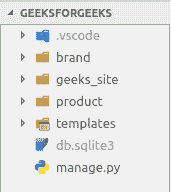

# 姜戈模板|集合–1

> 原文:[https://www.geeksforgeeks.org/django-templates-set-1/](https://www.geeksforgeeks.org/django-templates-set-1/)

有两种类型的网页——静态网页和动态网页。**静态网页**是那些内容是静态的网页，即不随时间变化的网页。每次打开该页面，您都会看到相同的内容。他们的内容与时间、地点、用户等无关。**动态网页**是那些内容动态生成的网页，即它们根据位置、时间、用户和各种因素而变化。

### 什么是模板？

Django 框架高效地处理和生成最终用户可见的动态网页。Django 主要与后端功能，所以，为了提供前端和提供我们的网站布局，我们使用模板。根据我们的需要，有两种方法可以将模板添加到我们的网站上。

1.  我们可以使用一个单一的模板目录，它将遍布整个项目。
2.  对于我们项目的每个应用程序，我们可以创建不同的模板目录。

对于我们当前的项目，我们将创建一个单一的模板目录，为了简单起见，它将分布在整个项目中。应用级模板通常用于大型项目，或者我们希望为网页的每个组件提供不同的布局。

### 向项目添加模板–

在与我们的项目相同的目录中创建一个模板目录。在我们的例子中，这就是“T2”。所以，我们的目录结构是现在，

现在，导航到`geeksforgeeks/geeks_site/settings.py`。

```
TEMPLATES = [
    {
        'BACKEND': 'django.template.backends.django.DjangoTemplates',
        'DIRS': [],
        'APP_DIRS': True,
        'OPTIONS': {
            'context_processors': [
                'django.template.context_processors.debug',
                'django.template.context_processors.request',
                'django.contrib.auth.context_processors.auth',
                'django.contrib.messages.context_processors.messages',
            ],
        },
    },
]
```

在上面的代码中，修改

```
'DIRS': []

as
'DIRS': [os.path.join(BASE_DIR, 'templates')]
```

上面一行使用 os 模块将我们的项目链接到我们的模板目录。如果您在终端中打印 BASE_DIR，您将看到项目的目录。例如，在我的例子中，它是

```
/home/ankush/Desktop/Programming/webproject/geeksforgeeks
```

现在，我们的命令将把我们的 BASE_DIR 加入到“templates”中，并将其输入到 TEMPLATE 的“DIRS”键中。现在，我们可以将我们的 HTML 代码保存在***geeksforgeeks/templates***目录中，并可以从我们的代码中访问它。