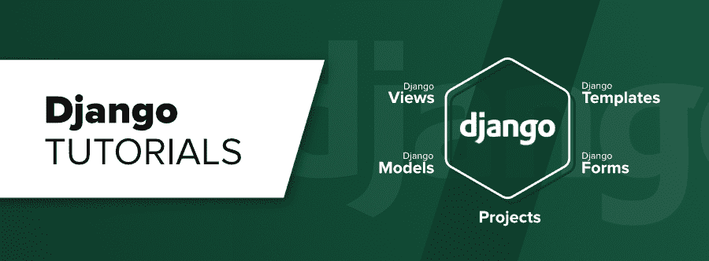

# 姜戈教程

> 原文:[https://www.geeksforgeeks.org/django-tutorial/](https://www.geeksforgeeks.org/django-tutorial/)

Django 是一个基于 Python 的网络框架，允许您快速创建高效的网络应用程序。它也被称为电池内置框架，因为 Django 为一切提供内置功能，包括 Django 管理界面、默认数据库——sqllite 3 等。当你建立一个网站时，你总是需要一组相似的组件:一种处理用户身份验证(注册、登录、注销)的方法，一个网站、表单的管理面板，一种上传文件的方法，等等。Django 为您提供现成的组件供您使用，这也有助于快速开发。

#### 为什么是 Django 框架？

*   优秀的文档和高扩展性。
*   顶级跨国公司和公司使用，如 Instagram、Disqus、Spotify、Youtube、Bitbucket、Dropbox 等。这份名单永无止境。
*   最容易学习的框架，快速开发和电池完全包括在内。
*   学习 Django 的最后一个同样重要的原因是 **[Python](https://www.geeksforgeeks.org/python-programming-language/)** ，Python 拥有庞大的库和 Web 报废、机器学习、图像处理、科学计算等功能。人们可以将所有这些与 web 应用程序集成在一起，并做许多高级的事情。

**[姜戈近况！！](https://www.geeksforgeeks.org/tag/python-django/)**

### 决哥基础课

*   [姜戈基础](https://www.geeksforgeeks.org/django-basics/)
*   [姜戈介绍及安装](https://www.geeksforgeeks.org/django-introduction-and-installation/)
*   [何时使用姜戈？与其他开发栈的比较](https://www.geeksforgeeks.org/when-to-use-django-comparison-with-other-development-stacks/)
*   [姜戈项目 MVT 结构](https://www.geeksforgeeks.org/django-project-mvt-structure/)
*   [如何利用姜戈的 MVT 创建基础项目？](https://www.geeksforgeeks.org/how-to-create-a-basic-project-using-mvt-in-django/)
*   [如何在姜戈创建 App？](https://www.geeksforgeeks.org/how-to-create-an-app-in-django/)

### 姜戈表格

*   [姜戈表格](https://www.geeksforgeeks.org/django-forms/)
*   [如何使用 Django Forms 创建表单？](https://www.geeksforgeeks.org/how-to-create-a-form-using-django-forms/)
*   [在姜戈](https://www.geeksforgeeks.org/render-html-forms-get-post-in-django/)渲染 HTML 表单(获取&帖子)
*   [姜戈表单域](https://www.geeksforgeeks.org/django-forms/#form-fields)
*   [表单域自定义小部件](https://www.geeksforgeeks.org/django-form-field-custom-widgets/)
*   [初始表单数据–姜戈表单](https://www.geeksforgeeks.org/initial-form-data-django-forms/)
*   [模型表单–从模型创建表单](https://www.geeksforgeeks.org/django-modelform-create-form-from-models/)
*   [手动渲染表单域](https://www.geeksforgeeks.org/render-django-form-fields-manually/)
*   [姜戈模具集](https://www.geeksforgeeks.org/django-formsets/)
*   [姜戈模型集](https://www.geeksforgeeks.org/django-modelformsets/)

### Django 模板

*   [姜戈模板](https://www.geeksforgeeks.org/django-templates/)
*   [模板过滤器](https://www.geeksforgeeks.org/django-template-filters/)
*   [模板标签](https://www.geeksforgeeks.org/django-template-tags/)
*   [变量](https://www.geeksforgeeks.org/variables-django-templates/)
*   [布尔运算符](https://www.geeksforgeeks.org/boolean-operators-django-template-tags/)
*   [为循环](https://www.geeksforgeeks.org/for-loop-django-template-tags/)
*   [if–姜戈模板](https://www.geeksforgeeks.org/if-django-template-tags/)
*   [模板继承](https://www.geeksforgeeks.org/extends-django-template-tags/)

### 混杂的

*   [在 Django 处理 Ajax 请求](https://www.geeksforgeeks.org/handling-ajax-request-in-django/)
*   [姜戈](https://www.geeksforgeeks.org/python-user-groups-custom-permissions-django/)中具有自定义权限的用户组
*   [姜戈管理界面](https://www.geeksforgeeks.org/python-django-admin-interface/)
*   [扩展和定制 django-allaus](https://www.geeksforgeeks.org/python-extending-and-customizing-django-allauth/)
*   [姜戈-处理警告](https://www.geeksforgeeks.org/django-dealing-with-warnings/)
*   [使用 django 的会话框架](https://www.geeksforgeeks.org/python-sessions-framework-using-django/)
*   [姜戈注册并使用确认邮件登录](https://www.geeksforgeeks.org/django-sign-up-and-login-with-confirmation-email-python/)

### 姜戈观点

*   [姜戈视图](https://www.geeksforgeeks.org/views-in-django-python/)
*   [基于功能的视图](https://www.geeksforgeeks.org/django-crud-create-retrieve-update-delete-function-based-views/)
    *   [创建视图](https://www.geeksforgeeks.org/create-view-function-based-views-django/)
    *   [列表视图](https://www.geeksforgeeks.org/list-view-function-based-views-django/)
    *   [详细视图](https://www.geeksforgeeks.org/detail-view-function-based-views-django/)
    *   [更新视图](https://www.geeksforgeeks.org/update-view-function-based-views-django/)
    *   [删除视图](https://www.geeksforgeeks.org/delete-view-function-based-views-django/)
*   [基于类的通用视图姜戈](https://www.geeksforgeeks.org/class-based-generic-views-django-create-retrieve-update-delete/)

    ### 姜戈模型

    ### 项目

    *   [Createview](https://www.geeksforgeeks.org/createview-class-based-views-django/)
    *   [列表浏览](https://www.geeksforgeeks.org/listview-class-based-views-django/)
    *   详细视图
    *   [更新浏览](https://www.geeksforgeeks.org/updateview-class-based-views-django/)
    *   删除视图
    *   [表单视图](https://www.geeksforgeeks.org/formview-class-based-views-django/)
    *   [姜戈车型](https://www.geeksforgeeks.org/django-models/)
    *   [表单-插入、更新&删除数据](https://www.geeksforgeeks.org/django-orm-inserting-updating-deleting-data/)
    *   [基本应用模型–进行迁移和迁移](https://www.geeksforgeeks.org/django-basic-app-model-makemigrations-and-migrate/)
    *   [模型数据类型和字段列表](https://www.geeksforgeeks.org/django-model-data-types-and-fields-list/)
    *   [在姜戈模型](https://www.geeksforgeeks.org/add-the-slug-field-inside-django-model/)中添加废料场
    *   [姜戈的中间字段](https://www.geeksforgeeks.org/intermediate-fields-in-django-python/)
    *   [在姜戈上传图片](https://www.geeksforgeeks.org/python-uploading-images-in-django/)
    *   [姜戈管理界面中的渲染模型](https://www.geeksforgeeks.org/render-model-in-django-admin-interface/)
    *   [使用 __str__ 函数更改对象显示名称–姜戈模型](https://www.geeksforgeeks.org/change-object-display-name-using-__str__-function-django-models-python/)
    *   [内置现场验证–姜戈车型](https://www.geeksforgeeks.org/built-in-field-validations-django-models/)
    *   [姜戈模型中的自定义字段验证](https://www.geeksforgeeks.org/custom-field-validations-in-django-models/)
    *   [如何使用 Django 字段选择？](https://www.geeksforgeeks.org/how-to-use-django-field-choices/)
    *   [覆盖保存方法–姜戈模型](https://www.geeksforgeeks.org/overriding-the-save-method-django-models/)
    *   [谷歌认证，从头开始取邮件](https://www.geeksforgeeks.org/python-django-google-authentication-and-fetching-mails-from-scratch/)
    *   [使用 Django 的 ToDo web app](https://www.geeksforgeeks.org/python-todo-webapp-using-django/)
    *   [姜戈新闻应用程序](https://www.geeksforgeeks.org/python-django-news-app/)
    *   [使用 Django 的天气应用](https://www.geeksforgeeks.org/weather-app-using-django-python/)