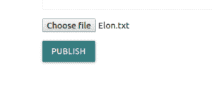

# 姜戈–使用文件系统存储上传文件

> 原文:[https://www . geesforgeks . org/django-upload-files-with-files system storage/](https://www.geeksforgeeks.org/django-upload-files-with-filesystemstorage/)

Django 附带了[文件系统存储](https://docs.djangoproject.com/en/2.2/ref/files/storage/#django.core.files.storage.FileSystemStorage)类，该类有助于在本地存储文件，以便这些文件可以作为开发中的介质。在本文中，我们将看到如何使用文件系统存储应用编程接口在本地存储文件来实现文件上传系统。
**注:**此法只应用于开发，不应用于生产。

### 如何使用文件系统存储上传文件？

*   **Step 1**: We will start off by making a template form to upload files.

    **模板**

    ```
    <form method = 'POST' class="col s12" enctype="multipart/form-data">

            

            {{new_form.as_p}}

        <!--Below is our main file upload input -->
            <input type = "file" name = 'document'>
            <p><button type = "submit" class = "waves-effect waves-light btn" style = "background-color: teal">Publish</button></p>
    </form>
    ```

    这里，注意输入(通过它用户可以输入文件)具有名称“文档”。

*   **Step 2:** Now, we will write the view for the same in the `views.py` file

    **查看**
    首先，使用导入文件系统存储类在文件顶部

    ```
    from django.core.files.storage import FileSystemStorage
    ```

    ```
    if request.method == "POST":
        # if the post request has a file under the input name 'document', then save the file.
        request_file = request.FILES['document'] if 'document' in request.FILES else None
        if request_file:
                # save attatched file

                # create a new instance of FileSystemStorage
                fs = FileSystemStorage()
                file = fs.save(request_file.name, request_file)
                # the fileurl variable now contains the url to the file. This can be used to serve the file when needed.
                fileurl = fs.url(file)

    return render(request, "template.html")
    ```

    在这里，FileSystemStorage 类的构造函数接受参数“location”，它是指向您想要存储文件的目录的路径。默认情况下，它是变量设置中的路径。' MEDIA_ROOT '。它还采用参数“base_url”，这是您希望媒体对应的 url。默认情况下，它被设置为变量设置的值。请确保在 settings.py 文件中设置了这些常量。

    函数 FileSystemStorage.save 接受 3 个参数；名称、内容(文件本身)和最大长度(默认值=无)。
    该函数将文件–“内容”存储在名称“名称”下。如果存在同名文件，它会稍微修改文件名以生成唯一的名称。

    在同一的 [django 文档中阅读更多关于文件系统存储类的构造函数参数和方法](https://docs.djangoproject.com/en/2.2/ref/files/storage/#django.core.files.storage.FileSystemStorage)

*   **步骤 3:** 定义媒体根和媒体网址(如果尚未定义)。
    **设置**
    确保在 settings.py.

    ```
    MEDIA_ROOT = os.path.join(BASE_DIR, 'media') # media directory in the root directory
    MEDIA_URL = '/media/'
    ```

    中配置了 MEDIA_ROOT 和 MEDIA_URL
*   **Step 4:** Finally, we add a route to MEDIA_URL.
    **URLs**
    In urls.py, import

    ```
    from django.conf.urls.static import static
    from django.conf import settings
    ```

    并在文件末尾添加以下内容

    ```
    # only in development
    if settings.DEBUG:
        urlpatterns += static(settings.MEDIA_URL, document_root = settings.MEDIA_ROOT)
    ```

    这将添加一个到媒体网址的路由，并在用户向媒体网址/(文件名)发出获取请求时从媒体根目录提供文件。完成所有这些后，上传的文件应该显示在 MEDIA_ROOT 常量中指定的目录中。

**输出–**
前端应该是这样的


如前所述，这种方法只能用于开发中的媒体服务，而不能用于生产中。你可能想在生产中使用类似 [nginx](https://www.nginx.com/) 的东西。