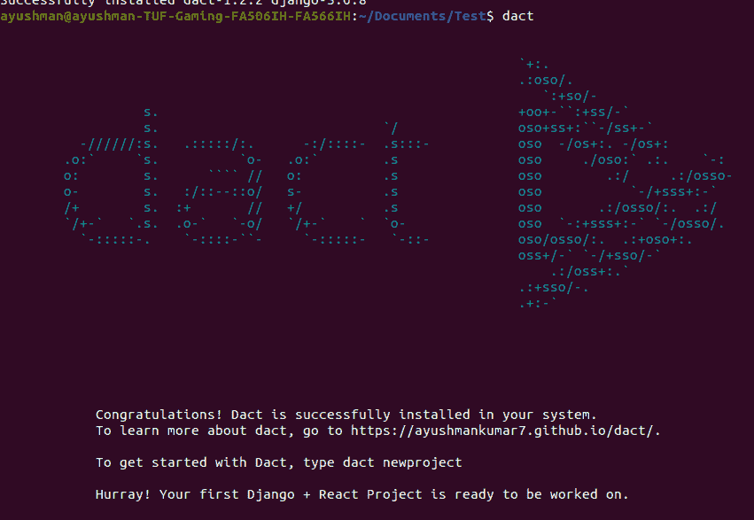
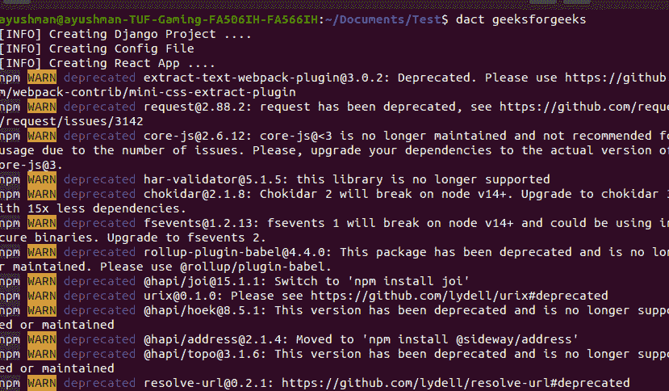
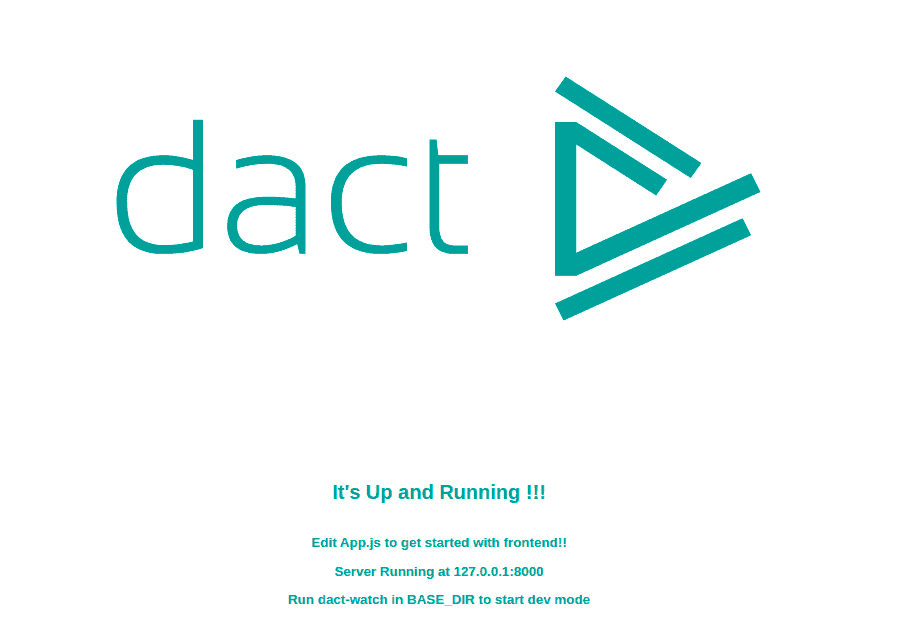
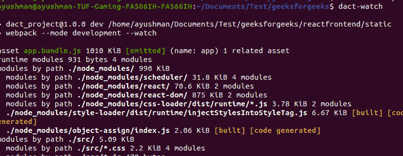
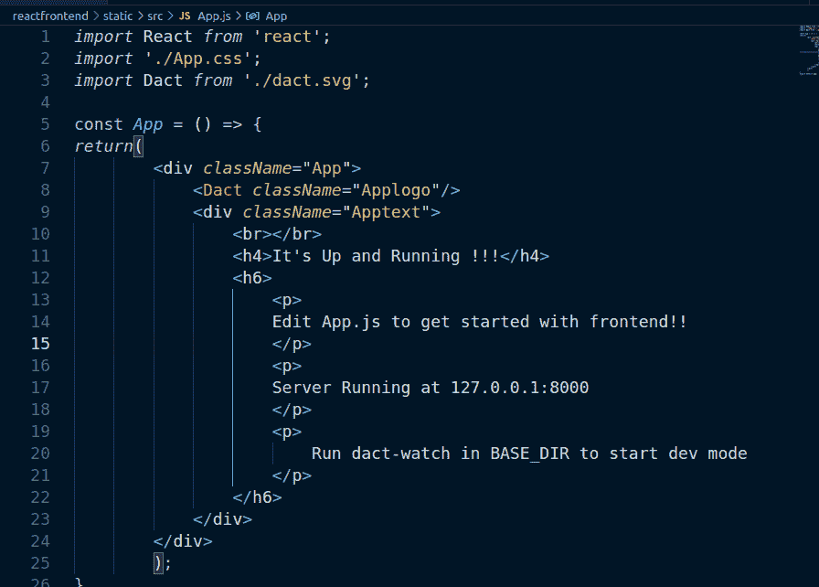
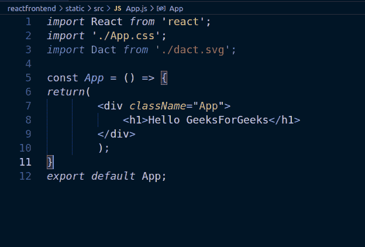
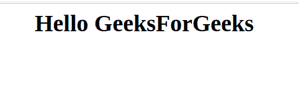

# Django+使用 Dact 反应全栈开发设置

> 原文:[https://www . geeksforgeeks . org/django react-全栈-开发-设置-使用-dact/](https://www.geeksforgeeks.org/djangoreact-full-stack-development-setup-using-dact/)

当我们在一个项目中工作时，该项目将 **Django 作为我们的后端**，并使用 React 拥有强大的**前端，开发设置需要花费大量的时间来设置——配置 Babel、Webpack、URL、视图等。在 **npx create-react-app** 到来之前，我们曾经设置过这个来开始使用 ReactJS。**

**npx create-react-app** 命令使我们能够在不考虑所有巴别塔、网络包等的情况下处理 react。当我们试图在 Django 应用程序中使用 npx create-react-app 时，它**就成了一个问题。因此，在本文中，我们将使用 Python 命令行界面应用程序或包- [Dact。](https://pypi.org/project/dact/) **Dact** 使我们能够在一个**命令**中设置一个反应-姜戈开发设置。它是开源的，其代码可在 **GitHub** 上获得。**

```py
Note: Make sure you have Python, pip and npm installed in your system.
```

按照以下步骤在您的系统中成功设置 React-Django 项目:

**第一步:**首先我们需要使用 pip 安装 **dact** ，如下图所示:

```py
pip install dact
```


**第二步:**在终端输入“dact”检查 dact 是否安装成功。

```py
dact 
```



**步骤 3:** 要启动 Django-React 全栈开发项目，只需键入-

```py
dact {your_project_name}
```



它用您提供的名称创建了一个 Django 项目，并创建了一个名为“reactfrontend”的前端应用程序。您也可以使用自定义前端应用程序名称来设置项目

```py
dact {your_project_name} {react_front_end_app_name}
```

**第四步:**进入项目

```py
cd my_project
```

**步骤 5:** 运行 Django 服务器

```py
python manage.py runserver
```

您的欢迎页面服务于本地主机:8000



第六步:**观察 React 文件中**的变化。

打开不同的终端和类型

```py
dact-watch
```



```py
Note: Make sure you are in the same directory as manage.py.
```

当您在前端工作时，让 dact-watch 在后台运行。

**第七步:**编辑你的反应前端。要编辑反应文件，您需要转到:

```py
reactfrontend > static > src > App.js
```



让我们写《你好，极客》吧。



做出改变。确保 **dact-watch** 在后台运行。刷新您的欢迎页面。



现在你可以在 **Dact** 的帮助下，使用 **React 和 Django** 为后端创建你自己的 Django 应用程序并开发你的梦想项目..