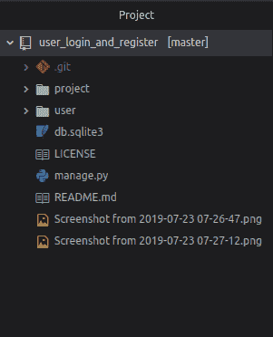
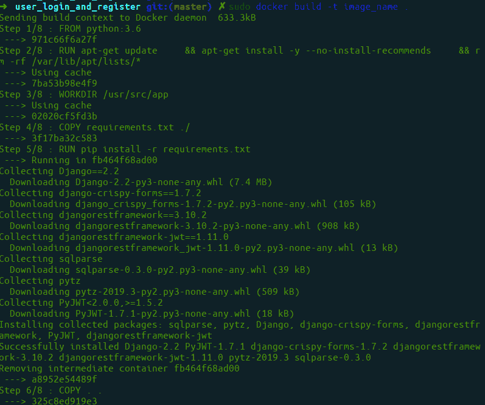
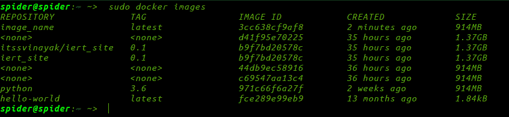
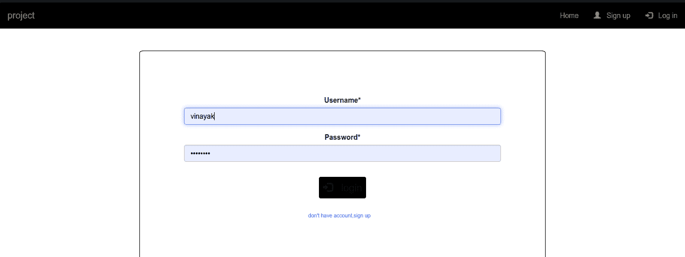

# 记录一个简单的姜戈应用程序

> 原文:[https://www . geesforgeks . org/dockerzing-a-simple-django-app/](https://www.geeksforgeeks.org/dockerizing-a-simple-django-app/)

Docker 是一组平台即服务产品，使用操作系统级虚拟化在称为容器(命名空间)的包中交付软件。这里，我们正在记录一个简单的用户登录并注册 Django 项目。我们正在使用的项目太多了[注册并登录](https://www.geeksforgeeks.org/django-sign-up-and-login-with-confirmation-email-python/)

要下载源代码，请使用

```
$ git clone https://github.com/itsvinayak/user_login_and_register.git
```



下一步是向其中添加 Docker。因此，创建一个名为 Dockerfile 的空文件，并将这段代码放入其中

```
$ touch Dockerfile
```

现在编辑它。

```
FROM python:3.6

RUN apt-get update \
    && apt-get install -y --no-install-recommends \
    && rm -rf /var/lib/apt/lists/*

WORKDIR /usr/src/app
COPY requirements.txt ./
RUN pip install -r requirements.txt
COPY . .

EXPOSE 8000
CMD ["python", "manage.py", "runserver", "0.0.0.0:8000"]

```

现在我们需要建立我们的 Docker 映像并运行它。这可以通过以下命令来完成:

建立形象

```
$ sudo docker build -t image_name .
```



要查看图像是否退出使用，您可以查看所有图像。

```
$ sudo docker images
```



要运行 docker 应用程序，请使用

```
$ sudo docker run -p 8000:8000 image_name
```

