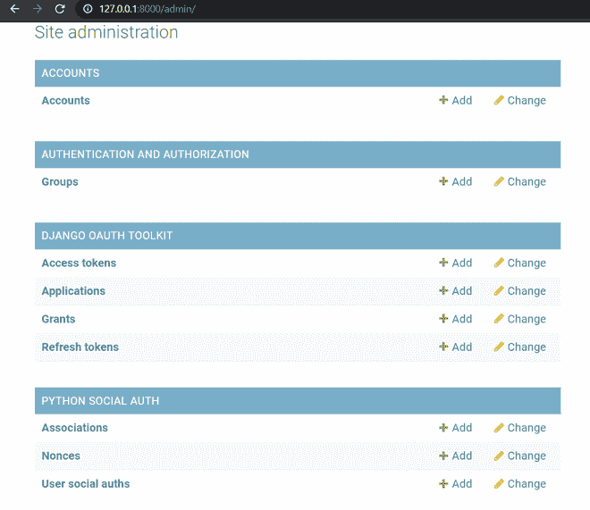
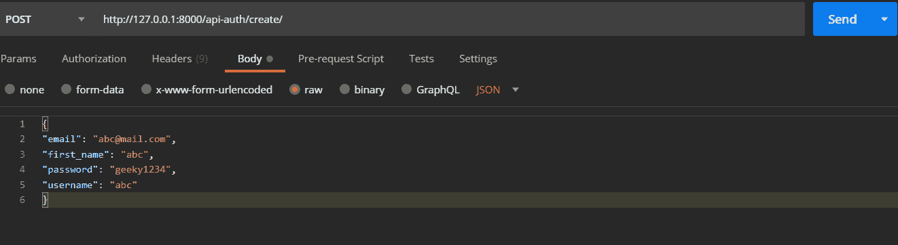
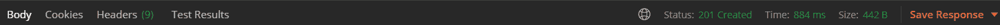
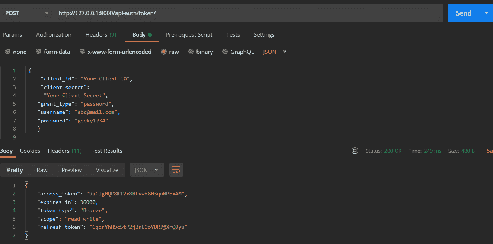
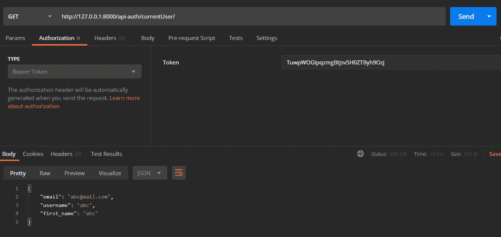
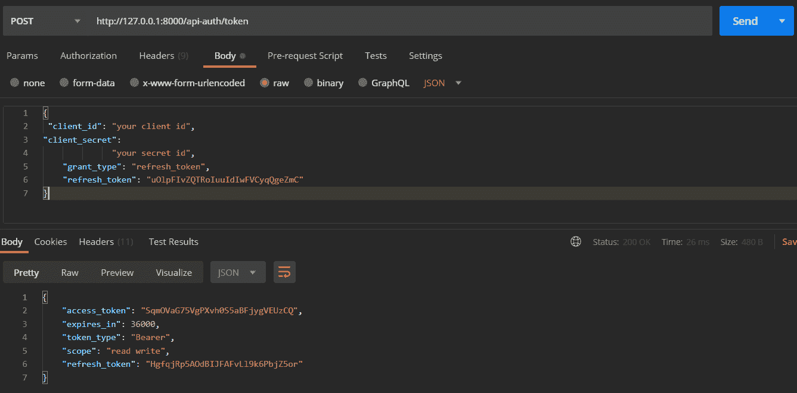

# Django 的电子邮件+社交登录–分步指南

> 原文:[https://www . geesforgeks . org/email-social-登录-in-django-逐步指南/](https://www.geeksforgeeks.org/email-social-logins-in-django-step-by-step-guide/)

本文围绕一个姜戈项目展开。它包括任何 Django 项目中的电子邮件+社交登录集成。我们使用 React 作为前端来演示项目的工作。您可以使用自己的前端来进行 int

#### 要求–

1.  我们需要注册一个用户，我们需要传递用户名，电子邮件，名字，密码(因为我们的模式)。
2.  我们需要登录该用户并验证用户身份。
3.  用户应该能够登录多个社交平台。
4.  我们需要为所有需求制作应用编程接口。

#### 身份验证将如何进行:

在开始之前，我们需要知道，我们将通过在请求的授权报头中发送**承载**令牌来发送经过身份验证的请求。该令牌将告诉服务器 ***哪个用户**发送了请求*。为此，我们将做以下工作:

1.  我们会将用户名和密码发送到一个端点以获取令牌，这将作为我们的登录
2.  作为回报，我们将获得访问令牌和刷新令牌，并将所有请求的授权头设置为此访问令牌
3.  但是，访问令牌将在短时间后过期，然后我们将向端点发送刷新令牌以获取新的访问令牌
4.  因此，我们将在内部重复步骤 2 和 3，而不会让用户知道访问令牌何时到期

#### 在开始之前，让我们先了解一些先决条件:

*   Django 基础知识–[Django 教程](https://www.geeksforgeeks.org/django-tutorial/)
*   创建 django 项目(最好在虚拟环境中)–[在 Django 创建演示项目](https://www.geeksforgeeks.org/how-to-create-a-basic-project-using-mvt-in-django/)
*   邮差安装在你的系统中(你可以从这里[下载](https://www.postman.com/downloads/)或者使用邮差的任何替代品)

### #步骤 1:在姜戈创建自定义用户模型

创建演示项目后。创建一个应用**账户**。

```py
python manage.py startapp accounts
```

然后你可以看到一个新的文件夹创建了帐户名称，现在让我们把它添加到 settings.py 中的 **INSTALLED_APPS** 中。所以它应该看起来像这样:

```py
INSTALLED_APPS = [
   'django.contrib.admin',
   'django.contrib.auth',
   'django.contrib.contenttypes',
   'django.contrib.sessions',
   'django.contrib.messages',
   'django.contrib.staticfiles',
    # add this
   'accounts',
]
```

在**模型中，py** 让我们创建模型**帐户**及其**管理器** &也导入这些:

```py
from django.db import models
from django.contrib.auth.models import AbstractBaseUser,PermissionsMixin,BaseUserManager
from django.utils.translation import gettext_lazy as _

class Account(AbstractBaseUser,PermissionsMixin):
   email=models.EmailField(unique=True)
   username= models.CharField(_('User Name'),max_length=150)
   first_name = models.CharField(_('First Name'),max_length=150)
   last_name = models.CharField(_('last Name'),max_length=150)
   is_staff=models.BooleanField(default=False)
   is_active=models.BooleanField(default=True)

   objects=CustomAccountManager()

   USERNAME_FIELD='email'
   REQUIRED_FIELDS=['username','first_name']

   def __str__(self):
       return self.email
```

*   这里我们使用**电子邮件**作为默认的 **username_FIELD** ，我们需要 USERNAME 和 first_name 作为必填字段(您也可以有任何其他字段**，但是 USERNAME 字段应该在那里**
*   **is_active** 默认为 **True** ， **is_staff** 默认为 **False**
*   为了创建对象(用户)，我们需要一个自定义管理器(我们在下面创建的*)*
*   写“**用户名**”而不是 user_name 或任何其他样式，因为 facebook 或 google 登录返回用户名
*   *使用 gettextlazy 是可选的*

```py
class CustomAccountManager(BaseUserManager):
    def create_user(self,email,username,first_name,password,**other_fields):
        if not email:
            raise ValueError(_('Please provide an email address'))
        email=self.normalize_email(email)
        user=self.model(email=email,username=username,first_name=first_name,**other_fields)
        user.set_password(password)
        user.save()
        return user

    def create_superuser(self,email,username,first_name,password,**other_fields):
        other_fields.setdefault('is_staff',True)
        other_fields.setdefault('is_superuser',True)
        other_fields.setdefault('is_active',True)
        if other_fields.get('is_staff') is not True:
                raise ValueError(_('Please assign is_staff=True for superuser'))
        if other_fields.get('is_superuser') is not True:
                raise ValueError(_('Please assign is_superuser=True for superuser'))
        return self.create_user(email,username,first_name,password,**other_fields)
```

### 在这里，create_user 将创建普通用户，而 create_superuser 是创建超级用户(管理员)。

#### 创建用户

*   为了创建用户，我们需要传递电子邮件、用户名、名字和密码以及任何其他字段
*   如果没有电子邮件，则引发错误，否则正常化电子邮件([阅读此处)](https://stackoverflow.com/questions/27936705/what-does-it-mean-to-normalize-an-email-address)
*   然后创建一个带有电子邮件、用户名和其他字段的模型帐户对象
*   然后设置密码， **set_password** 实际上将密码设置为模型对象中的**哈希**密码，这样**就没人能看到实际密码**
*   然后保存用户对象并返回它

#### 创建 _ 超级用户

*   默认情况下，is_staff、is _ 超级用户、is_active 应设置为真
*   如果未设置为真或传递了假，则引发错误，否则使用该值和其他字段创建用户

现在在 *settings.py* 中添加这个来使用我们的自定义用户模型:

```py
AUTH_USER_MODEL='accounts.Account'
```

然后我们需要将这个模型迁移到数据库。

```py
python manage.py makemigrations
python manage.py migrate
```

### #步骤 2:使 REST 应用编程接口端点用于身份验证

为此，我们需要先安装一些库，我将在下面解释为什么我们需要它们:

```py
pip install djangorestframework
pip install django-cors-headers
pip install drf_social_oauth2
```

*   **djangrestframework**用于 REST 应用编程接口端点
*   **django-CORS**-需要标头，以便我们的 React 应用程序可以与 django 服务器通信
*   **drf _ social _ oauth2**–这是一个主库，允许我们对电子邮件密码以及 google 和 facebook 进行基于 oauth 2 令牌的身份验证

现在在设置中，py 我们应该将这些添加到 INSTALLED_APPS 中，以便我们的应用程序按预期工作:

```py
INSTALLED_APPS = [
   'django.contrib.admin',
   'django.contrib.auth',
   'django.contrib.contenttypes',
   'django.contrib.sessions',
   'django.contrib.messages',
   'django.contrib.staticfiles',
   # add these 
   'rest_framework',
   'oauth2_provider',
   'social_django',
   'drf_social_oauth2',
    'corsheaders',
   # LOCAL
   'accounts',
]
```

让我们也将这些配置添加到 settings.py 中，我将在下面解释:

```py
AUTHENTICATION_BACKENDS = (  
  'drf_social_oauth2.backends.DjangoOAuth2',
  'django.contrib.auth.backends.ModelBackend',
)
REST_FRAMEWORK = {
   'DEFAULT_AUTHENTICATION_CLASSES': (
       'oauth2_provider.contrib.rest_framework.OAuth2Authentication',  
       'drf_social_oauth2.authentication.SocialAuthentication',
   )
}
CORS_ALLOWED_ORIGINS = [
   "http://localhost:3000",
   "http://127.0.0.1:3000"
]
```

*   **AUTHENTICATION _ back ends**–这样我们可以使用 OAuth2 **(基于令牌)**或基本身份验证(**无令牌**)进行身份验证
*   **REST_FRAMEWORK** 端点请求只能使用令牌进行身份验证
*   **CORS_ALLOWED_ORIGINS** 将是我们前端的地址(这里是 react 网站的地址)

好了，现在让我们给中间件和模板添加一些配置:

```py
MIDDLEWARE = [
   'django.middleware.security.SecurityMiddleware',
   'django.contrib.sessions.middleware.SessionMiddleware',
   'django.middleware.common.CommonMiddleware',
   'django.middleware.csrf.CsrfViewMiddleware',
   'django.contrib.auth.middleware.AuthenticationMiddleware',
   'django.contrib.messages.middleware.MessageMiddleware',
   'django.middleware.clickjacking.XFrameOptionsMiddleware',
    # add these 
   'corsheaders.middleware.CorsMiddleware',
   'django.middleware.common.CommonMiddleware',
]

TEMPLATES = [
   {
       'BACKEND': 'django.template.backends.django.DjangoTemplates',
       'DIRS': [],
       'APP_DIRS': True,
       'OPTIONS': {
           'context_processors': [
               'django.template.context_processors.debug',
               'django.template.context_processors.request',
               'django.contrib.auth.context_processors.auth',
               'django.contrib.messages.context_processors.messages',
                   # add these 
                'social_django.context_processors.backends',
               'social_django.context_processors.login_redirect',
           ],
       },
   },
]
```

**社交登录和 cors 需要的那些**

让我们给 django 项目的 urls.py 添加一些 URL，因为 rest 框架和 oauth 都需要这些 URL

```py
from django.contrib import admin
from django.urls import path,include

urlpatterns = [
   path('admin/', admin.site.urls), 
    # add these 
   path('api-auth/', include('rest_framework.urls')),
   path('api-auth/', include('drf_social_oauth2.urls',namespace='drf')),
]
```

#### 根据需要添加这个和那个之后，让我们再次开始编码。

为了注册/注册用户，我们需要编写一个序列化程序和视图。请注意，注册后，该用户需要自己登录，这不会自动发生。然而，我也谈到了这一点！因此，一个用户可以注册，我们的后端将登录该用户！！

让我们创建序列化程序，我已经在 accounts 文件夹中创建了一个 serializers.py，所以现在编写以下代码:

```py
from rest_framework import serializers
from .models import Account

class RegistrationSerializer(serializers.ModelSerializer):
   class Meta:
       model=Account
       fields=('email','username','password','first_name')
       extra_kwargs={'password':{'write_only':True}}

   def create(self,validated_data):
       password=validated_data.pop('password',None)
       instance=self.Meta.model(**validated_data)
       if password is not None:
           instance.set_password(password)
       instance.save()
       return instance
```

在注册器中:

*   元类有什么模型，字段将被序列化，密码不能被读取，只能被写入(对于表单)
*   创建方法将创建帐户的新实例，并用我们从视图中传递的经验证的数据来填充它
*   我们需要这个密码，如果这个密码不是无，我们可以设置散列密码，这样我们就可以从验证的数据中弹出它
*   然后我们将保存实例并返回它

现在我们将编写创建用户的视图:

```py
from django.shortcuts import render
from rest_framework.views import APIView
from rest_framework import status,generics
from rest_framework.response import Response  
from .serializers import RegistrationSerializer
from rest_framework import permissions
from .models import Account

class CreateAccount(APIView):
   permission_classes=[permissions.AllowAny]

   def post(self,request):
       reg_serializer=RegistrationSerializer(data=request.data)
       if reg_serializer.is_valid():
           new_user=reg_serializer.save()
           if new_user:
              return Response(status=status.HTTP_201_CREATED)
       return Response(reg_serializer.errors,status=status.HTTP_400_BAD_REQUEST)
```

*   我们导入必要的，允许任何人访问此视图，并且只允许向此视图发布请求
*   当发布请求发生时，我们将使用 request.data 初始化 RegistrationSerializer，如果数据有效，则保存它，否则返回错误
*   ***注:稍后**保存序列化数据后，我们会重新访问该视图登录用户

也可以在 accounts 目录中创建一个 urls.py 并写下这个

```py
from django.urls import path
from .views import CreateAccount

app_name = 'users'

urlpatterns = [
   path('create/', CreateAccount.as_view(), name="create_user"),]
```

最后将此 url 添加到项目的 urls.py 中

```py
from django.contrib import admin
from django.urls import path,include

urlpatterns = [
   path('admin/', admin.site.urls),  
   path('api-auth/', include('rest_framework.urls')),
   path('api-auth/', include('drf_social_oauth2.urls',namespace='drf')),
   #add this 
   path('api-auth/', include('accounts.urls'))
]
```

现在对于登录，我们**不需要编写任何额外的代码**，因为登录只是从服务器获取访问令牌，所有这些都已经由 drf-social-oauth2 处理。我们甚至不需要为此写任何端点！

我们需要创建一个**应用程序**并获取**客户端 _id** 和**客户端 _secret** 来获取访问令牌，所以让我们访问运行在 http://127.0.0.1:8000/admin/上的 admin，您应该会看到类似这样的内容:



管理

在这里你可以看到应用程序，按下添加按钮，创建一个新的应用程序。**不要碰客户端 id 和客户端密码**，选择用户作为你的管理员**超级用户**，客户端类型为**机密**，授权类型为**基于资源所有者密码的**，然后保存。

就这样，我们现在准备检查我们的应用程序，所以让我们创建一个超级用户，传递所需的值，然后在虚拟环境中运行服务器

```py
python manage.py runserver
```

### #第 3 步:使用电子邮件密码创建并登录用户

现在打开 Postman，写下这个 URL，在正文中写下这个并发送请求！



邮递员发送创建用户的请求

你应该得到这样一个空白的回答



状态 201 已创建

这样就创建了**用户**，所以工作正常！

为了发送令牌请求，我们将传递 **client_id、client_secret** 、**电子邮件**作为用户名、**密码**和 **grant_type=password** 让服务器知道这是为了**获取新的**access _ token 并刷新令牌

现在我们可以发送令牌请求，所以回到 postman，将此请求发送到 http://127 . 0 . 0 . 1:8000/API-auth/token:



请求返回令牌

**请注意，我们将电子邮件传递到请求中的用户名字段，因为传递用户名是强制性的**

*   应该返回**访问令牌和刷新令牌**以及**状态 200 Ok**
*   这个 access_token 可以设置在请求的**授权头**上，以发送经过身份验证的请求(我们将通过 react 来实现)

记得我说过我们将在保存序列化数据后重新访问 CreateAccount 视图来登录用户，让我们这样做吧

```py
import requests # add this

class CreateAccount(APIView):
   permission_classes=[permissions.AllowAny]

   def post(self,request):
       reg_serializer=RegistrationSerializer(data=request.data)
       if reg_serializer.is_valid():
           new_user=reg_serializer.save()
           if new_user:
              #add these
               r=requests.post('http://127.0.0.1:8000/api-auth/token', data = {
                   'username':new_user.email,
                   'password':request.data['password'],
                   'client_id':'Your Client ID',
                   'client_secret':'Your Client Secret',
                   'grant_type':'password'
               })
               return Response(r.json(),status=status.HTTP_201_CREATED)
       return Response(reg_serializer.errors,status=status.HTTP_400_BAD_REQUEST)
```

因此，在保存新用户后，我们将发送一个 post 请求来获取令牌，并将其作为 Response 发送回去。这将自动登录用户注册后！

**谷歌和脸书认证需要一个前端来完成演示，所以我将向您展示 react，但是任何前端都可以，如果您知道该怎么做的话！(必要步骤后我会这样做)**

## #第 4 步:认证请求演示准备

我们将创建一个不同的序列化程序，它将通过两个不同的视图返回关于用户和当前用户的信息，一个是经过身份验证的请求，另一个是非经过身份验证的请求。

因此序列化程序将如下所示:

```py
class UsersSerializer(serializers.ModelSerializer):
   class Meta:
       model=Account
       fields=('email','username','first_name')
```

我们将写这两种观点:

*   **所有用户**返回所有用户，任何一个都可以查看数据
*   **当前用户**只返回当前用户，只允许认证请求

```py
from rest_framework import status,generics

class AllUsers(generics.ListAPIView):
   permission_classes=[permissions.AllowAny]
   queryset=Account.objects.all()
   serializer_class=UsersSerializer

class CurrentUser(APIView):
   permission_classes = (permissions.IsAuthenticated,)
   def get(self, request):
       serializer = UsersSerializer(self.request.user)
       return Response(serializer.data)
```

urls.py 将如下所示:

```py
from django.urls import path
from .views import CreateAccount,AllUsers,CurrentUser

app_name = 'users'

urlpatterns = [
   path('create/', CreateAccount.as_view(), name="create_user"),
   path('all/', AllUsers.as_view(), name="all"),
   path('currentUser/', CurrentUser.as_view(), name="current"),
   ]
```

### #第 5 步:认证请求演示

所以让我们先发送未认证的请求，它会返回这个响应(**注意，授权头里面什么都没有**)


现在让我们获取之前在第 3 步收到的访问令牌

*   **从下拉列表中将授权类型设置为**持有者**令牌**
*   **向 http://127 . 0 . 0 . 1:8000/API-auth/currentUser/**

****

**它现在将返回当前用户，如果你碰巧发送了没有授权头的请求，它会像这样返回**

****

****现在如果访问令牌过期了怎么办，那怎么办？？****

**为此，我们需要向同一个端点发送刷新令牌，以获得新的访问和刷新令牌**

**让我示范给你看！因此，我们使用 **client_id，client_secret，grant_type = refresh_token** 发送请求到/token(以便服务器了解请求具有刷新令牌，然后将**旧的**访问和刷新令牌**转换为新的**访问和刷新令牌)，并且**刷新 _token** 将是我们在第三步中收到的令牌**

****

*****它返回新的令牌作为响应*** 您可以使用这个新的访问令牌作为**承载令牌**来验证请求**

### **#第六步:脸书和谷歌登录**

**将这些添加到 settings.py 中，要获得 facebook 和 google 所需的**键，您需要访问这里的[获取 fb](https://developers.facebook.com/apps/.) 和这里的[获取 google](https://console.developers.google.com/apis/credentials) 并在那里执行必要的步骤。****

```py
AUTHENTICATION_BACKENDS = (  
   'social_core.backends.google.GoogleOAuth2',
   'social_core.backends.facebook.FacebookAppOAuth2',
   'social_core.backends.facebook.FacebookOAuth2',

  'drf_social_oauth2.backends.DjangoOAuth2',
  'django.contrib.auth.backends.ModelBackend',
)
# Facebook configuration
SOCIAL_AUTH_FACEBOOK_KEY = 'your facebook key'
SOCIAL_AUTH_FACEBOOK_SECRET = 'your facebook secret'

# Define SOCIAL_AUTH_FACEBOOK_SCOPE to get extra permissions from Facebook.
# Email is not sent by default, to get it, you must request the email permission.
SOCIAL_AUTH_FACEBOOK_SCOPE = ['email']
SOCIAL_AUTH_FACEBOOK_PROFILE_EXTRA_PARAMS = {
   'fields': 'id, name, email'
}
SOCIAL_AUTH_USER_FIELDS=['email','first_name','username','password']

SOCIAL_AUTH_GOOGLE_OAUTH2_KEY = "your google oauth2 key"
SOCIAL_AUTH_GOOGLE_OAUTH2_SECRET = "your google oauth2 secret"

# Define SOCIAL_AUTH_GOOGLE_OAUTH2_SCOPE to get extra permissions from Google.
SOCIAL_AUTH_GOOGLE_OAUTH2_SCOPE = [
   'https://www.googleapis.com/auth/userinfo.email',
   'https://www.googleapis.com/auth/userinfo.profile',
]
```

### **#第 7 步:使用 React JS 登录谷歌和脸书**

**在使用这部分教程之前，先查看 [React JS 教程](https://www.geeksforgeeks.org/reactjs/)。创建反应应用程序后，请执行以下步骤–**

**一旦你有了密钥，认证就非常容易了，现在我们需要*安装 axios，react-Facebook-登录，react-Google-登录***

**然后创建一个登录组件，在那里我们呈现这些 **fb 和谷歌登录按钮**，它们将带着**所需的键**，当每个用户尝试用这些按钮登录时，将返回一个访问令牌以及关于用户的信息**

```py
import ReactFacebookLogin from "react-facebook-login";
import ReactGoogleLogin from "react-google-login";
import { facebookLogin, googleLogin } from "../axios";# I'll create this later

export default function LogIn() {

  function responseFb(response) {
    console.log(response);
    facebookLogin(response.accessToken);
  }
  function responseGoogle(response) {
    console.log(response);
    googleLogin(response.accessToken);
  }

  return (
    <>
    <ReactFacebookLogin
           appId="Your App Id"
           fields="name,email"
           callback={responseFb}
         />
         <ReactGoogleLogin
           clientId="your google client id"
           buttonText="Login"
           onSuccess={responseGoogle}
           onFailure={responseGoogle}
           cookiePolicy={"single_host_origin"}
         />
    </>
  );
}
```

**然而**我们的服务器没有线索**我们已经登录了一个用户，因为这个访问令牌是从谷歌、facebook 和**返回的，而不是从我们的服务器**返回的。**

**那么如何让我们的服务器知道呢？将此令牌发送到我们的服务器，还是将此令牌设置为我们的授权承载令牌？否。在这种情况下，我们无法使用我们的帐户模型创建帐户对象，也无法以当前用户的身份访问任何帐户对象，因此我们的用户在技术上不会被注册或连接。**

**所以我们需要**转换这个令牌**来获得**访问令牌，从我们的服务器**刷新令牌，(注册我们的用户)，为此我**创建了一个 axios.js 文件**，我在那里放了这个代码:**

```py
export function facebookLogin(accessToken) {
 axios
   .post(`http://127.0.0.1:8000/api-auth/convert-token`, {
     token: accessToken,
     backend: "facebook",
     grant_type: "convert_token",
     client_id: "your client id",
     client_secret:"your client secret ",
   })
   .then((res) => {
    // Save somewhere these access and refresh tokens
     console.log(res.data);
   });
}
export function googleLogin(accessToken) {
 axios
   .post(`http://127.0.0.1:8000/api-auth/convert-token`, {
     token: accessToken,
     backend: "google-oauth2",
     grant_type: "convert_token",
     client_id: "your client id",
     client_secret: "your client secret",
   })
   .then((res) => {
    // Save somewhere these access and refresh tokens
     console.log(res.data);
   });
}
```

**我们在这里做的是:**

1.  **向**http://127 . 0 . 0 . 1:8000/API-auth/convert-token**发出 post 请求，转换令牌**
2.  **后端将是您获得要转换的访问令牌的后端**
3.  ****grant_type** 将是 **convert_token** 让服务器知道我们希望将这个令牌转换为我们服务器的访问令牌**
4.  **client_id 和 client_secret 将与前面的步骤一样**

**那么，如果访问令牌过期，如何刷新令牌呢？？我们希望**自动发生**而不会让用户感到困扰。**

*   **为此，我们将使用 axios 拦截器，它将返回响应，但如果有错误，它将处理这些错误**
*   **如果错误状态为 **401(未授权请求**)，那么如果本地存储中没有刷新令牌，那么它会要求用户登录，如果存在刷新令牌，那么它会将其发送到 http://127 . 0 . 0 . 1:8000/API-auth/token 到**获取新的访问权限并刷新令牌****
*   **请注意，我使用本地存储来存储访问令牌作为一个例子，但你应该有一个安全的方法可能**网络 Cookies(安全，HttpOnly，同一个站点)****
*   ****窗口需要重新加载**让 react fetch 网站使用最新的访问令牌进行认证**

```py
axiosInstance.interceptors.response.use(
 (response) => {
   return response;
 },
 async function (error) {
   const originalRequest = error;
   console.log(originalRequest);

   if (typeof error.response === "undefined") {
     alert("a server error happNeD, we will fix it shortly");
     return Promise.reject(error);
   }

   if (
     error.response.status === 401 &&
     !localStorage.getItem("refresh_token")
   ) {
     window.location.href = "/login/";
     return Promise.reject(error);
   }

   if (
     error.response.status === 401 &&
     error.response.statusText === "Unauthorized" &&
     localStorage.getItem("refresh_token") !== undefined
   ) {
     const refreshToken = localStorage.getItem("refresh_token");

     return axios
       .post("http://127.0.0.1:8000/api-auth/token", {
         client_id: "Your client id ",
         client_secret:
           "Your client secret",
         grant_type: "refresh_token",
         refresh_token: refreshToken,
       })
       .then((response) => {
         localStorage.setItem("access_token", response.data.access_token);
         localStorage.setItem("refresh_token", response.data.refresh_token);
         window.location.reload();
         axiosInstance.defaults.headers["Authorization"] =
           "Bearer " + response.data.access_token;
       })
       .catch((err) => console.log(err));
   }
 }
);
```

**这样，我们可以验证来自 Django 的用户，并使用社交登录进行反应。**