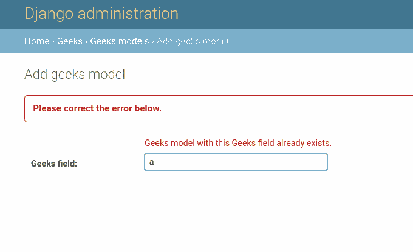
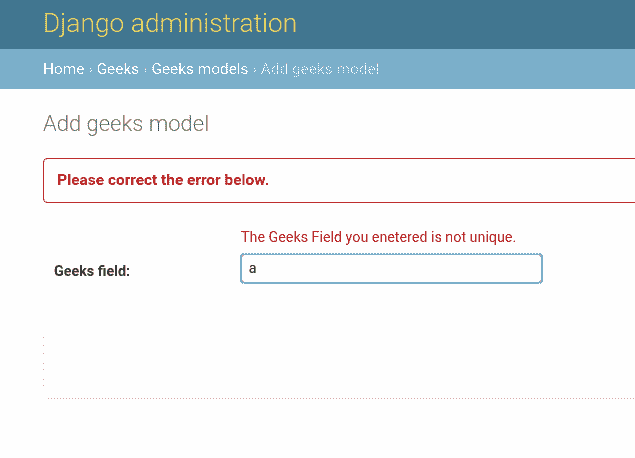

# 错误消息–姜戈内置现场验证

> 原文:[https://www . geesforgeks . org/error _ messages-django-内置字段-验证/](https://www.geeksforgeeks.org/error_messages-django-built-in-field-validation/)

Django 模型中的内置字段验证是预定义给所有 Django 字段的验证。每个字段都有来自姜戈[验证器](https://docs.djangoproject.com/en/2.2/ref/validators/)的内置验证。还可以添加更多的内置字段验证，以应用或删除特定字段的某些约束。 **error_messages** 属性用于修改某些约束失败时在管理界面中显示的错误消息。
例如，您可以将“此字段为必填项”消息改写为您自己的消息。它允许您覆盖该字段将引发的默认消息。传入一个字典，其关键字与您想要覆盖的错误消息相匹配。错误信息键包括**空**、**空**、**无效**、**无效 _ 选择**、**唯一**、**唯一 _for_date** 。
**语法–**

```py
field_name = models.Field(error_messages = {"key": "message"})
```

## Django 内置字段验证可编辑=错误解释

使用示例说明**错误信息**。考虑一个名为 geeksforgeeks 的项目，它有一个名为 geeks 的应用程序。

> 请参考以下文章，查看如何在 Django 中创建项目和应用程序。
> 
> *   [如何利用姜戈的 MVT 创建基础项目？](https://www.geeksforgeeks.org/how-to-create-a-basic-project-using-mvt-in-django/)
> *   [如何在姜戈创建 App？](https://www.geeksforgeeks.org/how-to-create-an-app-in-django/)

将以下代码输入**极客** app 的 models.py 文件。我们将使用 CharField 对所有字段选项进行实验。

## 蟒蛇 3

```py
from django.db import models
from django.db.models import Model
# Create your models here.

class GeeksModel(Model):
    geeks_field = models.CharField(
                    max_length = 200, 
                    unique = True
                    )
```

在 Django 上运行 makemigrations 和 migration 并呈现上面的模型之后，让我们从 Django 管理界面创建一个实例，字符串为“ **a** ”。现在，为了打破**唯一=真**的约束，让我们尝试使用相同的字符串创建模型的另一个实例。现在它会显示这个错误。



现在让我们将此错误消息修改为“您输入的极客字段不是唯一的。”使用**错误信息**。将型号. py 改为

## 蟒蛇 3

```py
from django.db import models
from django.db.models import Model
# Create your models here.

class GeeksModel(Model):
    geeks_field = models.CharField(
                    max_length = 200, 
                    unique = True,
                    error_messages ={
                    "unique":"The Geeks Field you entered is not unique."
                    }
                    )
```

由于 models.py 被修改，所以运行 makemigrations 并在项目中再次迁移。打开管理界面，再次尝试使用字符串“a”创建实例。



您可以看到修改后的错误消息。因此，error_messages 会修改字段错误消息。可以使用其他属性进行修改，如**空**、**空**等。

#### 更多内置字段验证

。数学表{边框折叠:折叠；宽度:100%；} .数学表 td {边框:1px 实心# 5fb962 文本对齐:向左！重要；填充:8px} .数学表 th {边框:1px 实心# 5fb962 填充:8px} .数学表 tr>th{背景色:# c6ebd9 垂直对齐:中间；} .数学表 tr:第 n 个子(奇数){背景色:# ffffff}

<figure class="table">

| 字段选项 | 描述 |
| --- | --- |
| [零](https://www.geeksforgeeks.org/nulltrue-django-built-in-field-validation/) | 如果**为真**，姜戈会在数据库中将空值存储为**空值**。默认为**假**。 |
| [空白](https://www.geeksforgeeks.org/blanktrue-django-built-in-field-validation/) | 如果**为真**，则该字段允许为空。默认为**假**。 |
| 数据库 _ 列 | 用于此字段的数据库列的名称。如果没有给出，Django 将使用字段的名称。
 |
| [默认](https://www.geeksforgeeks.org/default-django-built-in-field-validation/) | 该字段的默认值。这可以是一个值或一个可调用对象。如果可调用，它将在每次创建新对象时被调用。
 |
| [帮助 _ 文字](https://www.geeksforgeeks.org/help_text-django-built-in-field-validation/) | 要与表单小部件一起显示的额外“帮助”文本。即使您的字段没有在表单上使用，它对文档也很有用。
 |
| [主键](https://www.geeksforgeeks.org/primary_key-django-built-in-field-validation/) | 如果为真，则该字段是模型的主键。 |
| [可编辑](https://www.geeksforgeeks.org/editablefalse-django-built-in-field-validation/) | 如果**为假**，该字段将不会显示在管理或任何其他模型表单中。在模型验证期间也会跳过它们。默认为**真**。
 |
| [错误信息](https://www.geeksforgeeks.org/error_messages-django-built-in-field-validation/) | error_messages 参数允许您覆盖该字段将引发的默认消息。传入一个字典，其关键字与您想要覆盖的错误消息相匹配。
 |
| [帮助 _ 文字](https://www.geeksforgeeks.org/help_text-django-built-in-field-validation/) | 要与表单小部件一起显示的额外“帮助”文本。即使您的字段没有在表单上使用，它对文档也很有用。
 |
| [verbose_name](https://www.geeksforgeeks.org/verbose_name-django-built-in-field-validation/) | 该字段的可读名称。如果没有给出详细名称，Django 将使用字段的属性名称自动创建它，将下划线转换为空格。
 |
| [验证器](https://www.geeksforgeeks.org/custom-field-validations-in-django-models/) | 为此字段运行的验证程序列表。更多信息参见[验证器文档](https://docs.djangoproject.com/en/2.2/ref/validators/)。
 |
| [独特](https://www.geeksforgeeks.org/uniquetrue-django-built-in-field-validation/) | 如果为真，则该字段在整个表中必须是唯一的。
 |

</figure>