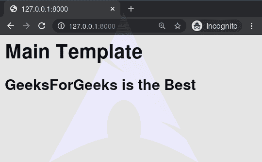

# 延伸–姜戈模板标签

> 原文:[https://www.geeksforgeeks.org/extends-django-template-tags/](https://www.geeksforgeeks.org/extends-django-template-tags/)

Django 模板是使用 Django 模板语言标记的文本文档或 Python 字符串。Django 是一个强大的包含电池的框架，为在模板中呈现数据提供了便利。Django 模板不仅允许在视图和模板之间传递数据，还提供了一些有限的编程特性，如变量、循环、注释、扩展等。
本文围绕如何在模板中使用**扩展标签**。extends 标签用于 django 中模板的继承。人们需要一遍又一遍地重复同样的代码。使用扩展，我们可以继承模板和变量。

**语法:**

```
 
```

**示例:**
假设如下目录结构:

```
dir1/
    template.html
    base2.html
    my/
        base3.html
base1.html
```

在 template.html，以下路径是有效的:

## 超文本标记语言

```



```

## 扩展–姜戈模板标签说明

用一个例子说明如何在姜戈模板中使用扩展标签。考虑一个名为 geeksforgeeks 的项目，它有一个名为 geeks 的应用程序。

> 请参考以下文章，查看如何在 Django 中创建项目和应用程序。
> 
> *   [如何利用姜戈的 MVT 创建基础项目？](https://www.geeksforgeeks.org/how-to-create-a-basic-project-using-mvt-in-django/)
> *   [如何在姜戈创建 App？](https://www.geeksforgeeks.org/how-to-create-an-app-in-django/)

现在创建一个视图，我们将通过它访问模板。

## 蟒蛇 3

```
# import Http Response from django
from django.shortcuts import render

# create a function
def geeks_view(request):

    # return response
    return render(request, "extendedgeeks.html")
```

创建 url 路径以映射到此视图。在极客/URL . py 中，

## 蟒蛇 3

```
from django.urls import path

# importing views from views.py
from .views import geeks_view

urlpatterns = [
    path('', geeks_view),
]
```

extends 总是与块标记一起使用，以便可以被继承和重写。在 templates/geeks.html 中创建一个模板作为基础模板。

## 超文本标记语言

```
<h1>Main Template</h1>



```

现在创建一个模板，将使用 geeks.html 作为基础模板。创建一个新模板 extendedgeeks.html，

## 超文本标记语言

```



<h2> GeeksForGeeks is the Best

```

让我们检查一下 extendedgeeks.html 的两个模板是否都显示了数据



#### 高级用法

使用变量值。如果变量的计算结果为字符串，Django 将使用该字符串作为父模板的名称。如果变量评估为一个模板对象，Django 将使用该对象作为父模板。