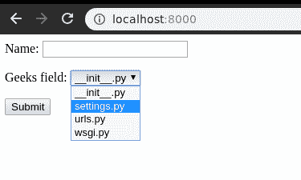
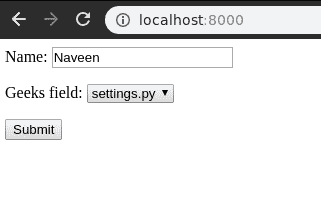
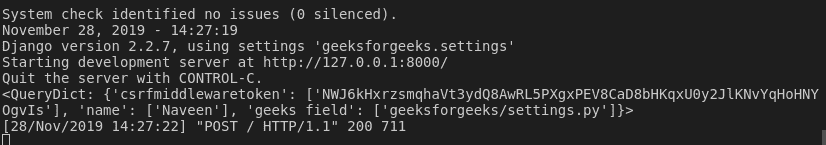

# 文件路径字段–姜戈表格

> 原文:[https://www.geeksforgeeks.org/filepathfield-django-forms/](https://www.geeksforgeeks.org/filepathfield-django-forms/)

Django 表单中的文件路径字段是一个字符串字段，用于从服务器输入特定文件的路径。它用于用户的选择输入。需要指定在文件路径字段中应该使用哪些文件夹，并且字段以选择字段的形式显示输入。该输入的默认部件是[选择](https://docs.djangoproject.com/en/2.2/ref/forms/widgets/#django.forms.Select)。
**文件路径字段有以下必需和可选参数:**

*   **路径:-** 要列出其内容的目录的绝对路径。该目录必须存在。
*   **递归:-** 如果为假(默认值)，则只提供路径的直接内容作为选择。如果为真，目录将递归下降到，所有后代将作为选项列出。
*   **匹配:-** 一个正则表达式模式；仅允许名称与此表达式匹配的文件作为选择。
*   **允许 _ 文件:-** 可选。非真即假。默认值为真。指定是否应包含指定位置的文件。此文件夹或允许文件夹必须为真。
*   **允许 _ 文件夹:-** 可选。非真即假。默认值为假。指定是否应包括指定位置的文件夹。此文件或允许文件必须为真。

**语法**

```py
field_name = forms.FilePathField(**options)
```

### Django 表单文件路径字段解释

使用示例说明文件路径字段。考虑一个名为 geeksforgeeks 的项目，它有一个名为 geeks 的应用程序。

> 请参考以下文章，查看如何在 Django 中创建项目和应用程序。
> 
> *   [如何利用姜戈的 MVT 创建基础项目？](https://www.geeksforgeeks.org/how-to-create-a-basic-project-using-mvt-in-django/)
> *   [如何在姜戈创建 App？](https://www.geeksforgeeks.org/how-to-create-an-app-in-django/)

将以下代码输入**极客** app 的 forms.py 文件。

## 蟒蛇 3

```py
from django import forms

class GeeksForm(forms.Form):
    name = forms.CharField()
    geeks_field = forms.FilePathField(path = "geeksforgeeks/")
```

将极客应用程序添加到 INSTALLED_APPS 中

## 蟒蛇 3

```py
# Application definition

INSTALLED_APPS = [
    'django.contrib.admin',
    'django.contrib.auth',
    'django.contrib.contenttypes',
    'django.contrib.sessions',
    'django.contrib.messages',
    'django.contrib.staticfiles',
    'geeks',
]
```

现在要将这个表单呈现为一个视图，我们需要一个视图和一个映射到该 URL 的 URL。让我们首先在极客应用程序的 views.py 中创建一个视图，

## 蟒蛇 3

```py
from django.shortcuts import render
from .forms import GeeksForm

# Create your views here.
def home_view(request):
    context = {}
    context['form'] = GeeksForm()
    return render( request, "home.html", context)
```

这里，我们从 forms.py 导入该特定表单，并在视图中创建它的一个对象，以便它可以在模板中呈现。

现在，要创建一个姜戈表单，你需要创建一个 home.html，在那里你可以设计他们喜欢的东西。让我们在 home.html 创建一个表单。

## 超文本标记语言

```py
<form method="POST" enctype="multipart/form-data">
    
    {{ form.as_p }}
    <input type = "submit" value = "Submit">
</form>
```

最后，在 urls.py 中映射到此视图的 URL

## 蟒蛇 3

```py
from django.urls import path

# importing views from views..py
from .views import home_view

urlpatterns = [
    path('', home_view ),
]
```

让我们运行服务器并检查实际发生了什么，运行

```py
Python manage.py runserver
```



因此，极客 _ 字段**文件路径字段**是通过将“_”替换为“”而创建的。它是一个从用户输入文件路径的字段。

### 如何使用文件路径字段？

文件路径字段用于输入数据库中文件的路径。人们可以从特定的文件夹等输入文件。到目前为止，我们已经讨论了如何实现文件路径字段，但是如何在视图中使用它来执行逻辑部分。为了执行一些逻辑，我们需要将输入到字段中的值输入到 python 字符串实例中。
在视图中，

## 蟒蛇 3

```py
from django.shortcuts import render
from .forms import GeeksForm

# Create your views here.
def home_view(request):
    context ={}
    form = GeeksForm()
    context['form']= form
    if request.POST:
        temp = request.POST
        print(temp)
    return render(request, "home.html", context)
```

作为一个选择字段，它只接受选择输入，否则会出现验证错误。现在让我们试着从字段中选择一个选项。



可以使用相应的请求字典提取日期数据。如果方法是 GET，数据将在**请求中可用。获取**和如果发布，**请求。相应地开机自检**。在上面的例子中，我们有一个可以用于任何目的的 temp 值。



### 核心字段参数

核心字段参数是为每个字段提供的参数，用于对特定字段应用某种约束或赋予特定特征。例如，向文件路径字段添加一个必需的参数= False 将使用户可以将其留空。每个字段类构造函数至少接受这些参数。有些字段类采用额外的、特定于字段的参数，但以下参数应始终被接受:

<figure class="table">

| 字段选项 | 描述 |
| --- | --- |
| [必需](https://www.geeksforgeeks.org/required-django-form-field-validation/) | 默认情况下，每个字段类都假定该值是必需的，因此要使其不是必需的，您需要将 required 设置为 False |
| 标签 | label 参数允许您为此字段指定“人性化”标签。当字段显示在表单中时使用。 |
| [标签 _ 后缀](https://www.geeksforgeeks.org/label-django-form-field-validation/) | 标签后缀参数允许您在每个字段的基础上覆盖表单的[标签后缀](https://docs.djangoproject.com/en/2.2/ref/forms/fields/#label-suffix)。 |
| 小部件 | widget 参数允许您指定呈现此字段时要使用的 Widget 类。有关更多信息，请参见[小部件](https://docs.djangoproject.com/en/2.2/ref/forms/widgets/)。 |
| [帮助 _ 文字](https://www.geeksforgeeks.org/help_text-django-form-field-validation/) | 帮助文本参数允许您为此字段指定描述性文本。如果提供 help_text，当字段通过方便的表单方法之一呈现时，它将显示在字段旁边。
 |
| [错误信息](https://www.geeksforgeeks.org/error_messages-django-form-field-validation/) | error_messages 参数允许您覆盖该字段将引发的默认消息。传入一个字典，其关键字与您想要覆盖的错误消息相匹配。 |
| [验证器](https://www.geeksforgeeks.org/django-form-field-custom-widgets/) | validators 参数允许您为此字段提供一个验证函数列表。
 |
| [本地化](http://localize) | localize 参数允许对表单数据输入以及呈现的输出进行本地化。 |
| [禁用](https://www.geeksforgeeks.org/disabled-django-form-field-validation/)。 | 禁用的布尔参数设置为真时，使用禁用的 HTML 属性禁用表单字段，这样用户就无法编辑它。
 |

</figure>