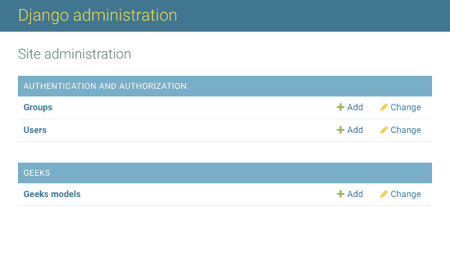
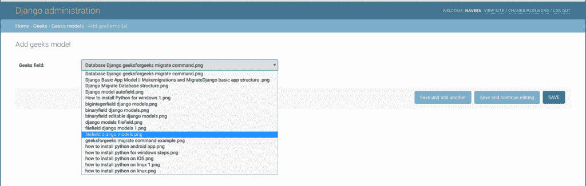

# 文件路径字段–姜戈模型

> 原文:[https://www.geeksforgeeks.org/filepathfield-django-models/](https://www.geeksforgeeks.org/filepathfield-django-models/)

文件路径字段是一个字符字段，它的选择仅限于文件系统中某个目录的文件名。文件路径字段实例在数据库中创建为`varchar`列，默认最大长度为 100 个字符。

**语法:**

> field_name = models。文件路径字段(路径=无，匹配=无，递归=假，最大长度=100，[* *选项](#field-options))

**文件路径字段有以下特殊参数，其中第一个是必需的:**

*   **文件路径字段.路径**–此属性是必需的。该文件路径字段应该从中获得选择的目录的绝对文件系统路径。示例:`"/home/images"`。
*   **文件路径字段匹配**–文件路径字段将用于过滤文件名的字符串形式的正则表达式。请注意，正则表达式将应用于基本文件名，而不是完整路径。例:“**喷火。*\.txt { content } # x201D**，将匹配名为 **foo23.txt** 的文件，但不匹配 **bar.txt** 或**foo23.png**。
*   **文件路径字段.递归**–要么**为真**要么**为假**。默认为**假**。指定是否应包含路径的所有子目录
*   **文件路径字段.允许文件**–要么**真**要么**假**。默认为**真**。指定是否应包含指定位置的文件。要么这个要么`allow_folders`一定是真的。
*   **文件路径字段.允许 _ 文件夹**–或者**真**或者**假**。默认为**假**。指定是否应包括指定位置的文件夹。要么这个要么`allow_files`一定是真的。

需要考虑的一个要点是**匹配**适用于基本文件名，而不是完整路径。所以，这个例子:

```py
FilePathField(path ="/home/images",
              match ="foo.*", 
              recursive = True)
```

……将匹配 **/home/images/foo.png** ，但不匹配 **/home/images/foo/bar.png** ，因为匹配适用于基本文件名(**foo.png**和**bar.png**)。

## Django 模型文件路径字段解释

使用示例说明文件路径字段。考虑一个名为`geeksforgeeks`的项目，它有一个名为`geeks`的应用程序。

> 请参考以下文章，查看如何在 Django 中创建项目和应用程序。
> 
> *   [如何利用姜戈的 MVT 创建基础项目？](https://www.geeksforgeeks.org/how-to-create-a-basic-project-using-mvt-in-django/)
> *   [如何在姜戈创建 App？](https://www.geeksforgeeks.org/how-to-create-an-app-in-django/)

将以下代码输入**极客** app 的`models.py`文件。

```py
from django.db import models
from django.db.models import Model
# Create your models here.

class GeeksModel(Model):
    geeks_field = models.FilePathField(path ="/home/naveen/projects/geeksforgeeks/images")
```

将极客应用添加到`INSTALLED_APPS`

```py
# Application definition

INSTALLED_APPS = [
    'django.contrib.admin',
    'django.contrib.auth',
    'django.contrib.contenttypes',
    'django.contrib.sessions',
    'django.contrib.messages',
    'django.contrib.staticfiles',
    'geeks',
]
```

现在当我们从终端运行`makemigrations`命令时，

```py
Python manage.py makemigrations
```

将在`geeks`目录中创建一个名为“迁移”的新文件夹，文件名为`0001_initial.py`

```py
# Generated by Django 2.2.5 on 2019-09-25 06:00

from django.db import migrations, models

class Migration(migrations.Migration):

    initial = True

    dependencies = [
    ]

    operations = [
        migrations.CreateModel(
            name ='GeeksModel',
            fields =[
                ('id', 
                  models.AutoField(
                  auto_created = True,
                  primary_key = True,
                  serialize = False, 
                  verbose_name ='ID'
                )),
                ('geeks_field', models.FilePathField(
                 path ="/home/naveen/projects/geeksforgeeks/images")),
            ],
        ),
    ]
```

现在快跑，

```py
Python manage.py migrate
```

因此，当您在项目上运行迁移时，会创建一个 `geeks_field` **文件路径字段**。它是数据库中存储任何类型文件的字段。

## 如何使用文件路径字段？

文件路径字段用于将文件存储到数据库中。在文件路径字段中可以有任何类型的文件。让我们尝试在上面创建的模型中存储一个图像。

*   要开始创建模型实例，请使用以下命令创建一个管理员帐户。

    ```py
    Python manage.py createsuperuser
    ```

*   Enter a username, email and a secure password. Then in your browser enter the following URL.

    ```py
    http://localhost:8000/admin/
    ```

    

*   转到**极客模型**前添加。
    
*   选择要上传的文件，然后单击保存。现在让我们在管理服务器中检查它。我们已经创建了一个极客模型的实例。
    

## 字段选项

字段选项是为每个字段提供的参数，用于对特定字段应用某些约束或赋予特定特征。例如，向文件路径字段添加参数`null = True`将使其能够在关系数据库中存储该表的空值。
以下是文件路径字段可以使用的字段选项和属性。

| 字段选项 | 描述 |
| --- | --- |
| [零](https://www.geeksforgeeks.org/nulltrue-django-built-in-field-validation/) | 如果**为真**，姜戈会在数据库中将空值存储为**空值**。默认为**假**。 |
| [空白](https://www.geeksforgeeks.org/blanktrue-django-built-in-field-validation/) | 如果**为真**，则该字段允许为空。默认为**假**。 |
| 数据库 _ 列 | 用于此字段的数据库列的名称。如果没有给出，Django 将使用字段的名称。 |
| [默认](https://www.geeksforgeeks.org/default-django-built-in-field-validation/) | 该字段的默认值。这可以是一个值或一个可调用对象。如果可调用，它将在每次创建新对象时被调用。 |
| [帮助 _ 文字](https://www.geeksforgeeks.org/help_text-django-built-in-field-validation/) | 要与表单小部件一起显示的额外“帮助”文本。即使您的字段没有在表单上使用，它对文档也很有用。 |
| [主键](https://www.geeksforgeeks.org/primary_key-django-built-in-field-validation/) | 如果为真，则该字段是模型的主键。 |
| [可编辑](https://www.geeksforgeeks.org/editablefalse-django-built-in-field-validation/) | 如果**为假**，该字段将不会显示在管理或任何其他模型表单中。在模型验证期间也会跳过它们。默认为**真**。 |
| [错误信息](https://www.geeksforgeeks.org/error_messages-django-built-in-field-validation/) | error_messages 参数允许您覆盖该字段将引发的默认消息。传入一个字典，其关键字与您想要覆盖的错误消息相匹配。 |
| [帮助 _ 文字](https://www.geeksforgeeks.org/help_text-django-built-in-field-validation/) | 要与表单小部件一起显示的额外“帮助”文本。即使您的字段没有在表单上使用，它对文档也很有用。 |
| [verbose_name](https://www.geeksforgeeks.org/verbose_name-django-built-in-field-validation/) | 该字段的可读名称。如果没有给出详细名称，Django 将使用字段的属性名称自动创建它，将下划线转换为空格。 |
| [验证器](https://www.geeksforgeeks.org/custom-field-validations-in-django-models/) | 为此字段运行的验证程序列表。更多信息参见[验证器文档](https://docs.djangoproject.com/en/2.2/ref/validators/)。 |
| [独特](https://www.geeksforgeeks.org/uniquetrue-django-built-in-field-validation/) | 如果为真，则该字段在整个表中必须是唯一的。 |