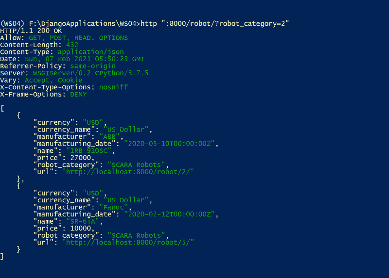
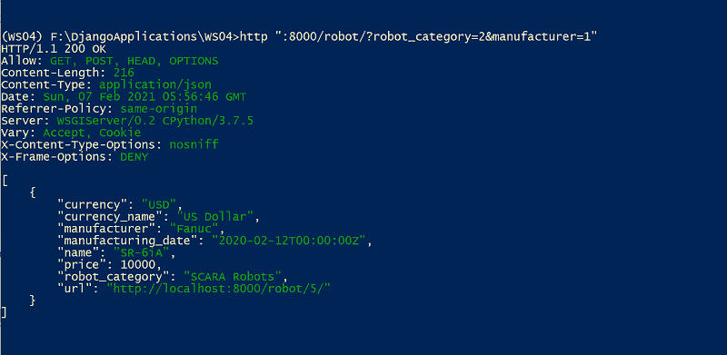
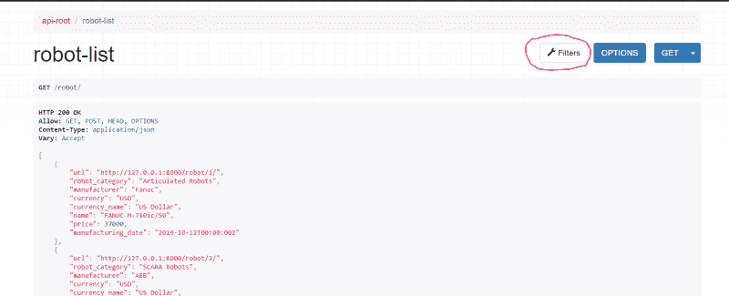
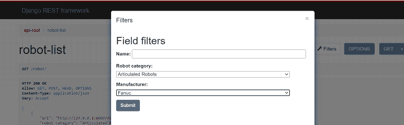
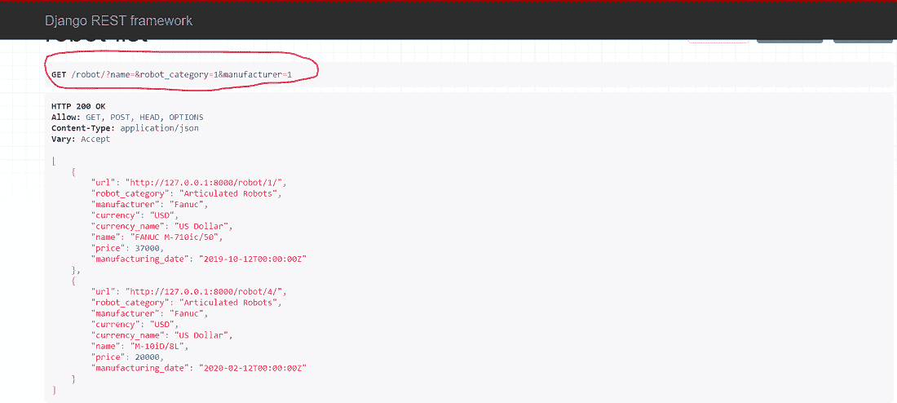
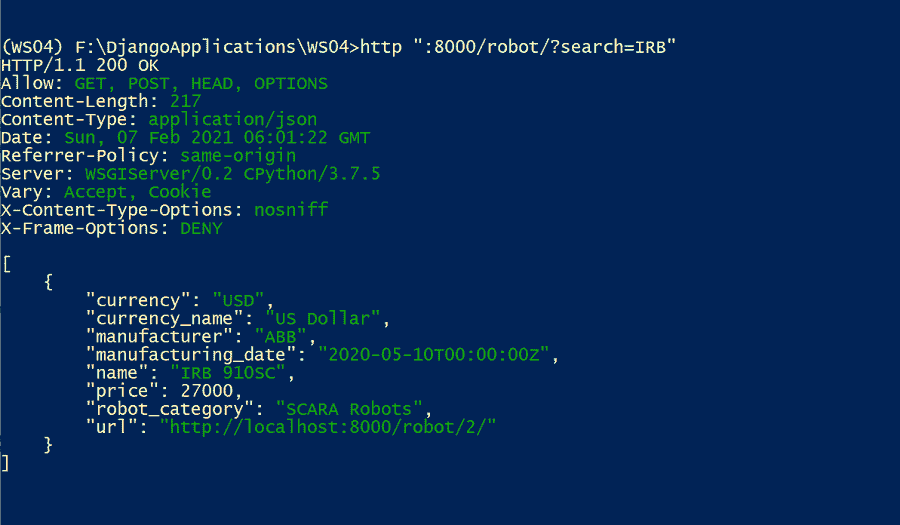
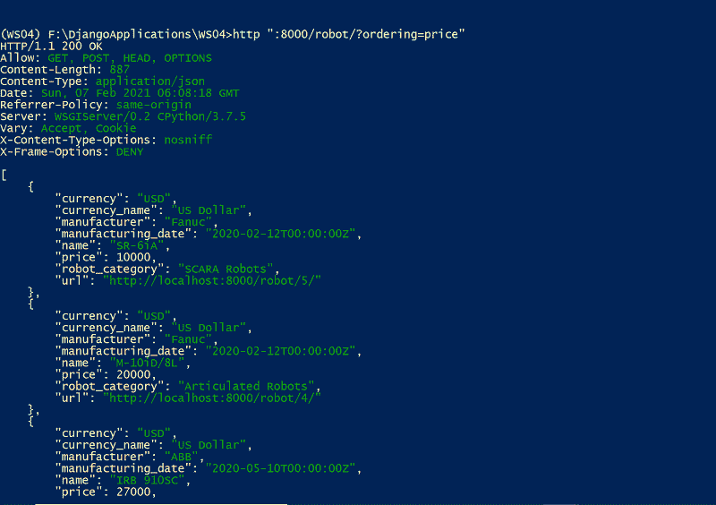

# 在 Django Rest 框架中过滤数据

> 原文:[https://www . geesforgeks . org/filter-data-in-django-rest-framework/](https://www.geeksforgeeks.org/filter-data-in-django-rest-framework/)

默认情况下，Django REST 框架的通用列表视图返回模型管理器的整个查询集。对于现实世界的应用程序，有必要根据需要过滤 queryset 以检索相关结果。因此，让我们讨论如何创建一个提供过滤功能的 RESTful 网络服务。

*   詹戈过滤器后端
*   搜索过滤器
*   订购过滤器

**注意:**您可以参考文章中使用的模型、序列化程序和项目视图的[可浏览 API](https://www.geeksforgeeks.org/browsable-api-in-django-rest-framework/) 部分

## 詹戈过滤器后端

DjanGoFilter 后端类用于根据一组指定的字段过滤 queryset。这个后端类自动创建一个 filter set(*django _ filters . rest _ framework。给定字段的 FilterSet* )类。我们还可以创建自己的带有自定义设置的 FilterSet 类。

为了在我们的 Django Web Service 中配置过滤器后端类，我们需要在我们的虚拟环境中安装 *django-filter* 包。确保退出 Django 开发服务器(Ctrl + C)并激活虚拟环境。让我们运行下面的命令。

```
pip install django-filter
```

安装后，我们需要在 settings.py 文件中将 *django_filters* 应用程序定义为 *INSTALLED_APPS* 。

## 蟒蛇 3

```
INSTALLED_APPS = [
    'django.contrib.admin',
    'django.contrib.auth',
    'django.contrib.contenttypes',
    'django.contrib.sessions',
    'django.contrib.messages',
    'django.contrib.staticfiles',
    # Django REST framework
    'rest_framework',
    'robots.apps.RobotsConfig',
    # Django Filters
    'django_filters',
]
```

下一步，我们需要将 django_filters 中的*djangofilterbackender*类设置为默认的过滤器类。让我们向 settings.py 文件中的 *REST_FRAMEWORK* 字典提一下。

## 蟒蛇 3

```
REST_FRAMEWORK = {
    'DEFAULT_FILTER_BACKENDS'🙁
        'django_filters.rest_framework.DjangoFilterBackend',
    ),
}
```

现在我们的 RESTful web 服务被配置为利用*django _ filters . rest _ framework 提供的过滤功能。DjangoFilterBackend 后端*类。让我们过滤检索机器人列表的机器人类。机器人列表类如下:

## 蟒蛇 3

```
class RobotList(generics.ListCreateAPIView):
    queryset = Robot.objects.all()
    serializer_class = RobotSerializer
    name = 'robot-list'

    filter_fields = (
        'robot_category',
        'manufacturer',
    )
```

在这里，您可以注意到一个名为 *filter_fileds* 的属性，我们在这里指定要过滤的字段名。现在，我们可以根据机器人的类别(robot_category)和/或制造商来检索机器人。

让我们根据机器人类别过滤机器人。HTTPie 命令是

> http:8000/robot/？robot_category=2 英寸

**输出:**



让我们尝试另一个基于机器人类别和制造商过滤机器人的 HTTPie 命令。HTTPie 命令是

> http://8000/robot/？机器人 _ 类别= 2 &制造商=1 "

**输出:**



现在让我们检查一下可浏览应用编程接口中的功能。您可以浏览以下网址

> http://127.0.0.1:8000/robot/



您可以单击右上角的“过滤器”按钮来使用过滤器功能。它将显示如下



点击提交按钮，您将获得基于如下所示填充的过滤器字段的结果。



## 搜索过滤器

*SearchFilter* 类支持基于单个查询参数的搜索功能，它基于 Django admin 的搜索功能。

默认情况下， *SearchFilter* 类使用不区分大小写的部分匹配，它可能包含多个搜索词(应该是空白和/或逗号分隔的)。我们还可以通过在 search_fields 前添加各种字符来限制搜索行为。

*   '^'从搜索开始。
*   = '完全匹配。
*   @ '全文搜索。(针对 Django 的 PostgreSQL 后端)
*   { content } ' 2019；正则表达式搜索

默认情况下，搜索参数被命名为*搜索，*您可以使用*搜索 _ 参数*设置来覆盖它。让我们通过在 *REST_FRAMEWORK* 字典中添加*REST _ FRAMEWORK . filters . SearchFilter*类来利用 search filter 类。

## 蟒蛇 3

```
REST_FRAMEWORK = {
    'DEFAULT_FILTER_BACKENDS'🙁
        'django_filters.rest_framework.DjangoFilterBackend',
        'rest_framework.filters.SearchFilter',
    ),
}
```

我们的机器人列表类如下所示:

## 蟒蛇 3

```
class RobotList(generics.ListCreateAPIView):
    queryset = Robot.objects.all()
    serializer_class = RobotSerializer
    name = 'robot-list'

    search_fields = (
        '^name',
    )
```

*search_fields* 属性指定了一个字符串元组，它指示了我们希望包含在搜索功能中的字段名称。

让我们搜索机器人，它以名字“IRB”开始。HTTPie 命令是

> http:8000/robot/？search=IRB "

**输出:**



## 订购过滤器

*排序过滤器*类允许您根据指定的字段对结果进行排序。默认情况下，查询参数名为*排序，*，可以通过*排序 _ 参数*设置进行覆盖。 *ordering_field* 属性指定了一个字符串元组，它指示对结果进行排序的字段名。

如果您没有在视图上指定 *ordering_fields* 属性，过滤器类允许用户过滤由 serializer_class 属性指定的任何可读字段。这允许用户针对敏感信息(如密码哈希字段等)进行订购，这可能会导致意外的数据泄露。您也可以通过在视图上设置排序属性来指定默认顺序。它可以是字符串或字符串列表/元组。

要使用*排序过滤器*类，我们需要将该类设置为 *REST_FRAMEWORK* 字典的默认排序过滤器类。

## 蟒蛇 3

```
REST_FRAMEWORK = {
    'DEFAULT_FILTER_BACKENDS'🙁
        'django_filters.rest_framework.DjangoFilterBackend',
        'rest_framework.filters.OrderingFilter',
    ),
}
```

让我们提到 RobotList 类上的 ordering_fields 属性。代码如下:

## 蟒蛇 3

```
class RobotList(generics.ListCreateAPIView):
    queryset = Robot.objects.all()
    serializer_class = RobotSerializer
    name = 'robot-list'

    ordering_fields = (
        'price',
    )
```

现在，让我们根据价格订单的增加来检索机器人。HTTPie 命令是

> http://8000/robot/？订购=价格”

**输出:**

