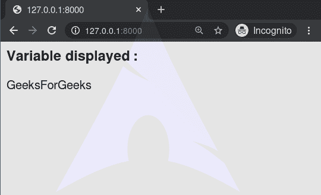

# first of–django 模板标记

> 哎哎哎:# t0]https://www . geeksforgeeks . org/first of-django 模板标签/

Django 模板是使用 Django 模板语言标记的文本文档或 Python 字符串。Django 是一个强大的包含电池的框架，为在模板中呈现数据提供了便利。Django 模板不仅允许从一个视图到另一个模板分配数据，还提供了一些有限的编程特性，比如变量、循环、注释、firstof 等。
本文围绕如何在模板中使用**第一个标签**。`**firstof**`标记输出第一个不是“假”的参数变量(即存在，不为空，不是假布尔值，也不是零数值)。如果所有传递的变量都为“假”，则不输出任何内容。

###### 句法

```py



```

###### 例子

```py

```

这相当于:

```py

    {{ var1 }}

    {{ var2 }}

    {{ var3 }}

```

如果所有传递的变量都为 False，也可以使用文字字符串作为后备值:

```py

```

## 首先–姜戈模板标签说明

举例说明如何在姜戈模板中使用 firstof 标签。考虑一个名为`geeksforgeeks`的项目，它有一个名为`geeks`的应用程序。

> 请参考以下文章，查看如何在 Django 中创建项目和应用程序。
> 
> *   [如何利用姜戈的 MVT 创建基础项目？](https://www.geeksforgeeks.org/how-to-create-a-basic-project-using-mvt-in-django/)
> *   [如何在姜戈创建 App？](https://www.geeksforgeeks.org/how-to-create-an-app-in-django/)

现在创建一个视图，我们将通过它访问模板，
在`geeks/views.py`中，

```py
# import Http Response from django
# import Http Response from django
from django.shortcuts import render

# create a function
def geeks_view(request):
    # create a dictionary
    context = {
        "var1":None,
        "var2":None,
        "var3":"GeeksForGeeks"
    }
    # return response
    return render(request, "geeks.html", context)
```

创建 url 路径以映射到此视图。在`geeks/urls.py`中，

```py
from django.urls import path

# importing views from views.py
from .views import geeks_view

urlpatterns = [
    path('', geeks_view),
]
```

在`templates/geeks.html`中创建模板。

```py
<h3>Variable displayed : </h3>


```

我们来看看`geeks.html`
第三个变量是否显示数据

#### 高级用法

这个标记自动转义变量值。您可以通过以下方式禁用自动转义:

```py

    

```

或者，如果只有一些变量应该被转义，您可以使用:

```py

```

您可以使用语法``将输出存储在变量中。