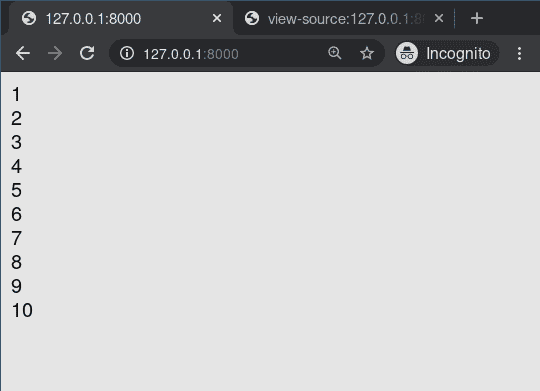
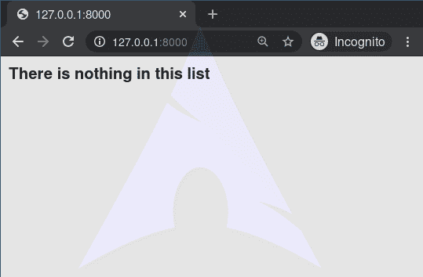

# 用于…空循环–姜戈模板标签

> 原文:[https://www . geesforgeks . org/for-empty-loop-django-template-tags/](https://www.geeksforgeeks.org/for-empty-loop-django-template-tags/)

Django 模板是使用 Django 模板语言标记的文本文档或 Python 字符串。Django 是一个强大的包含电池的框架，为在模板中呈现数据提供了便利。Django 模板不仅允许在视图和模板之间传递数据，还提供了一些有限的编程特性，如变量、循环、注释、扩展等。
本文围绕如何在模板中使用**进行空**标记展开。 **for tag** 循环遍历数组中的每一项，使该项在上下文变量中可用。for 标记可以采用可选的子句，如果给定数组为空或找不到该子句，则会显示该子句的文本。这基本上是作为检查**query set 是否为空**以及在相同场景下要执行什么操作时要遵循的条件。

**语法:**

```py

// Do this in non - empty condition

// Do this in empty condition

```

**示例:**
例如，要显示运动员列表中提供的运动员列表:

## 超文本标记语言

```py
<ul>

    <li>{{ athlete.name }}</li>

    <li>Sorry, no athletes in this list.</li>

</ul>
```

以上相当于——但更短、更干净，并且可能比——以下内容更快:

## 超文本标记语言

```py
<ul>
  
    
      <li>{{ athlete.name }}</li>
    
  
    <li>Sorry, no athletes in this list.</li>
  
</ul>
```

## 对于…空的–姜戈模板标签解释

举例说明如何在姜戈模板中使用…空标签。考虑一个名为 geeksforgeeks 的项目，它有一个名为 geeks 的应用程序。

> 请参考以下文章，查看如何在 Django 中创建项目和应用程序。
> 
> *   [如何利用姜戈的 MVT 创建基础项目？](https://www.geeksforgeeks.org/how-to-create-a-basic-project-using-mvt-in-django/)
> *   [如何在姜戈创建 App？](https://www.geeksforgeeks.org/how-to-create-an-app-in-django/)

现在创建一个视图，我们将通过它传递上下文字典。

## 蟒蛇 3

```py
# import Http Response from django
from django.shortcuts import render

# create a function
def geeks_view(request):
    # create a dictionary
    context = {
        "data" : [1, 2, 3, 4, 5, 6, 7, 8, 9, 10],
    }
    # return response
    return render(request, "geeks.html", context)
```

创建 url 路径以映射到此视图。在极客/URL . py 中，

## 蟒蛇 3

```py
from django.urls import path

# importing views from views.py
from .views import geeks_view

urlpatterns = [
    path('', geeks_view),
]
```

在 templates/geeks.html 中创建模板，

## 超文本标记语言

```py

    <div class="row">
        {{ i }}
    </div>

```

让我们检查一下“/”上显示的内容是否显示在模板中。



任何包含在 for 标记之间的内容都将被重复，即循环运行的次数。
现在让我们传递一个空数组，并使用空标记和 for 标记。
在极客/观点. py 中，

## 蟒蛇 3

```py
# import Http Response from django
from django.shortcuts import render

# create a function
def geeks_view(request):
    # create a dictionary
    context = {
        "data" : [],
    }
    # return response
    return render(request, "geeks.html", context)
```

现在在模板/极客. html 中，

## 超文本标记语言

```py

    <div class="row">
        {{ i }}
    </div>
    
    <h4>There is nothing in this list</h4>

```

现在，查看 [http://127.0.0.1:8000/](http://127.0.0.1:8000/) ，

