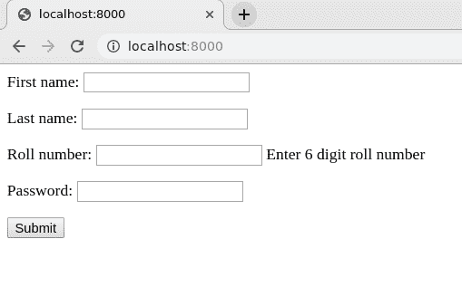
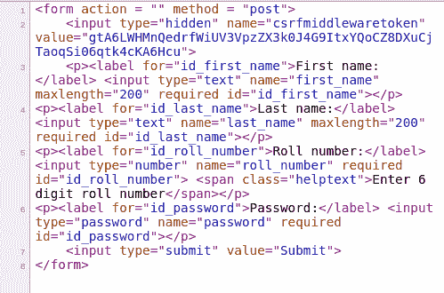

# { { form . as _ p } }–将姜戈表单渲染为段落

> 原文:[https://www . geesforgeks . org/form-as _ p-render-django-forms-as-段落/](https://www.geeksforgeeks.org/form-as_p-render-django-forms-as-paragraph/)

Django 表单是一组高级的 HTML 表单，可以使用 python 创建，并以 python 方式支持 HTML 表单的所有功能。在模板中呈现 Django 表单有时看起来很混乱，但是如果对 Django 表单和字段属性有足够的了解，就可以轻松创建具有所有强大功能的优秀表单。在本文中，表单在模板中呈现为段落。

#### { { form . as _ p } }–将姜戈表单呈现为段落

举例说明 **{{ form.as_p }}** 。考虑一个名为`geeksforgeeks`的项目，它有一个名为`geeks`的应用程序。

> 请参考以下文章，查看如何在 Django 中创建项目和应用程序。
> 
> *   [如何利用姜戈的 MVT 创建基础项目？](https://www.geeksforgeeks.org/how-to-create-a-basic-project-using-mvt-in-django/)
> *   [如何在姜戈创建 App？](https://www.geeksforgeeks.org/how-to-create-an-app-in-django/)

让我们创建一个示例 Django 表单来呈现它，并作为示例展示。在`geeks > forms.py`中，输入以下代码

```py
from django import forms

# creating a form 
class InputForm(forms.Form):

    first_name = forms.CharField(max_length = 200)
    last_name = forms.CharField(max_length = 200)
    roll_number = forms.IntegerField(
                     help_text = "Enter 6 digit roll number"
                     )
    password = forms.CharField(widget = forms.PasswordInput())
```

现在我们需要一个视图来将这个表单呈现到一个模板中。让我们创建一个视图，

```py
from django.shortcuts import render
from .forms import InputForm

# Create your views here.
def home_view(request):
    context ={}
    context['form']= InputForm()
    return render(request, "home.html", context)
```

最后，我们将创建需要放置表单的模板。在`templates > home.html`中，

```py
<form action = "" method = "post">
    
    {{form.as_p }}
    <input type="submit" value=Submit">
</form>
```

这里 **{{ form.as_p }}** 会将它们包裹在< p >标签中。让我们检查一下这是否正常工作。打开 [http://localhost:8000/](http://localhost:8000/)


我们来检查一下源代码，表单是否呈现为段落。作为段落呈现意味着所有输入字段都将包含在< p >标签中。
这是演示，



#### 其他方法

*   [{{ form.as_table }}](https://www.geeksforgeeks.org/form-as_table-render-django-forms-as-table/) 会将它们渲染为包裹在< tr >标签中的表格单元格
*   [{{ form.as_ul }}](https://www.geeksforgeeks.org/form-as_ul-render-django-forms-as-list/) 将使它们包裹在< li >标签中