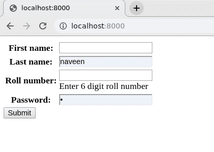
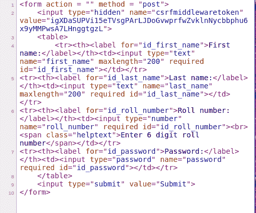

# { { form . as _ table } }–将姜戈表单渲染为表格

> 原文:[https://www . geesforgeks . org/form-as _ table-render-django-forms-as-table/](https://www.geeksforgeeks.org/form-as_table-render-django-forms-as-table/)

Django 表单是一组高级的 HTML 表单，可以使用 python 创建，并以 python 方式支持 HTML 表单的所有功能。在模板中呈现 Django 表单有时看起来很混乱，但是如果对 Django 表单和字段属性有足够的了解，就可以轻松创建具有所有强大功能的优秀表单。在本文中，表单在模板中呈现为表格。

#### { { form . as _ Table } }–将 Django 表单呈现为表格

使用示例说明 **{{ form.as_table }}** 。考虑一个名为`geeksforgeeks`的项目，它有一个名为`geeks`的应用程序。

> 请参考以下文章，查看如何在 Django 中创建项目和应用程序。
> 
> *   [如何利用姜戈的 MVT 创建基础项目？](https://www.geeksforgeeks.org/how-to-create-a-basic-project-using-mvt-in-django/)
> *   [如何在姜戈创建 App？](https://www.geeksforgeeks.org/how-to-create-an-app-in-django/)

让我们创建一个示例 Django 表单来呈现它，并作为示例展示。在`geeks > forms.py`中，输入以下代码

```py
from django import forms

# creating a form 
class InputForm(forms.Form):

    first_name = forms.CharField(max_length = 200)
    last_name = forms.CharField(max_length = 200)
    roll_number = forms.IntegerField(
                     help_text = "Enter 6 digit roll number"
                     )
    password = forms.CharField(widget = forms.PasswordInput())
```

现在我们需要一个视图来将这个表单呈现到一个模板中。让我们创建一个视图，

```py
from django.shortcuts import render
from .forms import InputForm

# Create your views here.
def home_view(request):
    context ={}
    context['form']= InputForm()
    return render(request, "home.html", context)
```

最后，我们将创建需要放置表单的模板。在`templates > home.html`中，

```py
<form action = "" method = "post">
    
    <table>
        {{ form.as_table }}
    </table>
    <input type="submit" value="Submit">
</form>
```

这里 **{{ form.as_table }}** 将它们呈现为包裹在< tr >标签中的表格单元格。让我们检查一下这是否正常工作。打开 [http://localhost:8000/](http://localhost:8000/)



让我们检查源代码，看看表单是否呈现为表。渲染为表格意味着所有输入字段都将包含在标签中。
下面是演示，



#### 其他方法

*   [{{ form.as_p }}](https://www.geeksforgeeks.org/form-as_p-render-django-forms-as-paragraph/) 将使它们包裹在< p >标签中
*   [{{ form.as_ul }}](https://www.geeksforgeeks.org/form-as_ul-render-django-forms-as-list/) 将使它们包裹在< li >标签中