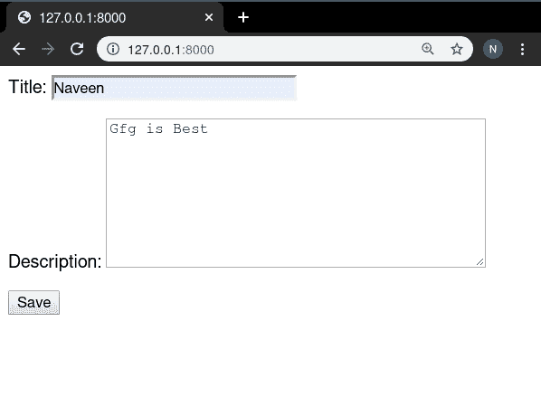
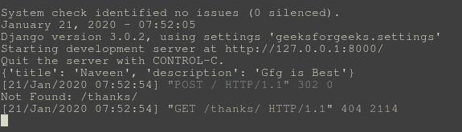

# 表单视图–基于类的视图姜戈

> 原文:[https://www . geesforgeks . org/formview-基于类-view-django/](https://www.geeksforgeeks.org/formview-class-based-views-django/)

表单视图是指显示和验证姜戈表单的视图(逻辑)。例如，在 geeksforgeeks 上注册用户的表单。基于类的视图提供了一种将视图实现为 Python 对象而不是函数的替代方法。它们不取代基于函数的视图，但与基于函数的视图相比有一定的区别和优势:

*   与特定 HTTP 方法(GET、POST 等)相关的代码的组织。)可以通过单独的方法而不是条件分支来解决。
*   面向对象的技术，如 mixins(多重继承)可以用来将代码分解成可重用的组件。

基于类的视图比基于函数的视图管理起来更简单有效。一个有大量代码行的基于函数的视图可以被转换成只有很少代码行的基于类的视图。这就是面向对象编程产生影响的地方。

## Django 表单视图–基于类的视图

使用示例说明**如何创建和使用 FormView** 。考虑一个名为 geeksforgeeks 的项目，它有一个名为 geeks 的应用程序。

> 请参考以下文章，查看如何在 Django 中创建项目和应用程序。
> 
> *   [如何利用姜戈的 MVT 创建基础项目？](https://www.geeksforgeeks.org/how-to-create-a-basic-project-using-mvt-in-django/)
> *   [如何在姜戈创建 App？](https://www.geeksforgeeks.org/how-to-create-an-app-in-django/)

在你有了一个项目和一个应用程序之后，让我们创建一个表单，我们将创建表单视图。在极客/表单. py 中，

## 蟒蛇 3

```
from django import forms

# creating a form
class GeeksForm(forms.Form):
    # specify fields for model
    title = forms.CharField()
    description = forms.CharField(widget = forms.Textarea)
```

创建表单后，让我们创建**表单视图**。在极客/观点. py 中，

## 蟒蛇 3

```
# import generic FormView
from django.views.generic.edit import FormView

# Relative import of GeeksForm
from .forms import GeeksForm

class GeeksFormView(FormView):
    # specify the Form you want to use
    form_class = GeeksForm

    # specify name of template
    template_name = "geeks / geeksmodel_form.html"

    # can specify success url
    # url to redirect after successfully
    # updating details
    success_url ="/thanks/"
```

在极客/极客模型 _ 表单. html 中为此视图创建一个模板，

## 超文本标记语言

```
<form method="post">
    
    {{ form.as_p }}
    <input type="submit" value="Save">
</form>
```

在极客/url . py 中，将一个 URL 映射到此视图，

## 蟒蛇 3

```
from django.urls import path

# importing views from views..py
from .views import GeeksFormView
urlpatterns = [
    path('', GeeksFormView.as_view()),
]
```

现在访问 [http://127.0.0.1:8000/](http://127.0.0.1:8000/) ，


### 在表单视图中验证表单数据

基于类的视图提供了用于验证表单数据的内置函数。极客/观点. py 中，

## 蟒蛇 3

```
# import generic FormView
from django.views.generic.edit import FormView

# Relative import of GeeksForm
from .forms import GeeksForm

class GeeksFormView(FormView):
    # specify the Form you want to use
    form_class = GeeksForm

    # specify name of template
    template_name = "geeks / geeksmodel_form.html"

    # can specify success url
    # url to redirect after successfully
    # updating details
    success_url ="/thanks/"

    def form_valid(self, form):
        # This method is called when valid form data has been POSTed.
        # It should return an HttpResponse.

        # perform a action here
        print(form.cleaned_data)
        return super().form_valid(form)
```

人们可以在 form_valid 函数中执行所需的功能。在我们的例子中，它打印数据。让我们尝试在表单中输入数据，并检查它是否正常工作。



如果已打印详细信息，请在终端登记。

