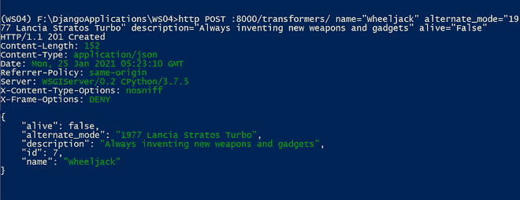
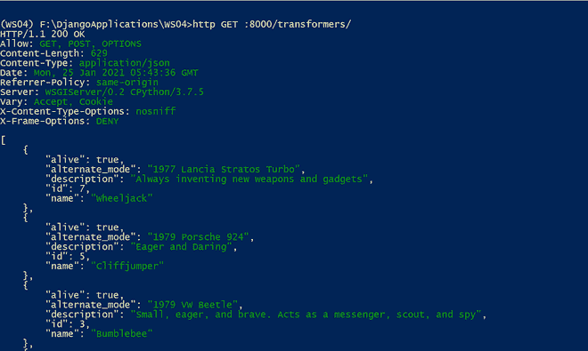
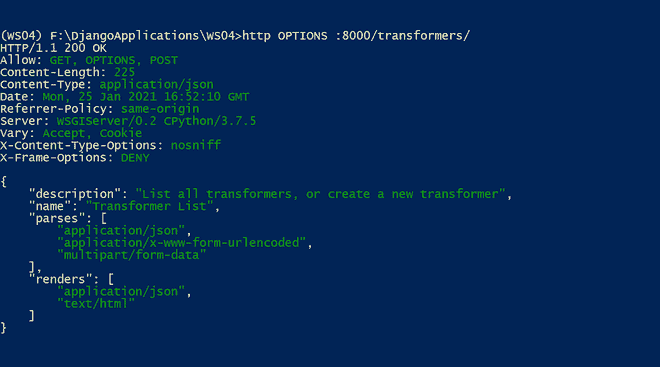
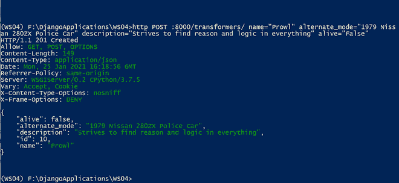
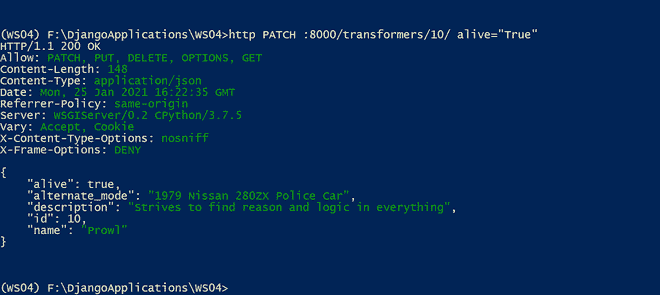
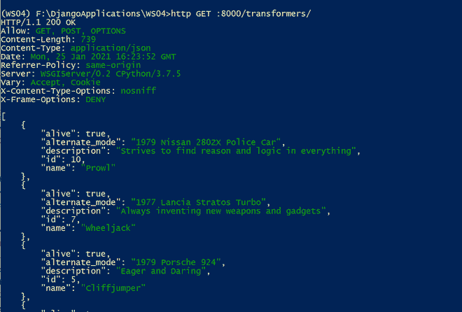

# 基于功能的视图–姜戈休息框架

> 原文:[https://www . geesforgeks . org/function-based-view-django-rest-framework/](https://www.geeksforgeeks.org/function-based-views-django-rest-framework/)

Django REST 框架允许我们使用常规的 Django 视图。它有助于处理 HTTP 请求和提供适当的 HTTP 响应。在本节中，您将了解如何为 Restful Web 服务实现 Django 视图。我们还利用了@api_view 装饰器。

在使用 Django REST 框架序列化程序之前，您应该确保已经在虚拟环境中安装了 Django 和 Django REST 框架。您可以查看以下教程:

*   [使用 venv | Python 创建虚拟环境](https://www.geeksforgeeks.org/create-virtual-environment-using-venv-python/)
*   姜戈安装
*   [Django REST 框架安装](https://www.geeksforgeeks.org/django-rest-framework-installation/)

接下来，您可以创建一个名为 emt 的项目和一个名为 transformers 的应用程序。请参考以下文章，查看如何在 Django 中创建项目和应用程序。

*   [如何利用姜戈的 MVT 创建基础项目？](https://www.geeksforgeeks.org/how-to-create-a-basic-project-using-mvt-in-django/)
*   [如何在姜戈创建 App？](https://www.geeksforgeeks.org/how-to-create-an-app-in-django/)

在本节中，我们将使用 PostgreSQL。您必须在 PostgreSQL 中创建一个名为 emt 的数据库。您可以查看下面的安装链接。

[在 Windows 上安装 PostgreSQL](https://www.geeksforgeeks.org/install-postgresql-on-windows/)

> 注意:如果需要使用 SQLite，可以继续使用默认数据库。

为了利用 PostgreSQL，我们需要安装一个 Python-PostgreSQL 数据库适配器(psycopg2)。这个包帮助 Django 与 PostgreSQL 数据库进行交互。您可以使用下面的命令来安装 psycopg2 包。确保 PostgreSQL bin 文件夹包含在 PATH 环境变量中，并且虚拟环境在执行命令之前被激活。

> pip 安装 psycopg2

现在，您需要在您的 Django 项目中配置 PostgreSQL 数据库。默认情况下，数据库配置有一个 SQLite 数据库引擎和数据库文件名。您可以检查 setting.py Python 文件，并用 PostgreSQL 数据库配置替换默认数据库配置。

```py
DATABASES = {
   'default': {
       'ENGINE': 'django.db.backends.postgresql',
       'NAME': 'emt',
       'USER': 'username',
       'PASSWORD': 'password',
       'HOST': '127.0.0.1',
       'PORT': '5432',
   }
}
```

这里，名称指的是数据库名称，用户和密码指的是 Postgres 用户名和密码。

最后，我们需要在虚拟环境中安装 httpie 包。我们将为 CRUD 操作编写 HTTPie 命令。您可以激活虚拟环境并运行以下命令

> pip 安装–升级 httpie

现在，让我们创建模型和序列化程序。

## 创建模型和序列化程序

在进入基于类的视图之前，让我们创建一个模型及其序列化程序，这有助于演示基于函数的视图的工作。

### 创建模型

在姜戈，模型是以面向对象的方式处理数据库的类。每个模型类引用一个数据库表，模型类中的每个属性引用一个数据库列。在这里，我们将在 Django 中创建一个简单的 transformer 模型，其中存储了 Transformer 角色的名称、替代模式、描述以及角色是活的还是死的。我们要求变压器实体具有以下属性:

*   名字
*   备用模式
*   描述
*   活着的

在 RESTFul 网络服务中，每个资源都使用一个唯一的网址来访问，这意味着每个员工都有他们唯一的网址。并且，模型的每个方法都由一个 HTTP 动词和作用域组成。

<figure class="table">

| HTTP 动词 | 范围 | 语义学 | 统一资源定位器 |
| --- | --- | --- | --- |
| 得到 | 变压器 | 取回单个变压器 | http://localhost:8000/transformers/{ id }/ |
| 得到 | 变压器集锦 | 检索集合中的所有转换器 | http://localhost:8000/transformers/ |
| 邮政 | 变压器集锦 | 在集合中创建新的转换器 | http://localhost:8000/transformers/ |
| 放 | 变压器 | 更新现有变压器 | http://localhost:8000/transformers/{ id }/ |
| 修补 | 变压器 | 部分更新现有变压器 | http://localhost:8000/transformers/{ id }/ |
| 删除 | 变压器 | 删除现有变压器 | http://localhost:8000/transformers/{ id }/ |

</figure>

让我们开始在姜戈实现 Transformer 模型。您可以用下面的代码替换 models.py Python 文件:

## 蟒蛇 3

```py
from django.db import models

class Transformer(models.Model):
    name = models.CharField(max_length=150, unique=True)
    alternate_mode = models.CharField(
        max_length=250,
        blank=True,
        null=True)
    description = models.CharField(
        max_length=500,
        blank=True,
        null=True)
    alive = models.BooleanField(default=False)

    class Meta:
        ordering = ('name',)

    def __str__(self):
        return self.name
```

Transformer 模型是 django.db.models.Model 类的子类，定义了属性和一个 Meta 内部类。它有一个排序属性，根据名称以升序对结果进行排序。让我们使用以下命令进行初始迁移(确保您在 settings.py Python 文件中的 INSTALLED_APPS 中定义了您的应用程序(' transformers . APPS . transformers config ')

> python manage.py makemigrations

接下来，使用以下命令应用所有生成的迁移:

> python manage.py 迁移

应用生成的迁移将在数据库中创建一个 Transformer 表。

### 创建序列化程序

在您的应用程序(转换器)文件夹中创建一个新的 serializers.py Python 文件，并添加以下代码:

## 蟒蛇 3

```py
from rest_framework import serializers
from transformers.models import Transformer

class TransformerSerializer(serializers.ModelSerializer):
    class Meta:
        model = Transformer
        fields = "__all__"
```

这里，我们创建了一个从 REST _ Framework . serializer . model serializer 继承的 TransformerSerializer 类，如果你想深入挖掘不同类型的序列化，可以查看 [Django REST Framework (DRF)序列化](https://www.geeksforgeeks.org/serializers-django-rest-framework/)。现在，是时候开始我们的基于功能的视图之旅了。我们将从常规的 Django 视图开始，然后利用@api_view 装饰器。

## 基于函数的视图

Django 视图便于处理 HTTP 请求和提供 HTTP 响应。在接收到一个 HTTP 请求时，Django 创建一个 HTTP request 实例，并将它作为第一个参数传递给视图函数。此实例包含 HTTP 动词，如 GET、POST、PUT、PATCH 或 DELETE。视图函数检查该值，并基于 HTTP 谓词执行代码。这里的代码使用@ csrf _ exclude 装饰器来设置一个 csrf(跨站点请求伪造)cookie。这使得从没有 CSRF 令牌的客户端发布到此视图成为可能。让我们进入实施过程。您可以在 views.py 文件中添加以下代码。

## 蟒蛇 3

```py
from django.http import HttpResponse, JsonResponse
from django.views.decorators.csrf import csrf_exempt
from rest_framework.parsers import JSONParser

from transformers.models import Transformer
from transformers.serializers import TransformerSerializer

@csrf_exempt
def transformer_list(request):
    """
    List all transformers, or create a new transformer
    """
    if request.method == 'GET':
        transformer = Transformer.objects.all()
        serializer = TransformerSerializer(transformer, many=True)
        return JsonResponse(serializer.data, safe=False)

    elif request.method == 'POST':
        data = JSONParser().parse(request)
        serializer = TransformerSerializer(data=data)
        if serializer.is_valid():
            serializer.save()
            return JsonResponse(serializer.data, status=201)
        return JsonResponse(serializer.errors, status=400)

@csrf_exempt
def transformer_detail(request, pk):
    try:
        transformer = Transformer.objects.get(pk=pk)
    except Transformer.DoesNotExist:
        return HttpResponse(status=404)

    if request.method == 'GET':
        serializer = TransformerSerializer(transformer)
        return JsonResponse(serializer.data)

    elif request.method == 'PUT':
        data = JSONParser().parse(request)
        serializer = TransformerSerializer(transformer, data=data)

        if serializer.is_valid():
            serializer.save()
            return JsonResponse(serializer.data)
        return JsonResponse(serializer.errors, status=400)

    elif request.method == 'DELETE':
        transformer.delete()
        return HttpResponse(status=204)
```

让我们评估一下代码。这里我们有两个功能。

*   transformer_list()
*   变压器详细信息()

### transformer_list()

ransformer _ list()函数能够处理两个 HTTP 动词——GET 和 POST。

如果动词是 *GET* ，代码将检索所有的转换器实例。

```py
    if request.method == 'GET':
        transformer = Transformer.objects.all()
        serializer = TransformerSerializer(transformer, many=True)
        return JsonResponse(serializer.data, safe=False)
```

*   它使用 objects.all()方法检索转换器的所有数据。
*   使用 TransformerSerializer 序列化任务。
*   然后使用 JsonResponse()呈现序列化数据，并返回结果

**注意**:指定的 multi = True 参数序列化多个 Transformer 实例。

如果动词是 *POST* ，代码会创建一个新的转换器。这里的数据是在编写 HTTP 请求时以 JSON 格式提供的。

```py
    elif request.method == 'POST':
        data = JSONParser().parse(request)
        serializer = TransformerSerializer(data=data)
        if serializer.is_valid():
            serializer.save()
            return JsonResponse(serializer.data, status=201)
        return JsonResponse(serializer.errors, status=400)
```

*   使用 JSONParser 解析请求，
*   使用 TransformerSerializer 序列化已解析的数据，
*   如果数据有效，它将保存在数据库中，并返回带有状态代码的呈现结果。

### 变压器详细信息()

transformer_detail()函数能够处理三个 HTTP 动词——GET、PUT 和 DELETE。如果动词是 GET，则代码基于主键检索单个转换器实例。如果动词是 PUT，则代码更新实例并将其保存到数据库中，如果是 DELETE，则代码从数据库中删除该实例。

下一步，我们需要将网址路由到视图。您需要在 app (transformers)文件夹中创建新的 Python 文件名 urls.py，并添加以下代码。

## 蟒蛇 3

```py
from django.urls import path
from transformers import views

urlpatterns = [
    path('transformers/',
         views.transformer_list,
         name = 'employee-list'),
    path('transformers/<int:pk>/',
         views.transformer_detail,
         name = 'employee-detail'),
]
```

现在，让我们更新根 URL 配置。您可以将下面的代码添加到 urls.py 文件(包含 settings.py 文件的同一文件夹)中。

## 蟒蛇 3

```py
from django.contrib import admin
from django.urls import path, include

urlpatterns = [
    path('', include('transformers.urls')),
]
```

现在是时候编写和发送 HTTP 请求来测试我们的视图了。

让我们创建一个新条目。HTTPie 命令是:

> http POST:8000/transformers/name = " wheel jack " alternate _ mode = " 1977 蓝旗亚·斯特拉斯特涡轮增压" description= "总是发明新的武器和小玩意" alive="False "

输出

```py
HTTP/1.1 201 Created
Content-Length: 152
Content-Type: application/json
Date: Mon, 25 Jan 2021 05:23:10 GMT
Referrer-Policy: same-origin
Server: WSGIServer/0.2 CPython/3.7.5
X-Content-Type-Options: nosniff
X-Frame-Options: DENY

{
    "alive": false,
    "alternate_mode": "1977 Lancia Stratos Turbo",
    "description": "Always inventing new weapons and gadgets",
    "id": 7,
    "name": "Wheeljack"
}
```

分享命令提示符截图供您参考



让我们将转换器(id=7)的活动字段更新为 True。HTTPie 命令是:

> http PUT:8000/transformers/7/name = " wheel jack " alternate _ mode = " 1977 蓝旗亚·斯特罗斯特涡轮增压" description= "总是发明新的武器和小玩意" alive="True "

输出

```py
HTTP/1.1 200 OK
Content-Length: 151
Content-Type: application/json
Date: Mon, 25 Jan 2021 05:26:22 GMT
Referrer-Policy: same-origin
Server: WSGIServer/0.2 CPython/3.7.5
X-Content-Type-Options: nosniff
X-Frame-Options: DENY

{
    "alive": true,
    "alternate_mode": "1977 Lancia Stratos Turbo",
    "description": "Always inventing new weapons and gadgets",
    "id": 7,
    "name": "Wheeljack"
}
```

让我们找回所有的变形金刚。HTTPie 命令是:

> http GET :8000/transformers/

输出

```py
HTTP/1.1 200 OK
Allow: GET, POST, OPTIONS
Content-Length: 629
Content-Type: application/json
Date: Mon, 25 Jan 2021 05:43:36 GMT
Referrer-Policy: same-origin
Server: WSGIServer/0.2 CPython/3.7.5
Vary: Accept, Cookie
X-Content-Type-Options: nosniff
X-Frame-Options: DENY

[
    {
        "alive": true,
        "alternate_mode": "1977 Lancia Stratos Turbo",
        "description": "Always inventing new weapons and gadgets",
        "id": 7,
        "name": "Wheeljack"
    },
    {
        "alive": true,
        "alternate_mode": "1979 Porsche 924",
        "description": "Eager and Daring",
        "id": 5,
        "name": "Cliffjumper"
    },
    {
        "alive": true,
        "alternate_mode": "1979 VW Beetle",
        "description": "Small, eager, and brave. Acts as a messenger, scout, and spy",
        "id": 3,
        "name": "Bumblebee"
    },
    {
        "alive": false,
        "alternate_mode": "1979 Freightliner Semi",
        "description": "Optimus Prime is the strongest and most courageous and leader of all Autobots",
        "id": 1,
        "name": "Optimus Prime"
    }
]
```

共享命令提示符截图



## @api_view

*@api_view* 是*rest _ framework . decorator*模块中的一个装饰器，它是所有姜戈 REST 框架视图的基类。我们可以在 *@api_view* 装饰器中提供允许的 HTTP 动词作为 http _ methods _ names 参数(字符串列表)。如果 RESTful Web 服务收到不支持的 HTTP Verb，装饰器将返回一个适当的响应，而不是 Django 中的意外错误。

```py
@api_view(http_method_names=['GET'])
```

您可以用下面的代码替换 views.py 文件。

## 蟒蛇 3

```py
from rest_framework.decorators import api_view
from rest_framework.response import Response
from rest_framework import status

from transformers.models import Transformer
from transformers.serializers import TransformerSerializer

@api_view(['GET','POST'])
def transformer_list(request):
    """
    List all transformers, or create a new transformer
    """
    if request.method == 'GET':
        transformer = Transformer.objects.all()
        serializer = TransformerSerializer(transformer, many=True)
        return Response(serializer.data)

    elif request.method == 'POST':
        serializer = TransformerSerializer(data=request.data)
        if serializer.is_valid():
            serializer.save()
            return Response(serializer.data,
                            status=status.HTTP_201_CREATED)
        return Response(serializer.errors,
                        status=status.HTTP_400_BAD_REQUEST)

@api_view(['GET','PUT','PATCH','DELETE'])
def transformer_detail(request, pk):
    try:
        transformer = Transformer.objects.get(pk=pk)
    except Transformer.DoesNotExist:
        return Response(status=status.HTTP_404_NOT_FOUND)

    if request.method == 'GET':
        serializer = TransformerSerializer(transformer)
        return Response(serializer.data)

    elif request.method == 'PUT':
        serializer = TransformerSerializer(transformer, data=request.data)

        if serializer.is_valid():
            serializer.save()
            return Response(serializer.data)
        return Response(serializer.errors,
                        status=status.HTTP_400_BAD_REQUEST)
    elif request.method == 'PATCH':
        serializer = TransformerSerializer(transformer,
                                           data=request.data,
                                           partial=True)

        if serializer.is_valid():
            serializer.save()
            return Response(serializer.data)
        return Response(serializer.errors,
                        status=status.HTTP_400_BAD_REQUEST)

    elif request.method == 'DELETE':
        transformer.delete()
        return Response(status=status.HTTP_204_NO_CONTENT)
```

在新代码中，transformer_list 和 transformer_detail 函数用@api_vew 装饰器包装。transformer_list 函数支持 GET 和 POST 谓词，而 transformer_detail 方法支持 GET、PUT、PATCH 和 DELETE 谓词。这些受支持的动词作为装饰器参数传递给每个方法。在这里，我们删除了*rest _ framework . parser . jsonparser*类。这样，我们可以让代码与不同的解析器一起工作。我们还用更通用的*rest _ framework . response . response*类替换了 JSONResponse 类。

让我们运行带有 OPTIONS 动词的 HTTPie 命令，列出 transformer_list 方法中支持的方法和动词。

> http OPTIONS :8000/transformers/

输出

```py
HTTP/1.1 200 OK
Allow: GET, OPTIONS, POST
Content-Length: 225
Content-Type: application/json
Date: Mon, 25 Jan 2021 16:52:10 GMT
Referrer-Policy: same-origin
Server: WSGIServer/0.2 CPython/3.7.5
Vary: Accept, Cookie
X-Content-Type-Options: nosniff
X-Frame-Options: DENY

{
    "description": "List all transformers, or create a new transformer",
    "name": "Transformer List",
    "parses": [
        "application/json",
        "application/x-www-form-urlencoded",
        "multipart/form-data"
    ],
    "renders": [
        "application/json",
        "text/html"
    ]
}
```

共享命令提示符截图



输出显示 transformer_list 方法的详细信息。它允许 GET、OPTIONS 和 POST HTTP 动词。它还显示函数支持的不同解析和呈现。

让我们看看 transformer_detail 函数。HTTPie 命令是

> http OPTIONS:8000/transformers/1/

输出

```py
HTTP/1.1 200 OK
Allow: OPTIONS, DELETE, GET, PATCH, PUT
Content-Length: 177
Content-Type: application/json
Date: Mon, 25 Jan 2021 16:59:23 GMT
Referrer-Policy: same-origin
Server: WSGIServer/0.2 CPython/3.7.5
Vary: Accept, Cookie
X-Content-Type-Options: nosniff
X-Frame-Options: DENY

{
    "description": "",
    "name": "Transformer Detail",
    "parses": [
        "application/json",
        "application/x-www-form-urlencoded",
        "multipart/form-data"
    ],
    "renders": [
        "application/json",
        "text/html"
    ]
}
```

您可以注意到 transformer_detail()函数支持 OPTIONS、DELETE、GET、PATCH 和 PUT HTTP 谓词。它还显示函数支持的不同解析和呈现。

@api_view 装饰器可以通过选择合适的解析器来解析不同的内容类型。从上面的输出中，我们可以注意到@api_view decorator 中支持的不同解析器。当我们使用@api_view 装饰器时，它会自动利用 APIView 类及其设置。这样我们将能够使用解析器和渲染。

@api_view 装饰器帮助 Django REST 框架检查数据属性中的 Content-Type 头，并识别解析请求的确切解析器。它还调用*rest _ framework . conference . defaultcontentconference*类来为请求选择合适的渲染器。

现在，是时候编写和发送不同的 HTTP 请求了。让我们创建一个新条目。HTTPie 命令是

> http POST:8000/transformers/name = " cruise " alternate _ mode = " 1979 日产 280ZX 警车"描述= "努力在一切事物中寻找理性和逻辑" alive="False "

输出

```py
HTTP/1.1 201 Created
Allow: GET, POST, OPTIONS
Content-Length: 149
Content-Type: application/json
Date: Mon, 25 Jan 2021 16:18:56 GMT
Referrer-Policy: same-origin
Server: WSGIServer/0.2 CPython/3.7.5
Vary: Accept, Cookie
X-Content-Type-Options: nosniff
X-Frame-Options: DENY

{
    "alive": false,
    "alternate_mode": "1979 Nissan 280ZX Police Car",
    "description": "Strives to find reason and logic in everything",
    "id": 10,
    "name": "Prowl"
}
```

共享命令提示符截图



让我们将有效字段值更新为真。HTTPie 命令是:

> http PATCH:8000/变形金刚/10/ alive="True "

输出

```py
HTTP/1.1 200 OK
Allow: PATCH, PUT, DELETE, OPTIONS, GET
Content-Length: 148
Content-Type: application/json
Date: Mon, 25 Jan 2021 16:22:35 GMT
Referrer-Policy: same-origin
Server: WSGIServer/0.2 CPython/3.7.5
Vary: Accept, Cookie
X-Content-Type-Options: nosniff
X-Frame-Options: DENY

{
    "alive": true,
    "alternate_mode": "1979 Nissan 280ZX Police Car",
    "description": "Strives to find reason and logic in everything",
    "id": 10,
    "name": "Prowl"
}
```

共享命令提示符截图



让我们检索所有条目。HTTPie 命令是:

> http GET :8000/transformers/

输出

```py
HTTP/1.1 200 OK
Allow: GET, POST, OPTIONS
Content-Length: 739
Content-Type: application/json
Date: Mon, 25 Jan 2021 16:23:52 GMT
Referrer-Policy: same-origin
Server: WSGIServer/0.2 CPython/3.7.5
Vary: Accept, Cookie
X-Content-Type-Options: nosniff
X-Frame-Options: DENY

[
    {
        "alive": true,
        "alternate_mode": "1979 Nissan 280ZX Police Car",
        "description": "Strives to find reason and logic in everything",
        "id": 10,
        "name": "Prowl"
    },
    {
        "alive": true,
        "alternate_mode": "1977 Lancia Stratos Turbo",
        "description": "Always inventing new weapons and gadgets",
        "id": 7,
        "name": "Wheeljack"
    },
    {
        "alive": true,
        "alternate_mode": "1979 Porsche 924",
        "description": "Eager and Daring",
        "id": 5,
        "name": "Cliffjumper"
    },
    {
        "alive": true,
        "alternate_mode": "1979 VW Beetle",
        "description": "Small, eager, and brave. Acts as a messenger, scout, and spy",
        "id": 3,
        "name": "Bumblebee"
    },
    {
        "alive": false,
        "alternate_mode": "1979 Freightliner Semi",
        "description": "Optimus Prime is the strongest and most courageous and leader of all Autobots",
        "id": 1,
        "name": "Optimus Prime"
    }
]
```

共享命令提示符截图



在本节中，我们了解了如何编写 Django 视图的代码来处理 HTTP 请求并返回 HTTP 响应。我们还意识到了用@api_view 装饰器包装视图的重要性。最后，我们编写并发送了不同的请求，包括 OPTIONS HTTP 请求，其中显示了支持的 HTTP 动词、解析器和呈现器。