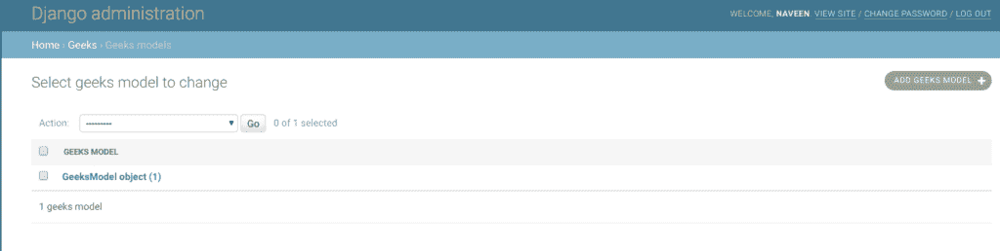

# genericipaddresfield–Django 车型

> 原文:[https://www . geeksforgeeks . org/genericipaddresfield-django-models/](https://www.geeksforgeeks.org/genericipaddressfield-django-models/)

**genericipaddresfield**是以字符串格式存储 **IPv4 或 IPv6 地址**的字段(例如 192.0.2.30 或 2a02:42fe::4)。该字段的默认表单部件是[文本输入](https://docs.djangoproject.com/en/2.2/ref/forms/widgets/#django.forms.TextInput)。IPv6 地址标准化遵循[RFC 4291 #第 2.2 节](https://tools.ietf.org/html/rfc4291.html#section-2.2)第 2.2 节，包括使用该节第 3 段中建议的 IPv4 格式，如`::ffff:192.0.2.0`。例如，将`2001:0::0:01`归一化为`2001::1`，将`::ffff:0a0a:0a0a`归一化为`::ffff:10.10.10.10`。所有字符都转换为小写。

**语法:**

```
field_name = models.GenericIPAddressField(**options)
```

**GenericIPAddressField 接受以下参数:**

```
GenericIPAddressField.protocol
```

将有效输入限制到指定的协议。接受的值为“**”(默认)、“ **IPv4** 或“ **IPv6** ”。匹配不区分大小写。**

```
GenericIPAddressField.unpack_ipv4
```

**解包 IPv4 映射地址，如**:ffff:192 . 0 . 2 . 1**。如果启用此选项，该地址将被解包到**192.0.2.1**。默认为禁用。只能在协议设置为“两者”时使用。**

## **Django 模型泛型 paddresfield 解释**

**使用示例说明 GenericIPAddressField。考虑一个名为`geeksforgeeks`的项目，它有一个名为`geeks`的应用程序。**

> **请参考以下文章，查看如何在 Django 中创建项目和应用程序。**
> 
> *   **[如何利用姜戈的 MVT 创建基础项目？](https://www.geeksforgeeks.org/how-to-create-a-basic-project-using-mvt-in-django/)**
> *   **[如何在姜戈创建 App？](https://www.geeksforgeeks.org/how-to-create-an-app-in-django/)**

**将以下代码输入**极客** app 的`models.py`文件。**

```
from django.db import models
from django.db.models import Model
# Create your models here.

class GeeksModel(Model):
    geeks_field = models.GenericIPAddressField()
```

**将极客应用添加到`INSTALLED_APPS`**

```
# Application definition

INSTALLED_APPS = [
    'django.contrib.admin',
    'django.contrib.auth',
    'django.contrib.contenttypes',
    'django.contrib.sessions',
    'django.contrib.messages',
    'django.contrib.staticfiles',
    'geeks',
]
```

**现在当我们从终端运行`makemigrations`命令时，**

```
Python manage.py makemigrations
```

**将在`geeks`目录中创建一个名为“迁移”的新文件夹，文件名为`0001_initial.py`**

```
# Generated by Django 2.2.5 on 2019-09-25 06:00

from django.db import migrations, models

class Migration(migrations.Migration):

    initial = True

    dependencies = [
    ]

    operations = [
        migrations.CreateModel(
            name ='GeeksModel',
            fields =[
                ('id', 
                  models.AutoField(
                  auto_created = True,
                  primary_key = True,
                  serialize = False, 
                  verbose_name ='ID'
                )),
                ('geeks_field', 
                  models.GenericIPAddressField()),
            ],
        ),
    ]
```

**现在快跑，**

```
Python manage.py migrate
```

**因此，当您在项目上运行迁移时，会创建一个 `geeks_field` **genericipedressfield**。它是一个存储整数的字段。**

## **如何使用 GenericIPAddressField？**

**GenericIPAddressField 用于存储 Pv4 或 IPv6 地址，为字符串格式，所以基本上是一个带有 IP 地址验证的 [CharField](https://www.geeksforgeeks.org/charfield-django-models/) 。让我们尝试在该字段中保存一个 IP 地址“ **0.0.0.0** ”。**

```
# importing the model
# from geeks app
from geeks.models import GeeksModel

# creating an instance of
# IP addresses
d = "0.0.0.0"

# creating a instance of 
# GeeksModel
geek_object = GeeksModel.objects.create(geeks_field = d)
geek_object.save()
```

**现在让我们在管理服务器中检查它。我们已经创建了一个极客模型的实例。**

****

## **字段选项**

**字段选项是为每个字段提供的参数，用于对特定字段应用某些约束或赋予特定特征。例如，向 GenericIPAddressField 添加参数`null = True`将使其能够在关系数据库中存储该表的空值。
下面是 GenericIPAddressField 可以使用的字段选项和属性。**

| 字段选项 | 描述 |
| --- | --- |
| [零](https://www.geeksforgeeks.org/nulltrue-django-built-in-field-validation/) | 如果**为真**，姜戈会在数据库中将空值存储为**空值**。默认为**假**。 |
| [空白](https://www.geeksforgeeks.org/blanktrue-django-built-in-field-validation/) | 如果**为真**，则该字段允许为空。默认为**假**。 |
| 数据库 _ 列 | 用于此字段的数据库列的名称。如果没有给出，Django 将使用字段的名称。 |
| [默认](https://www.geeksforgeeks.org/default-django-built-in-field-validation/) | 该字段的默认值。这可以是一个值或一个可调用对象。如果可调用，它将在每次创建新对象时被调用。 |
| [帮助 _ 文字](https://www.geeksforgeeks.org/help_text-django-built-in-field-validation/) | 要与表单小部件一起显示的额外“帮助”文本。即使您的字段没有在表单上使用，它对文档也很有用。 |
| [主键](https://www.geeksforgeeks.org/primary_key-django-built-in-field-validation/) | 如果为真，则该字段是模型的主键。 |
| [可编辑](https://www.geeksforgeeks.org/editablefalse-django-built-in-field-validation/) | 如果**为假**，该字段将不会显示在管理或任何其他模型表单中。在模型验证期间也会跳过它们。默认为**真**。 |
| [错误信息](https://www.geeksforgeeks.org/error_messages-django-built-in-field-validation/) | error_messages 参数允许您覆盖该字段将引发的默认消息。传入一个字典，其关键字与您想要覆盖的错误消息相匹配。 |
| [帮助 _ 文字](https://www.geeksforgeeks.org/help_text-django-built-in-field-validation/) | 要与表单小部件一起显示的额外“帮助”文本。即使您的字段没有在表单上使用，它对文档也很有用。 |
| [verbose_name](https://www.geeksforgeeks.org/verbose_name-django-built-in-field-validation/) | 该字段的可读名称。如果没有给出详细名称，Django 将使用字段的属性名称自动创建它，将下划线转换为空格。 |
| [验证器](https://www.geeksforgeeks.org/custom-field-validations-in-django-models/) | 为此字段运行的验证程序列表。更多信息参见[验证器文档](https://docs.djangoproject.com/en/2.2/ref/validators/)。 |
| [独特](https://www.geeksforgeeks.org/uniquetrue-django-built-in-field-validation/) | 如果为真，则该字段在整个表中必须是唯一的。 |