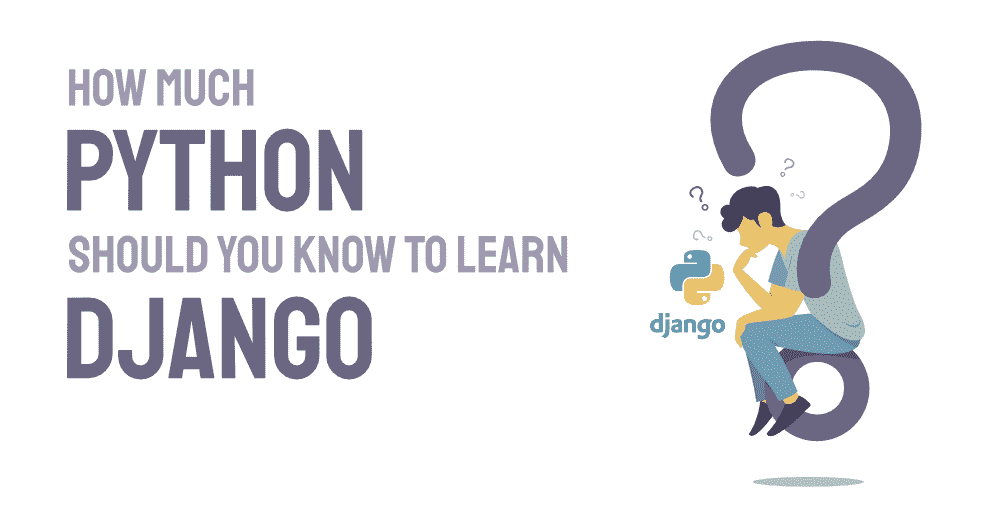

# 学姜戈要懂多少蟒蛇？

> 原文:[https://www . geesforgeks . org/多少-python-你应该知道-学习-django/](https://www.geeksforgeeks.org/how-much-python-should-you-know-to-learn-django/)

***学习姜戈需要多少巨蟒？？**T3】*

每个想要学习 Django 并在其中构建应用程序的初学者和有经验的开发人员都会想到这个问题。毫无疑问，大多数开发人员或初学者都希望尽快学习任何框架或库。我们都想知道学习任何框架或库所需的最低先决条件。在这里，我们将谈论最受欢迎的框架姜戈…

不同的 Django 经验丰富的开发人员对这个话题有不同的看法，每个人学习 Django 的方法也不同。

现在进入主题…学习 [**【姜戈】**](https://www.geeksforgeeks.org/django-introduction-and-installation/) 需要多少 Python？

如果你对 Python 没有信心，直接跳到 Django 可能会适得其反。很多时候，在 Django 构建应用程序时，我们会遇到其中的问题，但不是框架造成了问题，而是 Python 造成了问题。

但问题是……我们需要学习 Python 中的所有内容来启动 Django 吗……简单的回答是不需要……

不要学习 [**Python**](https://www.geeksforgeeks.org/python-programming-language/) 中的所有内容，然后从 Django 开始，只学习足够的 Python，这样你就可以从 Django 开始，然后在学习 Django 的同时，你可以学习 Python，两者并行。开始构建一个应用程序，看看你遇到了什么样的现实问题，然后在路上学习。一半的编码将在反复试验中完成，同时进行研究。如果您遵循这种方法，那么您将不必花费大量时间学习 Django 和 Python。

如果你是一个初学者，那么你肯定需要学习 Python 中的许多基本概念，如果你是一个有经验的开发人员，那么你只需要理解 Python 中基本概念的语法。让我们总结一下在 Django 上工作所需的 Python 概念。此外，我们将讨论为什么这些概念对学习很重要。

### 1.下载 Python 并学习画中画和函数

首先，您需要下载 python 并运行它。了解如何运行简单的 pip 安装和安装 Django。一旦你完成了，从学习基础知识开始…

### 2.基本概念

如果您是编程初学者，那么您需要首先了解 Python 的基础知识。变量、数据类型、条件语句、for 循环所有这些都是 python 的基础。理解这些概念是很重要的，以便不仅在 python 中，而且在编程中继续进行。这些概念是所有编程语言的一部分。如果你对基本知识不清楚，你在姜戈将会非常挣扎。

### **3 .迭代〔t1〕**

一旦你了解了基本概念，你就需要学习 iterables。在 python 中，列表和元组被描述为可迭代的。它们的对象允许您使用 for 循环或 while 循环迭代它。这些对象是我们实际上可以遍历大量数据的基本方式。

在姜戈的大部分时间里，你将和克雷塞一起工作。查询集也是对象，您可以将它们视为像列表一样的存储，但它们也有一些其他属性，允许您执行一些复杂的操作，如过滤、突变、比较等。所以查询集比列表稍微复杂一点，但是它们的行为方式是一样的，因为它们是可迭代的。

我们可以像遍历列表和元组一样遍历 Querysets。因此，如果您不熟悉列表、元组和遍历对象，那么您肯定会对 Django 中的查询集感到困惑。所以确保你对 iterables 以及如何迭代一个对象有很好的理解。

### 4.字典

在 Python 中，字典以键值对的形式存储数据。例如，您可以创建一个对象，该对象可以有名字、姓氏和年龄。我们可以把所有的值都储存在字典里。在姜戈，您将在模板中添加 **`context`** 时使用字典。

您可以访问 HTML 模板中的上下文信息。上下文是在 Django 中使用模板的概念。这就是为什么您应该首先将其理解为 python 对象。另外，要了解字典中的方法，如**、【更新】、【pop】、**

### **5。功能**

函数是所有编程语言中的重要概念。与姜戈一起工作的时候，你会写很多函数。在深入了解 Django 之前，了解函数及其工作原理是很好的。与姜戈一起工作时，也要理解` ***args** 和` ****kwargs`。**

### **6。装修工**

学习装饰师是很有选择性的。它在应用程序中不常使用。装饰者给你额外的功能。当需要装饰者登录时，您将在 Django 中看到这一点。你也可以使用已经存在的装饰者。在应用程序中使用装饰器非常容易。了解装饰者内心的想法。如何编写自己的装饰器以及它们是如何工作的。

### 7.班级

班级是姜戈的重要组成部分。在开始研究 Django 之前，理解类的概念。在 Django 的大部分代码中，您将使用类来编写。你需要专注于下面给出的东西来学习关于课程的一切。

在姜戈，您将使用**模型**、**表单**和**视图**中的类。您也可以使用函数，但是类会使应用程序变得更简单。下面是一些学习课程的细节。

*   编写类的语法。
*   面向对象的范例。
*   理解“自我”关键词的概念
*   特殊方法，如 _ _ init _ _ 方法。
*   实例和类之间的区别。
*   遗产
*   方法(实例方法、类方法)
*   超()函数的概念。
*   压倒一切的概念

### 8.包装

Python 中要学习的另一个重要概念是包。与 Django 一起工作时，您将从 Django 模块中导入许多函数和类。如果您不知道如何导入和使用库和第三方包，您将在您的 Django 应用程序中遇到很多困难。

您可以从 python 库开始，如“ [**【熊猫】**](https://www.geeksforgeeks.org/pandas-tutorial/) ”和“ [**numpy**](https://www.geeksforgeeks.org/python-numpy-tutorial/) ”。了解如何导入和使用 Python 包。

### 9.对 HTML 和 CSS 的基本理解

[**HTML**](https://www.geeksforgeeks.org/html-tutorials/) 和 [**CSS**](https://www.geeksforgeeks.org/css-tutorials/) 可能和 Python 没有关系但是对于 Django 来说有必要。Django 模板使用 HTML 和 CSS 来构造网页和设计网页风格。Django 在 python iterable 和字典的帮助下动态地构建这些网页。Django 模板也可以自我扩展。因此，对 HTML 标签和 CSS 属性的良好理解有助于您以更好的方式动态呈现这些网页。

### 结论

如果你没有强大的 Python 基础知识，学习 Django 并不容易。您不需要学习 Python 中的所有内容，但至少要在 Python 中明确基本概念，才能开始使用 Django 应用程序。特别关注 Python 中的类和面向对象编程。如果你对基本面很清楚，你会更容易潜入姜戈。

**资源:**

*   [Python 教程](https://www.geeksforgeeks.org/python-programming-language/)
*   [初学者免费 Python 课程](https://www.geeksforgeeks.org/free-python-course-for-beginners/)
*   [姜戈教程](https://www.geeksforgeeks.org/django-tutorial/)