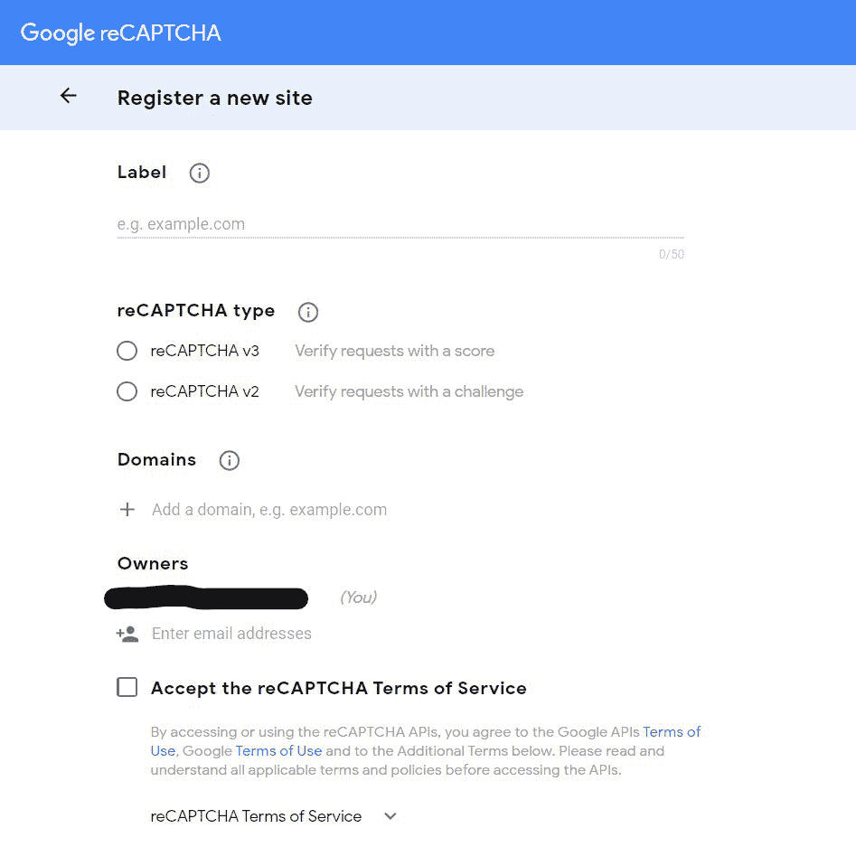
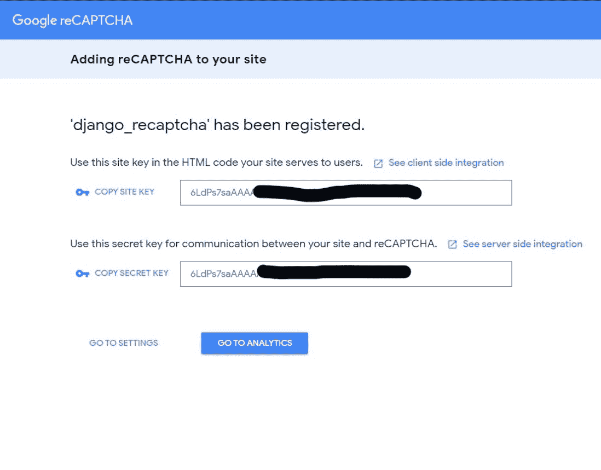

# 如何将 Google reCAPTCHA 添加到 Django 表单中？

> 原文:[https://www . geesforgeks . org/how-add-Google-recaptcha-to-django-forms/](https://www.geeksforgeeks.org/how-to-add-google-recaptcha-to-django-forms/)

本教程解释了如何将谷歌的 reCaptcha 系统集成到你的 Django 网站上。要在 Django 创建表单，您可以签出–[如何使用 Django Forms 创建表单？](https://www.geeksforgeeks.org/how-to-create-a-form-using-django-forms/)

## 入门指南

将 reCaptcha 添加到任何 HTML 表单都包括以下步骤:

1.  将您的站点域注册到注册管理控制台。
2.  向项目设置中添加 recaptcha 键。
3.  向 HTML 模板添加 reCaptcha 脚本和输入元素。
4.  提交表单时，向后端的 google reCaptcha API 发出 post 请求，表单的 reCaptcha 字段值和 reCaptcha 键作为 POST 数据。
5.  处理谷歌的回复。

虽然这可以手动完成，但我们将使用第三方库，因为它使过程更快、更简单。现在，让我们制作一个示例联系人表单，在其中我们将集成 reCaptcha

### 启动姜戈项目:

确保您已经完成了 django 的安装。

*   创建新的 django 项目:

```py
django-admin startproject dj_recaptcha
```

*   创建一个名为“联系人”的新应用程序:

```py
cd dj_recaptcha
python manage.py startapp contact
```

*   转到 dj_recaptcha/settings.py 添加联系人应用程序。

```py
INSTALLED_APPS = [
    ...
    'contact',
    ...
]
```

### 注册到谷歌注册管理控制台:

首先你需要在[注册你的网站。在域部分添加 127.0.0.1，因为我们正在本地测试它。稍后，您可以添加您的生产网址。](https://www.google.com/recaptcha/admin/create)



recaptcha 管理控制台

您可以指定您想要的任何 reCaptcha 类型，这里我们选择了带有“**我不是机器人票箱**”的 v2。您将在表单提交时获得应用编程接口密钥。



recaptcha api 密钥

将站点密钥和密钥复制到设置中，如下所示:

```py
RECAPTCHA_PUBLIC_KEY = Your_Site_Key
RECAPTCHA_PRIVATE_KEY = Your_Secret_key
```

如前所述，我们将使用一个名为 django-recaptcha 的第三方库来简化这个过程。让我们现在使用 pip 安装它，输入以下命令。

```py
pip install django-recaptcha
```

将该应用程序添加到设置中的 INSTALLED_APPS 列表中。py

```py
INSTALLED_APPS = [
    ...
    'contact',
    'captcha',
    ...
]
```

现在，让我们继续在 forms.py 中创建一个以电子邮件、反馈和验证码为字段的联系人表单。

## 蟒蛇 3

```py
# forms.py

from django import forms
from captcha.fields import ReCaptchaField
from captcha.widgets import ReCaptchaV2Checkbox

class ContactForm(forms.Form):
    email = forms.EmailField()
    feedback = forms.CharField(widget=forms.Textarea)
    captcha = ReCaptchaField(widget=ReCaptchaV2Checkbox)
```