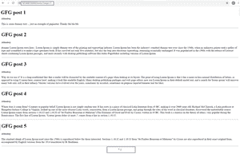
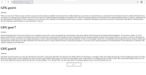

# 如何在 Django 项目中添加分页？

> 原文:[https://www . geesforgeks . org/how-add-paging-in-django-project/](https://www.geeksforgeeks.org/how-to-add-pagination-in-django-project/)

分页系统是博客、搜索引擎、结果列表等最常见的功能之一。看到分页系统的流行，django 开发人员已经构建了一个 Paginator 类，这样 web 开发人员就不必考虑制作分页器的逻辑。

Paginator 类位于 django/core/paginator.py。所以要使用分页器类，我们首先需要从 **django.core.paginator** 导入

```py
from django.core.paginator import Paginator
```

**语法:**

```py
p = Paginator(list_of_objects, no_of_objects_per_page)
```

第一个参数是将分布在页面上的对象列表。第二个参数表示每页显示的对象数量。这两个参数是必需的。

然而，分页器类接受下面列出的两个可选参数–

*   **孤儿**–其值必须是小于每页对象数量值的整数。它告诉最后一页是否有最小数量的对象。如果最后一页中剩余对象的数量小于或等于该参数的值，则这些对象将被添加到上一页。默认值为 0。
*   **allow _ empty _ first _ page**–取布尔值。是否允许第一页为空。

**注意:第一个参数不必是列表。相反，它可以是元组、queryset 或其他具有 count()或 __len__()方法的可切片对象。**

**如何使用分页器类？**

假设我们正在开发一个博客网站。我们在 models.py 中定义了 Post 模型，并创建了 8 个这样的帖子。现在在 views.py 中，我们已经编写了以下代码–

## 蟒蛇 3

```py
from django.shortcuts import render
from .models import Post
from django.core.paginator import Paginator
# Create your views here.

def index(request):
    posts = Post.objects.all()  # fetching all post objects from database
    p = Paginator(posts, 5)  # creating a paginator object
    # getting the desired page number from url
    page_number = request.GET.get('page')
    try:
        page_obj = p.get_page(page_number)  # returns the desired page object
    except PageNotAnInteger:
        # if page_number is not an integer then assign the first page
        page_obj = p.page(1)
    except EmptyPage:
        # if page is empty then return last page
        page_obj = p.page(p.num_pages)
    context = {'page_obj': page_obj}
    # sending the page object to index.html
    return render(request, 'index.html', context)
```

在第三行，分页器类被导入。在索引函数中，我们构造了一个名为 p 的分页器对象。每个页面对象将有相同数量的帖子对象。然后，我们从一个 GET 请求的查询参数“page”中检索所需的页码。该页码用于提取正确的页面对象。

现在在 index.html

## 超文本标记语言

```py
<!DOCTYPE html>
<html lang="en">
<head>
    <meta charset="UTF-8">
    <meta name="viewport" content="width=device-width, initial-scale=1.0">
    <title>Django Paginator example</title>
</head>
<body>
    <div class="container">
        
          {# note that the list of posts are in the page_obj.object_list not page_obj #}
            <h1>{{post.title}}</h1>
            <small>{{post.author}}</small>

<p>{{post.content}}</p>

            <hr/>
         
    </div>
    <center>
         {# whether the previous page exists #}
            <a href="?page={{page_obj.previous_page_number}}"><</a> {# link to the prev page #}
        
        <span>{{page_obj.number}}</span> {# the current page number #}

         {# whether the next page exists #}
            <a href="?page={{page_obj.next_page_number}}">></a> {# link to the next page #}
        
    </center>
</body>
</html>
```

**结果:**



在图中，我们发送了带有 GET 请求的页码值(用矩形表示)。您可以在图像的底部看到分页(用矩形标记)。

这是最后一页的另一张图片



**方法:**

<figure class="table">

| Paginator.get_page(页码) | 它接受一个数字参数，并返回一个具有给定的从 1 开始的索引的 Page 对象。如果传递的参数不是数字，则返回第一页。如果页码是负数或大于页数，则返回最后一页。如果页面的对象列表为空，并且 Paginator 对象中的 allow_empty_first_page 设置为 false，将引发 EmptyPage 错误。 |
| Paginator.page(页码) | 它也做同样的事情，但是如果那个号码的页面不存在，就会引发 InvalidPage 错误。 |

</figure>

**属性:**

<figure class="table">

| 分页器.计数 | 返回所有页面上的对象总数。 |
| Paginator.num _ pages | 返回总页数 |
| Paginator.page_range | 返回一个基于 1 的范围迭代器 |

</figure>

但是，由于 Paginator 类使用 Page 类来分发对象，所以如果我们更多地了解 Page 类会更好。

**页面类别:**

通常页面对象用于分页器类。您很少需要手动构建它。

**语法**:

```py
page = Page( object_list , number, paginator)
```

这里的对象列表是对象的列表，number 参数用于给 Page 对象编号。分页器是为其构造此页面对象的分页器对象。

**属性:**

<figure class="table">

| Page.object_list | 返回对象列表 |
| 页码 | 返回页面对象的编号 |
| Page.paginator | 返回相应的分页器对象 |

</figure>

**方法:**

<figure class="table">

| Page.has_next() | 如果下一个页面对象退出，则返回真，否则返回假 |
| Page.has_previous() | 如果前一页对象退出，则返回真，否则返回假 |
| Page.has _ other _ pages() | 如果有下一页或上一页，则返回“真”。 |
| Page.next_page_number() | 返回下一个页码。如果下一页不存在，则引发 InvalidPage。 |
| Page.previous_page_number() | 返回上一页的页码。如果上一页不存在，则引发 InvalidPage。 |
| Page.start_index() | 返回页面上第一个对象相对于分页器列表中所有对象的从 1 开始的索引 |
| Page.end_index() | 返回页面上最后一个对象相对于分页器列表中所有对象的从 1 开始的索引。 |

</figure>